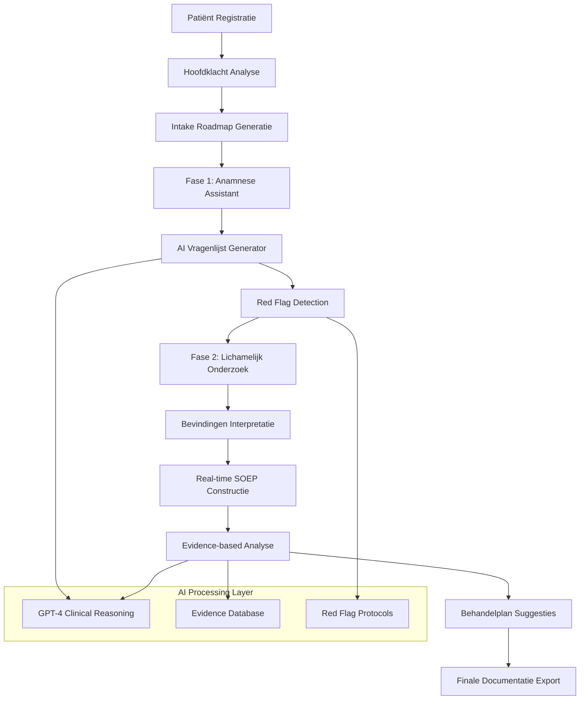

# Blueprint_HysioIntake.md

*Definitieve Blauwdruk voor Hysio Intake - AI-Ondersteunde Intake Assessment Module*

---

## 1. Executive Summary & Visie

### Wat is het?
Hysio Intake is een AI-ondersteunde module die fysiotherapeuten begeleidt door het volledige intake-assessment proces, van eerste contactmoment tot behandelplan, door intelligente vragenlijsten, automatische documentatie volgens SOEP-methodiek, en evidence-based beslissingsondersteuning te combineren in één gestroomlijnde workflow.

### Voor wie is het?
Primair: Eerstelijns fysiotherapeuten in particuliere praktijken en zorgcentra die dagelijks nieuwe patiënten ontvangen en gestructureerde, kwalitatieve intake-assessments willen uitvoeren zonder tijdverlies of administratieve last.

Secundair: Praktijk-eigenaren die consistent hoge kwaliteit intake-documentatie willen waarborgen en nieuwe therapeuten willen ondersteunen met evidence-based protocols.

### Welk probleem lost het op?
**De Intake Paradox**: Fysiotherapeuten weten dat een goede intake cruciaal is voor behandelsucces, maar ervaren het als tijdrovend, administratief zwaar en cognitief uitputtend. Ze worstelen met:
- Inconsistente intake-kwaliteit afhankelijk van ervaring en dagvorm
- Gemiste red flags door tijdsdruk of routine
- Incomplete SOEP-documentatie die later problemen geeft
- Moeite met evidence-based vraagstelling bij onbekende klachten
- Administratieve stress die afleidt van patiëntcontact

### Wat is de kernwaarde?
**"Van Chaos naar Klinische Excellence"** - Hysio Intake transformeert een stressvolle administratieve taak in een zelfverzekerde, professionele workflow waarin de therapeut wordt geleid door AI-intelligence terwijl de patiënt een persoonlijke, aandachtige behandeling ervaart.

---

## 2. De Gebruikersreis (Customer Journey)

*Vanuit de ik-vorm van therapeut Sarah, die net Hysio Intake gaat gebruiken voor een nieuwe patiënt met rugklachten*

Ik zie dat mijn volgende patiënt, meneer Jansen (45), er is voor rugklachten. In plaats van blanco te beginnen, open ik Hysio Intake. Het systeem toont me direct een warm welkomscherm: "Klaar voor je intake met meneer Jansen?"

Ik voer zijn basisgegevens in - naam, leeftijd, hoofdklacht "lage rugpijn sinds 3 weken". Hysio analyseert dit en toont me een gepersonaliseerde intake-roadmap: "Evidence-based intake voor lage rugpijn - 4 fasen, ~15 minuten". Ik voel me direct meer zelfverzeker.

Tijdens het gesprek gebruik ik de "Slimme Vragenassistent". Terwijl meneer Jansen vertelt over zijn klachten, typ ik steekwoorden in: "bukken pijnlijk", "rechterbeen tintelingen". Hysio suggereert direct follow-up vragen: "Loopt de tineling tot onder de knie?" en waarschuwt voor red flags: "⚠️ Vraag naar blaas/darmstoornissen".

In fase 2 (Anamnese) krijg ik contextuelle vragensets. Bij "tintelingen rechterbeen" toont Hysio automatisch neurologische screening vragen. Ik hoef niet alles uit mijn hoofd te weten - de AI begeleidt me door evidence-based protocols.

Tijdens het lichamelijk onderzoek (fase 3) documenteer ik bevindingen in natuurlijke taal: "Flexie 70%, pijnlijk eindstandig, SLR rechts positief op 45°". Hysio interpreteert dit real-time en bouwt mijn SOEP-documentatie op.

Als ik klaar ben, presenteert Hysio een complete, professioneel geformatteerde SOEP-rapportage. Maar meer nog: het geeft me een evidence-based behandelvoorstel: "Op basis van bevindingen: waarschijnlijk L5/S1 radiculopathie. Aanbevolen: McKenzie approach, neurodynamische oefeningen, educatie over prognose."

In 12 minuten heb ik een kwalitatief hoogwaardige intake afgerond die beter is dan wat ik normaal in 20 minuten zou produceren. Ik voel me professioneel, voorbereid, en kan me volledig focussen op de patiënt in plaats van op administratie.

---

## 3. Functionele Specificaties (Features & Flow)

### Kernfunctionaliteit

#### A. Intelligente Intake Orchestratie
**Feature**: Gepersonaliseerde Intake Roadmaps
- **User Story**: "Als therapeut wil ik een gepersonaliseerde intake-roadmap gebaseerd op hoofdklacht, zodat ik weet welke stappen te volgen en hoeveel tijd het kost."
- **Input**: Patiënt basisgegevens + hoofdklacht
- **Output**: Visuele roadmap met fasen, geschatte tijdsduur, belangrijke aandachtspunten

#### B. AI-Ondersteunde Vragenlijsten
**Feature**: Contextuelle Vragenassistent
- **User Story**: "Als therapeut wil ik tijdens het gesprek relevante follow-up vragen voorgesteld krijgen, zodat ik niets belangrijks mis en meer diepgang bereik."
- **Input**: Real-time intake input (steekwoorden, symptomen)
- **Output**: Geprioriteerde vragenlijst, red flag waarschuwingen, evidence-based follow-ups

#### C. Automatische SOEP Constructie
**Feature**: Real-time SOEP Builder
- **User Story**: "Als therapeut wil ik dat mijn intake-input automatisch wordt gestructureerd volgens SOEP-methodiek, zodat ik me kan focussen op de patiënt in plaats van documentatie."
- **Input**: Vrije tekst intake-bevindingen
- **Output**: Gestructureerde SOEP-documentatie met professional formatting

#### D. Evidence-Based Beslissingsondersteuning
**Feature**: Klinische Redenering Assistent
- **User Story**: "Als therapeut wil ik op basis van mijn bevindingen evidence-based behandelvoorstellen krijgen, zodat ik zelfverzekerder een behandelplan kan opstellen."
- **Input**: Complete intake data (anamnese + lichamelijk onderzoek)
- **Output**: Differentiële diagnose suggesties, behandelprotocol aanbevelingen, prognose indicaties

### Data Flow Diagram



---

## 4. UI/UX Ontwerp & Beschrijvende Wireframes

### Ontwerpprincipes

**"Guided Intelligence"** - Het interface fungeert als een intelligente gids die complexiteit verbergt maar expertise toont. Drie kernprincipes:

1. **Progressive Disclosure**: Toon alleen wat relevant is voor de huidige fase
2. **Contextual Assistance**: AI-suggesties verschijnen precies wanneer nodig
3. **Professional Confidence**: Interface straalt competentie uit en verhoogt gebruikersvertrouwen

### Beschrijvende Wireframes

#### Scherm 1: Intake Initialisatie
**Layout**: Fullscreen wizard-interface met Hysio brand kleuren
- **Header**: Hysio logo links, progress indicator centrum (4 fasen), tijd rechts
- **Hero Section**:
  - Grote welkomst card: "Klaar voor intake met [Patiëntnaam]?"
  - Input formulier: Naam, leeftijd, hoofdklacht (groot textarea)
  - DocumentUploader component rechts voor verwijsbrieven
- **AI Preview Panel**: Live voorvertoning van wat de AI al kan afleiden
- **CTA**: Prominente "Start Intake" knop (Hysio mint groen)

#### Scherm 2: Slimme Vragenassistent
**Layout**: Twee-koloms desktop interface
- **Linker Kolom (60%)**:
  - Intake gesprek simulatie interface
  - Groot tekstgebied voor vrije input ("Wat vertelt de patiënt?")
  - Voice-to-text knop voor hands-free invoer
- **Rechter Kolom (40%)**:
  - "Vragenassistent" panel met geprioriteerde suggesties
  - Red flag waarschuwingen in rode accent cards
  - "Checklist" component voor afgevinkte onderwerpen
- **Bottom Bar**: Fase navigatie + "Volgende: Lichamelijk Onderzoek"

#### Scherm 3: SOEP Real-time Builder
**Layout**: Dashboard-achtige interface met meerdere panels
- **Centrale Werkruimte**: Grote tekstinvoer voor bevindingen
- **Linker Sidebar**: Live SOEP constructie (S-O-E-P secties vullen zich automatisch)
- **Rechter Sidebar**:
  - Evidence-based suggesties panel
  - Behandelprotocol voorstellen
  - Klinische redenering hints
- **Header**: Progress bar (bijna klaar), geschatte tijd nog

#### Scherm 4: Professionele Rapportage
**Layout**: Document preview interface
- **Hoofdscherm**: Volledig geformatteerde SOEP rapportage in print-preview stijl
- **Zijmenu**:
  - Export opties (PDF, Word, EMD systeem)
  - Edit knoppen per sectie
  - Behandelplan generator
- **Bottom Actions**:
  - "Goedkeuren & Opslaan" (prominente CTA)
  - "Behandelplan Opstellen" (secondary)
  - "Nieuwe Intake" (tertiary)

### Consistentie met Hysio Brand Style Guide

**Kleurpalet**:
- Primary: Hysio Deep Green (#003728) voor headers en CTA's
- Secondary: Hysio Mint (#4ECDC4) voor accenten en progress
- Neutrals: Hysio Cream (#F7F5F3) voor achtergronden
- Alerts: Moderne rood/oranje voor red flags en waarschuwingen

**Typography**:
- Headings: Inter Bold voor professionele uitstraling
- Body: Inter Regular voor leesbaarheid
- Code/Data: JetBrains Mono voor technische content

**Componenten**:
- Hergebruik van bestaande Button, Card, Panel, en Modal componenten
- Nieuwe AI-specifieke componenten volgen Hysio design tokens
- Consistent gebruik van shadows, borders, en spacing grid

---

## 5. Technische Architectuur (Achter de Schermen)

### Frontend Componenten

#### Nieuwe Core Componenten
```typescript
// Hoofdorchestrator
<IntakeWorkflowOrchestrator
  patientInfo={PatientInfo}
  onComplete={(soepData) => void}
/>

// AI-ondersteunde invoer
<SmartQuestionAssistant
  currentInput={string}
  chiefComplaint={string}
  onSuggestionSelect={(question) => void}
  onRedFlagDetected={(flag) => void}
/>

// Real-time SOEP builder
<LiveSOEPBuilder
  intakeData={IntakeData}
  onSOEPUpdate={(soep) => void}
  showEvidence={boolean}
/>

// Evidence-based suggesties
<ClinicalReasoningPanel
  findings={ClinicalFindings}
  onTreatmentSelect={(protocol) => void}
/>
```

#### Gespecialiseerde UI Componenten
```typescript
<IntakeRoadmap phases={Phase[]} currentPhase={number} />
<RedFlagAlert severity="high|medium|low" message={string} />
<EvidenceCard reference={string} strength="A|B|C" />
<ProgressiveDisclosure sections={Section[]} />
```

### Backend Logica

#### API Endpoints Architecture

**`/api/intake/initialize`**
- **Purpose**: Start nieuwe intake sessie en genereer gepersonaliseerde roadmap
- **Input**: `{ patientInfo, chiefComplaint, referralDocuments? }`
- **Output**: `{ sessionId, roadmap: Phase[], estimatedDuration, initialQuestions }`
- **AI Processing**: Analyse hoofdklacht → evidence-based protocol selectie

**`/api/intake/assist`**
- **Purpose**: Real-time vragenlijst generatie en red flag detectie
- **Input**: `{ sessionId, currentInput, phase, context }`
- **Output**: `{ suggestedQuestions: Question[], redFlags: Alert[], nextSteps }`
- **AI Processing**: Contextual NLP → clinical reasoning → prioritized suggestions

**`/api/intake/soep-builder`**
- **Purpose**: Automatische SOEP structurering van intake data
- **Input**: `{ sessionId, rawFindings, phase }`
- **Output**: `{ soepStructure: SOEPData, completeness: number, suggestions }`
- **AI Processing**: Unstructured text → SOEP categorization → professional formatting

**`/api/intake/clinical-reasoning`**
- **Purpose**: Evidence-based behandelplan suggesties
- **Input**: `{ completeSOEP, patientProfile, preferences }`
- **Output**: `{ differentialDiagnosis, treatmentOptions, evidenceLevel, prognosis }`
- **AI Processing**: Clinical data → evidence database matching → treatment protocols

### AI Prompt Architectuur

#### System Prompt (Core Clinical Intelligence)
```typescript
const INTAKE_SYSTEM_PROMPT = `
Je bent een ervaren fysiotherapeut-educator en klinisch redenering specialist die fysiotherapeuten begeleidt tijdens intake-assessments. Je combineert evidence-based practice met praktische klinische ervaring.

JOUW KERNVERANTWOORDELIJKHEDEN:
1. Leiden door gestructureerde intake volgens Nederlandse fysiotherapie standaarden
2. Detecteren van red flags en alarm symptomen
3. Voorstellen van relevante, geprioriteerde vervolgvragen
4. Structureren van bevindingen volgens SOEP-methodiek
5. Aanbieden van evidence-based behandelprotocollen

JOUW WERKPRINCIPES:
- Gebruik Nederlandse terminologie en KNGF-richtlijnen
- Prioriteer patiëntveiligheid: red flags krijgen altijd voorrang
- Wees specifiek en praktisch: geef concrete vragen en acties
- Respecteer de autonomie van de therapeut: je bent adviseur, niet beslisser
- Gebruik evidence levels (A/B/C) bij behandelvoorstellen

KLINISCHE CONTEXT:
- Nederlandse eerstelijns fysiotherapie praktijk
- Patiënten met diverse klachten van acuut tot chronisch
- Therapeuten van beginnend tot expert niveau
- Tijdsdruk: intake moet efficiënt maar grondig zijn

COMMUNICATIE STIJL:
- Professioneel maar toegankelijk
- Gebruik bullet points voor duidelijkheid
- Markeer urgente zaken met ⚠️ symbolen
- Geef korte rationale bij complexe aanbevelingen
`;
```

#### Dynamic User Prompt Constructie
```typescript
class IntakePromptBuilder {
  static buildQuestionPrompt(context: IntakeContext): string {
    return `
HUIDIGE INTAKE SITUATIE:
Patiënt: ${context.age}jr, ${context.gender}
Hoofdklacht: ${context.chiefComplaint}
Fase: ${context.currentPhase}
Tot nu toe besproken: ${context.coveredTopics.join(', ')}

PATIËNT HEEFT ZOJUIST GEZEGD:
"${context.currentInput}"

GEVRAAGD:
1. Suggereer 3-5 prioritaire vervolgvragen (meest belangrijk eerst)
2. Identificeer mogelijke red flags in deze informatie
3. Geef aan welke SOEP-categorie deze informatie betreft

FORMAT:
**Prioritaire Vragen:**
- [Vraag 1 - waarom belangrijk]
- [Vraag 2 - waarom belangrijk]

**Red Flags Check:**
- [Eventuele waarschuwingssignalen]

**SOEP Categorisatie:**
- Deze informatie hoort bij: [S/O/E/P]
    `;
  }

  static buildSOEPPrompt(findings: ClinicalFindings): string {
    return `
INTAKE BEVINDINGEN VOOR SOEP STRUCTURERING:

Anamnese: ${findings.history}
Lichamelijk onderzoek: ${findings.physicalExam}
Patiënt profiel: ${findings.patientProfile}

OPDRACHT:
Structureer deze bevindingen volgens professionele SOEP-methodiek voor Nederlandse fysiotherapie.

VEREISTEN:
- Gebruik Nederlandse terminologie
- Wees beknopt maar volledig
- Gebruik professionele formulering
- Vermijd speculatie zonder bewijs
- Markeer lacunes met [AANVULLEN TIJDENS BEHANDELING]

Genereer een complete SOEP-rapportage die direct kan worden gebruikt in het patiëntendossier.
    `;
  }
}
```

### Technologiekeuzes

#### Nieuwe Dependencies
```json
{
  "dependencies": {
    "@tanstack/react-query": "^4.0.0",    // Complex state management
    "react-hook-form": "^7.45.0",         // Formulier validatie
    "zod": "^3.22.0",                     // Runtime type checking
    "fuse.js": "^6.6.0",                  // Fuzzy search voor evidence base
    "react-hotkeys-hook": "^4.4.0",       // Keyboard shortcuts
    "react-speech-recognition": "^3.10.0"  // Voice input ondersteuning
  },
  "devDependencies": {
    "@testing-library/user-event": "^14.0.0", // Integration testing
    "msw": "^1.3.0"                           // API mocking
  }
}
```

#### Infrastructure Overwegingen
- **Database**: Uitbreiding van bestaande PostgreSQL met nieuwe tabellen voor intake sessies
- **Caching**: Redis voor AI response caching (vergelijkbare intake situaties)
- **Monitoring**: Speciale telemetry voor AI accuracy en user satisfaction
- **Security**: Extra validatie voor medische data processing

---

## 6. Implementatieplan & Benodigdheden

### Fasering (MVP → Full Feature)

#### MVP (Minimum Viable Product) - 6 weken
**Core Value**: "Basis AI-ondersteunde intake met SOEP documentatie"

**Scope**:
- Basis intake workflow (4 fasen) zonder AI-suggesties
- Eenvoudige vragenlijsten op basis van hoofdklacht
- Automatische SOEP structurering van ingevoerde tekst
- PDF export van intake rapportage
- Integratie met bestaande patiënt database

**Acceptatiecriteria**:
- Therapeut kan volledige intake doorlopen in <20 minuten
- SOEP rapportage is professioneel geformatteerd
- Systeem is stabiel en responsive

#### Phase 2: Smart Assistant (4 weken)
**Added Value**: "Real-time AI ondersteuning tijdens intake"

**Nieuwe Features**:
- Contextuelle vragenvoorstellen tijdens gesprek
- Red flag detectie en waarschuwingen
- Voice-to-text invoer ondersteuning
- Live SOEP builder met real-time updates

#### Phase 3: Clinical Intelligence (6 weken)
**Added Value**: "Evidence-based behandelplan ondersteuning"

**Nieuwe Features**:
- Differentiële diagnose suggesties
- Evidence-based behandelprotocol aanbevelingen
- Klinische redenering ondersteuning
- Integratie met Nederlandse fysiotherapie richtlijnen
- Prognose indicaties

#### Phase 4: Advanced Features (4 weken)
**Added Value**: "Geavanceerde workflow en integraties"

**Nieuwe Features**:
- Intake templates voor specifieke klachten
- Multi-sessie intake ondersteuning (complexe cases)
- EMD systeem integraties
- Advanced analytics en quality metrics
- Mobiele app ondersteuning

### Takenlijst (Development Epics)

#### Epic 1: Core Infrastructure (2 weken)
```yaml
Backend Tasks:
- Database schema ontwerp en migraties
- API endpoints architectuur
- Authentication/authorization uitbreiding
- Basis AI service integratie

Frontend Tasks:
- Component library uitbreidingen
- Routing en state management setup
- Responsive design framework
- Accessibility compliance audit
```

#### Epic 2: Intake Workflow Engine (3 weken)
```yaml
Core Logic:
- IntakeOrchestrator component ontwikkeling
- Phase transition state machine
- Data persistence en recovery
- Progress tracking en analytics

AI Integration:
- OpenAI API service abstractie
- Prompt engineering en testing
- Response parsing en validation
- Error handling en fallbacks
```

#### Epic 3: Smart UI Components (2 weken)
```yaml
Interactive Components:
- SmartQuestionAssistant implementatie
- LiveSOEPBuilder met real-time updates
- RedFlagAlert system
- ProgressiveDisclosure patterns

User Experience:
- Keyboard navigation optimalisatie
- Voice input integration testing
- Performance optimalisatie
- Cross-browser compatibility
```

#### Epic 4: Clinical Intelligence (4 weken)
```yaml
Evidence Base:
- Nederlandse richtlijnen database integratie
- Clinical reasoning algoritme ontwikkeling
- Treatment protocol matching system
- Quality assurance en medical review

AI Enhancement:
- Advanced prompt engineering
- Model fine-tuning voor Nederlandse context
- Confidence scoring implementatie
- Continuous learning system setup
```

#### Epic 5: Quality & Production (3 weken)
```yaml
Testing & Validation:
- End-to-end testing suite
- Medical professional user testing
- Performance en load testing
- Security audit en compliance check

Production Readiness:
- Monitoring en logging setup
- Deployment pipeline configuratie
- Documentation en training materiaal
- Support procedures ontwikkeling
```

### Afhankelijkheden

#### Technische Afhankelijkheden
- **Bestaande Hysio Platform**: Patient database, authentication, UI components
- **OpenAI API**: GPT-4 toegang voor AI processing
- **Database**: PostgreSQL uitbreiding voor nieuwe data modellen
- **File Storage**: Bestaande document upload/storage systeem

#### Content Afhankelijkheden
- **Nederlandse Fysiotherapie Richtlijnen**: KNGF protocollen en standaarden
- **Evidence Base**: Toegang tot fysiotherapie literatuur en protocols
- **Medical Review**: Klinische validatie door ervaren fysiotherapeuten
- **User Testing**: Access tot praktijken voor real-world testing

#### Organisatorische Afhankelijkheden
- **Product Management**: Requirements validation en prioritering
- **Clinical Advisory**: Medische expertise voor AI prompt development
- **Legal/Compliance**: Privacy en medische data handling approval
- **Customer Success**: Training materiaal en onboarding support

### Risico's & Mitigatie

#### Hoge Risico's
1. **AI Hallucination in Medical Context**
   - Mitigatie: Extensive prompt engineering, confidence thresholds, human oversight requirements

2. **User Adoption Resistance**
   - Mitigatie: Gradual rollout, comprehensive training, clear value demonstration

3. **Performance Issues with Complex AI Processing**
   - Mitigatie: Caching strategies, progressive enhancement, fallback modes

#### Medium Risico's
1. **Integration Complexity with Existing Systems**
   - Mitigatie: API-first design, thorough testing, phased integration

2. **Regulatory Compliance Challenges**
   - Mitigatie: Early legal consultation, privacy-by-design, audit trails

---

**Document Status**: ✅ DEFINITIEVE BLAUWDRUK COMPLEET

Deze blauwdruk dient als de absolute single source of truth voor de ontwikkeling van Hysio Intake. Alle development beslissingen, feature specificaties, en kwaliteitscriteria zijn gebaseerd op dit document.

**Next Steps**:
1. Stakeholder review en approval (Product, Engineering, Clinical)
2. Technical feasibility audit door Lead Developer
3. Resource planning en timeline finalisatie
4. MVP development kickoff