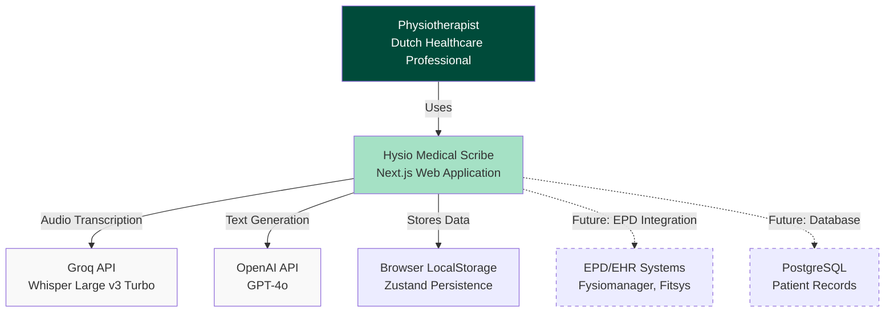
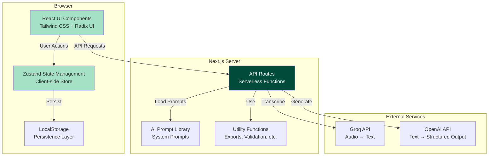
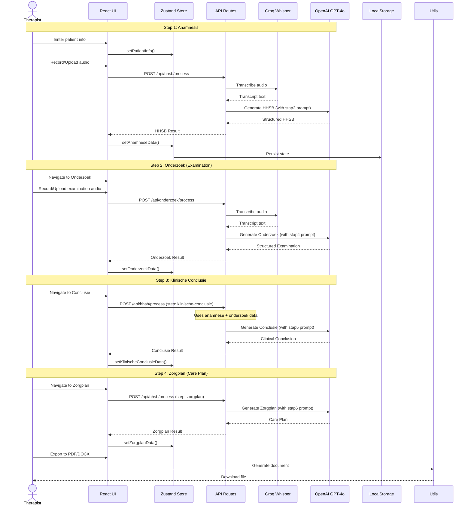
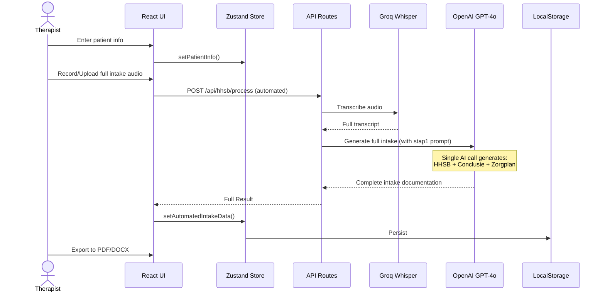
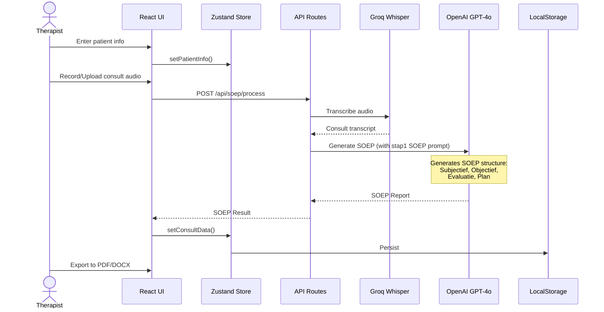
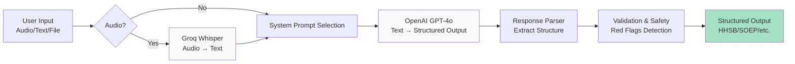
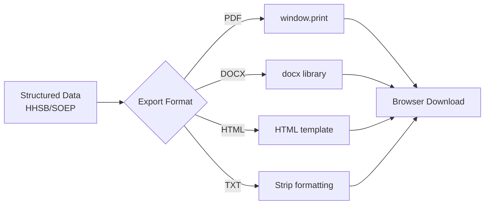

# Architecture Overview: Hysio Medical Scribe

## System Design Philosophy

Hysio follows a **pragmatic monolith** architecture pattern:
- **Single Next.js application** (not microservices - yet)
- **API routes as backend** (serverless-ready)
- **Zustand for state** (client-side, with persistence)
- **AI as orchestrated services** (Groq, OpenAI as external dependencies)
- **No database yet** (state persisted to localStorage, ready for DB migration)

This is **intentional**: Optimize for iteration speed and single-team development. Microservices when we need them, not before.

## High-Level Architecture (C4 Model - Level 1: Context)



## System Architecture (C4 Model - Level 2: Container)



## Data Flow: User Request Lifecycle

### Workflow 1: Intake Stapsgewijs (Step-by-Step Intake)



### Workflow 2: Intake Automatisch (Automated Intake)



### Workflow 3: Consult (Follow-up SOEP)



## Component Architecture (C4 Model - Level 3: Components)

### Frontend Components

```
hysio/src/
├── app/                              # Next.js App Router
│   ├── page.tsx                      # Landing page
│   ├── layout.tsx                    # Root layout
│   ├── scribe/                       # Scribe workflows
│   │   ├── page.tsx                  # Workflow entry
│   │   ├── layout.tsx                # Scribe layout
│   │   ├── workflow/                 # Workflow selection
│   │   ├── intake-stapsgewijs/       # Step-by-step workflow
│   │   │   ├── anamnese/             # Step 1
│   │   │   ├── anamnese-resultaat/   # Step 1 results
│   │   │   ├── onderzoek/            # Step 2
│   │   │   ├── onderzoek-resultaat/  # Step 2 results
│   │   │   ├── klinische-conclusie/  # Step 3
│   │   │   └── zorgplan/             # Step 4
│   │   ├── intake-automatisch/       # Automated workflow
│   │   │   ├── page.tsx              # Single-step input
│   │   │   └── conclusie/            # Results
│   │   └── consult/                  # Consult workflow
│   │       ├── page.tsx              # Consult input
│   │       └── soep-verslag/         # SOEP results
│   ├── assistant/                    # Hysio Assistant
│   ├── diagnosecode/                 # DiagnoseCode module
│   ├── edupack/                      # EduPack module
│   ├── smartmail/                    # SmartMail module
│   └── api/                          # API Routes (backend)
│       ├── preparation/              # Preparation generation
│       ├── hhsb/process/             # HHSB processing
│       ├── soep/process/             # SOEP processing
│       ├── onderzoek/process/        # Examination processing
│       ├── transcribe/               # Audio transcription
│       └── assistant/                # Assistant API
│
├── components/                       # React Components
│   ├── scribe/                       # Scribe-specific
│   │   ├── patient-info-form.tsx    # Patient info input
│   │   ├── hysio-assistant.tsx      # Embedded assistant
│   │   └── ...
│   ├── ui/                           # UI primitives
│   │   ├── audio-recorder.tsx       # Audio recording
│   │   ├── button.tsx, card.tsx     # Radix UI wrappers
│   │   ├── hhsb-results-panel.tsx   # HHSB display
│   │   ├── soep-result-view.tsx     # SOEP display
│   │   └── ...
│   ├── assistant/                    # Assistant components
│   ├── diagnosecode/                 # DiagnoseCode components
│   ├── edupack/                      # EduPack components
│   └── smartmail/                    # SmartMail components
│
├── lib/                              # Business Logic
│   ├── state/                        # State Management
│   │   ├── scribe-store.ts          # Main Zustand store
│   │   └── pre-intake-store.ts      # Pre-intake store
│   ├── api/                          # API Clients
│   │   ├── openai.ts                # OpenAI client
│   │   ├── groq.ts                  # Groq client
│   │   └── transcription.ts         # Transcription service
│   ├── prompts/                      # AI Prompts (CRITICAL)
│   │   ├── consult/                 # Consult prompts
│   │   ├── intake-automatisch/      # Automated intake prompts
│   │   ├── intake-stapsgewijs/      # Step-by-step prompts
│   │   └── index.ts                 # Prompt exports
│   ├── assistant/                    # Assistant logic
│   │   └── system-prompt.ts         # Assistant prompt
│   ├── medical/                      # Medical logic
│   │   ├── red-flags-detection.ts   # Red flags detector
│   │   └── ...
│   ├── utils/                        # Utilities
│   │   ├── document-export.ts       # PDF/DOCX export
│   │   ├── sanitize.ts              # XSS protection
│   │   ├── file-validation.ts       # Upload validation
│   │   └── ...
│   └── ...
│
└── types/                            # TypeScript Types
    ├── api.ts                        # API types
    ├── pre-intake.ts                 # Pre-intake types
    └── ...
```

### API Routes Architecture

```
API Routes (Backend):

/api/preparation/route.ts
├── Input: { workflowType, step, patientInfo, previousStepData? }
├── AI: OpenAI GPT-4o with preparation prompts
├── Output: { content: string, workflowType, step, generatedAt }
└── Purpose: Generate contextual preparation text before each step

/api/hhsb/process/route.ts
├── Input: { workflowType, step?, patientInfo, preparation?, inputData, previousStepData? }
├── Flow:
│   1. If inputData is audio → transcribe via Groq
│   2. Load appropriate system prompt (stap2/stap4/stap5/stap6)
│   3. Call OpenAI GPT-4o with prompt + transcript
│   4. Parse structured output (HHSB/Onderzoek/Conclusie/Zorgplan)
│   5. Detect red flags
├── Output: Structured clinical documentation
└── Purpose: Process intake workflows (both automated and step-by-step)

/api/soep/process/route.ts
├── Input: { workflowType: 'consult', patientInfo, preparation?, inputData }
├── Flow:
│   1. If inputData is audio → transcribe via Groq
│   2. Load SOEP prompt (stap1-verwerking-soep-verslag.ts)
│   3. Call OpenAI GPT-4o with SOEP prompt + transcript
│   4. Parse SOEP structure (S, O, E, P)
│   5. Detect red flags
├── Output: SOEP-structured consultation report
└── Purpose: Process follow-up consultations

/api/onderzoek/process/route.ts
├── Input: { patientInfo, preparation?, inputData, previousStepData.anamneseResult }
├── Flow: Similar to HHSB but specifically for examination step
├── Output: Structured examination findings
└── Purpose: Process examination step in step-by-step workflow

/api/transcribe/route.ts
├── Input: FormData with audio file
├── Flow: Call Groq Whisper Large v3 Turbo API
├── Output: { transcript: string, duration?: number }
└── Purpose: Audio transcription (used internally by other routes)

/api/assistant/route.ts
├── Input: { messages: ChatMessage[], conversationId? }
├── Flow:
│   1. Load Hysio Assistant system prompt
│   2. Call OpenAI GPT-4o in streaming mode
│   3. Apply clinical disclaimer if needed
│   4. Filter PII from input
├── Output: Streaming text response
└── Purpose: Hysio Assistant chat interface
```

## State Management Architecture

### Zustand Store Structure

**File**: `hysio/src/lib/state/scribe-store.ts`

```typescript
interface ScribeState {
  // Patient Information
  patientInfo: PatientInfo | null;
  setPatientInfo: (info: PatientInfo | null) => void;

  // Workflow Data (Step-by-step)
  workflowData: {
    anamneseData: WorkflowStepData<AnamneseResult> | null;
    onderzoekData: WorkflowStepData<OnderzoekResult> | null;
    klinischeConclusieData: WorkflowStepData<KlinischeConclusieResult> | null;
    zorgplanData: WorkflowStepData<any> | null;
    automatedIntakeData: WorkflowStepData<AutomatedIntakeResult> | null;
    consultData: WorkflowStepData<ConsultResult> | null;
    completedSteps: string[];
  };

  // SOEP Data (Consult)
  soepData: SOEPStructure | null;
  setSOEPData: (data: SOEPStructure | null) => void;

  // Current Workflow
  currentWorkflow: WorkflowType | null;
  setCurrentWorkflow: (workflow: WorkflowType | null) => void;

  // Setters for each workflow step
  setAnamneseData: (data: Partial<WorkflowStepData<AnamneseResult>>) => void;
  setOnderzoekData: (data: Partial<WorkflowStepData<OnderzoekResult>>) => void;
  setKlinischeConclusieData: (data: Partial<WorkflowStepData<KlinischeConclusieResult>>) => void;
  setZorgplanData: (data: Partial<WorkflowStepData<any>>) => void;
  setAutomatedIntakeData: (data: Partial<WorkflowStepData<AutomatedIntakeResult>>) => void;
  setConsultData: (data: Partial<WorkflowStepData<ConsultResult>>) => void;

  // Utilities
  validateStepDependencies: (step: string) => { isValid: boolean; missingSteps: string[] };
  getWorkflowProgress: (workflow: WorkflowType) => { completed: number; total: number; percentage: number };
  canProceedToStep: (step: string) => boolean;
  isStepCompleted: (step: string) => boolean;
  resetWorkflowState: () => void; // CRITICAL: Resets workflow data but preserves patient info
  resetScribeState: () => void; // Resets everything
}
```

**Key Design Decisions:**

1. **Immer Middleware**: All setters use Immer for immutable updates (lines 93-157)
   - Direct mutation inside Immer draft (safe and performant)
   - `Object.assign()` used instead of spread operators (Immer best practice)

2. **Persist Middleware**: State saved to localStorage
   - Only `patientInfo`, `workflowData`, `currentWorkflow`, `soepData` persisted
   - `sessionData` intentionally NOT persisted (session-specific)

3. **Workflow Isolation**: `resetWorkflowState()` function (lines 282-299)
   - Resets all workflow data to null
   - Preserves patient info (entered before workflow selection)
   - Called when navigating to workflow selection page
   - Guarantees pristine state for each new workflow session

## AI Orchestration Architecture

### The AI Pipeline



### System Prompts: The Core Intelligence

**Location**: `hysio/src/lib/prompts/`

Each workflow step has a dedicated system prompt that defines:
- Role and mission of the AI
- Input expectations
- Output structure requirements
- Clinical frameworks to follow
- Privacy and safety protocols
- Examples and anti-patterns

**Prompt Architecture Principles:**

1. **v7.0 Grounding Protocol** (Absolute Data Fidelity)
   - AI must ONLY use information explicitly present in input
   - Fabrication is PROHIBITED
   - Missing data is marked as "[Niet vermeld]"
   - Synthesis is allowed, invention is not

2. **v9.0 GOLDEN STANDARD** (SOEP Prompts)
   - Concise outputs (300-700 words per section max)
   - Structured with bullet points
   - Fully anonymized (no PII/PHI)
   - EPD-ready formatting

3. **v7.0 ULTRATHINK** (Hysio Assistant)
   - Evidence-based practice (EBP) focus
   - ICF model integration
   - Biopsychosocial perspective
   - Red flags awareness

**Critical Prompts to Understand:**

- `consult/stap1-verwerking-soep-verslag.ts` - SOEP generation (v9.0)
- `intake-stapsgewijs/stap2-verwerking-hhsb-anamnesekaart.ts` - HHSB anamnesis (v7.0)
- `intake-stapsgewijs/stap4-verwerking-onderzoeksbevindingen.ts` - Examination findings
- `intake-stapsgewijs/stap5-verwerking-klinische-conclusie.ts` - Clinical conclusion
- `intake-stapsgewijs/stap6-verwerking-zorgplan.ts` - Care plan
- `assistant/system-prompt.ts` - Hysio Assistant behavior

## Data Models & Type System

**Location**: `hysio/src/types/api.ts`

### Core Types

```typescript
// Patient Information
interface PatientInfo {
  initials: string;           // e.g., "J.D."
  birthYear: string;          // e.g., "1985"
  gender: 'male' | 'female';
  chiefComplaint: string;     // e.g., "Schouderpijn"
  additionalInfo?: string;    // Optional context
}

// Input Data (Audio, Transcribed Audio, or Manual Text)
type InputData = AudioInputData | TranscribedAudioInputData | ManualInputData;

interface AudioInputData {
  type: 'recording' | 'file';
  data: Blob | File;
  duration?: number;
}

interface TranscribedAudioInputData {
  type: 'transcribed-audio';
  data: string;
  originalSource: 'recording' | 'file';
  duration?: number;
  transcriptionConfidence?: number;
}

interface ManualInputData {
  type: 'manual';
  data: string;
}

// HHSB Structure (Anamnesis)
interface HHSBStructure {
  hulpvraag: string;         // Help request
  historie: string;          // History
  stoornissen: string;       // Impairments
  beperkingen: string;       // Limitations
  anamneseSummary: string;   // Summary
  redFlags: string[];        // Safety warnings
  fullStructuredText: string;// Complete formatted text
}

// SOEP Structure (Consultation)
interface SOEPStructure {
  subjectief: string;        // Subjective
  objectief: string;         // Objective
  evaluatie: string;         // Evaluation
  plan: string;              // Plan
  consultSummary: string;    // Summary (15-25 words)
  redFlags: string[];        // Safety warnings
  fullStructuredText: string;// Complete formatted text
}

// API Response Wrapper
interface ApiResponse<T = any> {
  success: boolean;
  data?: T;
  error?: string;
  message?: string;
}
```

### Workflow Step Data Wrapper

```typescript
interface WorkflowStepData<T> {
  preparation?: string;           // AI-generated preparation text
  recording?: File | null;        // Audio file (if uploaded)
  transcript?: string;            // Transcribed text
  result?: T;                     // Structured AI output
  completed?: boolean;            // Step completion status
  completedAt?: string;           // ISO timestamp
  processingDuration?: number;    // Milliseconds
  validationErrors?: string[];    // Validation issues
}
```

## Security & Privacy Architecture

### Privacy-First Design

**Automatic Anonymization** (enforced in all AI prompts):
- Patient names → "de patiënt" or "patiënt"
- Therapist names → "de therapeut" or "fysiotherapeut"
- Specific locations → generic terms ("thuis", "werk")
- Addresses, phone numbers, emails → removed entirely

**PII/PHI Protection**:
- No PII stored in backend (everything client-side in localStorage)
- AI prompts explicitly prohibit using PII in outputs
- Input filtering for PII detection (basic regex patterns)

**XSS Protection**:
- DOMPurify sanitization on all user inputs
- `createSafeHTML()` wrapper for `dangerouslySetInnerHTML`
- All user-generated content sanitized before display

**File Upload Validation**:
- Size limits: 50MB max
- Type validation: Audio formats only (MP3, WAV, M4A, etc.)
- Duration limits: Configurable per workflow
- Extension matching: File extension must match MIME type

### AVG/GDPR Compliance

**Data Minimization**:
- Only essential data collected (initials, birth year, gender)
- No full names, addresses, or contact info required

**Right to be Forgotten**:
- All data stored in browser localStorage (user-controlled)
- Clear localStorage = data deleted
- No server-side persistence (yet)

**Audit Trails** (future):
- All AI interactions logged (prepared for future implementation)
- Immutable logging for compliance
- 7-year retention period (medical records standard)

## Export & Document Generation

**Location**: `hysio/src/lib/utils/document-export.ts`

### Export Formats

1. **PDF**: Using browser print dialog (window.print())
2. **DOCX**: Using docx library (structured Word documents)
3. **HTML**: Formatted HTML with inline CSS
4. **TXT**: Plain text, stripped formatting

### Export Flow



## Performance Architecture

### Optimization Strategies

**Code Splitting**:
- Heavy components lazy-loaded (EduPack, DiagnoseCode, etc.)
- Dynamic imports for non-critical features
- Target: <2MB initial bundle, <500KB per route

**React Performance**:
- `React.memo()` on heavy components (AudioRecorder, HHSBResultsPanel)
- `useCallback()` on event handlers (prevent re-renders)
- `useMemo()` on expensive computations (HHSB parsing)

**API Performance**:
- Caching disabled (intentional - fresh results for medical data)
- Transcription optimized via Groq Whisper (fastest in market)
- OpenAI streaming for Assistant (lower perceived latency)

**State Performance**:
- Zustand with Immer (efficient immutable updates)
- LocalStorage persistence (async, doesn't block UI)
- Selective persistence (only essential data saved)

## Error Handling Architecture

### Error Boundaries

**Locations**:
- `hysio/src/components/error-boundary.tsx` - Global error boundary
- `hysio/src/components/workflow-error-boundary.tsx` - Workflow-specific

**Strategy**:
- React Error Boundaries catch render errors
- Fallback UI with error details and recovery options
- Toast notifications for user-facing errors
- Console logging for developer visibility

### API Error Handling

```typescript
try {
  const response = await openaiClient.chat.completions.create({...});
  // Process response
} catch (error) {
  if (error instanceof OpenAIError) {
    // Handle API errors (rate limits, auth, etc.)
  } else {
    // Handle unexpected errors
  }
  // Return user-friendly error
  return NextResponse.json({
    error: "Er is een fout opgetreden bij het verwerken van uw verzoek."
  }, { status: 500 });
}
```

## Testing Architecture (Current State)

**Testing Infrastructure**:
- Vitest (Jest replacement, faster)
- React Testing Library (component tests)
- Coverage thresholds: 15% (low, needs improvement)

**Existing Tests**:
- Utility functions: `sanitize.test.ts`, `file-validation.test.ts`, `hhsb-parser.test.ts`
- Components: `error-boundary.test.tsx`, `button.test.tsx`
- API integration: `api-integration.test.ts` (pre-intake module)

**Testing Gaps** (See `05-path-to-enterprise/testing-strategy.md`):
- No tests for AI prompts (prompt regression risk)
- No tests for critical workflow logic
- No E2E tests for complete user journeys
- No integration tests for API routes

## Deployment Architecture (Current)

**Development**:
```bash
npm run dev          # Next.js dev server (port 3000)
npm run build        # Production build
npm run start        # Production server
```

**Environment Variables**:
- `.env.example` - Template with all variables
- `.env.local` - Local development (not committed)
- Production: Set via deployment platform (Vercel, Kubernetes, etc.)

**Build Output**:
- Standalone mode enabled (`output: 'standalone'` in `next.config.ts`)
- Ready for containerization (Docker)
- Vercel-ready, AWS-ready, GCP-ready

## Future Architecture Considerations

### Database Migration (Phase 1)
- PostgreSQL for patient records and session data
- Redis for caching and session management
- Prisma ORM for type-safe queries

### Microservices Evolution (Phase 2)
- AI Service: Dedicated service for OpenAI/Groq orchestration
- Export Service: Dedicated service for PDF/DOCX generation
- Authentication Service: User management and RBAC

### Scalability (Phase 3)
- Kubernetes deployment for horizontal scaling
- Load balancing for API routes
- CDN for static assets
- Database read replicas

### Compliance (Phase 4)
- Medical device certification infrastructure
- Enhanced audit logging (immutable logs)
- Encryption at rest and in transit
- HIPAA/HITECH compliance for US market

---

**Key Takeaways:**
1. **Pragmatic monolith** - Not over-engineered, room to grow
2. **AI-centric** - System prompts are the core intelligence
3. **State-first** - Zustand with persistence, ready for DB
4. **Privacy by design** - Anonymization, PII protection, GDPR compliance
5. **Ready to scale** - Standalone build, API-first, stateless

**Next:** Read `user-lifecycles.md` to understand how users interact with this architecture.
