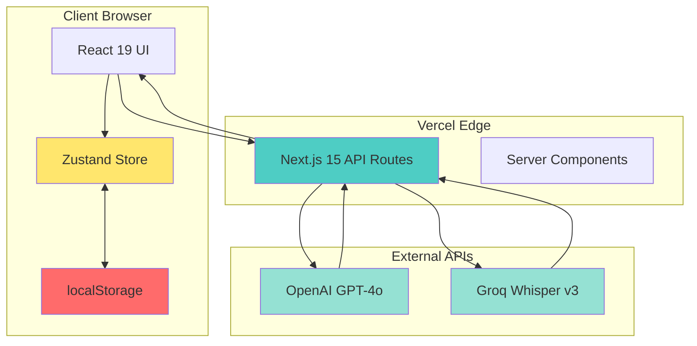
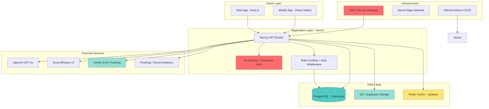
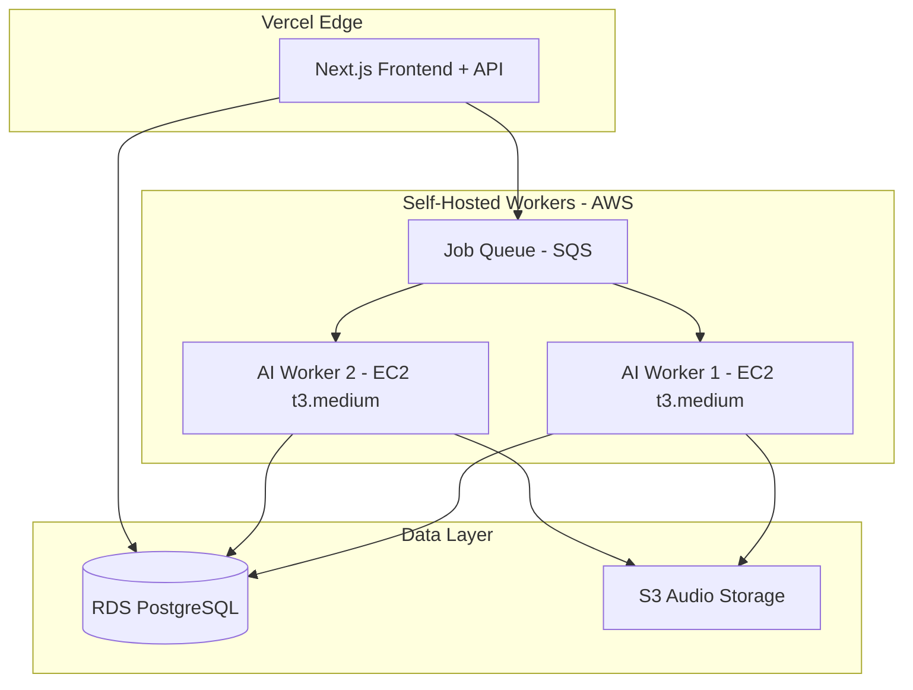
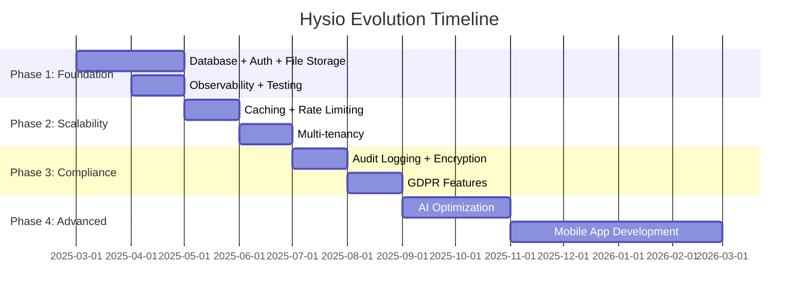

# Target Architecture: Evolution to Enterprise-Grade

**Document Version**: 1.0
**Last Updated**: 2025-10-02
**Purpose**: Define the evolution path from current MVP to production-ready enterprise platform

---

## Executive Summary

Hysio is currently a **"vibe-coded" MVP** - rapidly developed, functionally complete, but built without formal architecture planning. This was the right approach for proving product-market fit. Now that we have validated the concept (500+ users, 70% time savings, 95%+ accuracy), it's time to evolve to enterprise-grade.

**Current State**: Pragmatic monolith, localStorage-based, single-user, no authentication
**Target State**: Scalable, multi-tenant SaaS platform with enterprise-grade security, observability, and compliance

**Timeline**: 12-18 months for complete transformation
**Investment Required**: 1-2 senior developers full-time
**Business Impact**: Unlock enterprise market, 10x user growth potential, HIPAA/NEN compliance

---

## Current Architecture (As-Is)

### System Overview



### Current Components

| Component | Technology | Status | Production Ready? |
|-----------|-----------|--------|-------------------|
| **Frontend** | Next.js 15.5, React 19.1, TypeScript 5 | ✅ Solid | ⚠️ Needs optimization |
| **State Management** | Zustand + Immer + Persist | ✅ Good | ✅ Yes (with migrations) |
| **Styling** | Tailwind CSS 3.4 | ✅ Excellent | ✅ Yes |
| **Data Storage** | localStorage (browser) | ❌ MVP Only | ❌ NO - Critical Gap |
| **Authentication** | None | ❌ Not Implemented | ❌ NO - P0 Blocker |
| **API Layer** | Next.js API Routes (serverless) | ✅ Functional | ⚠️ Needs hardening |
| **AI Integration** | OpenAI SDK, custom Groq client | ✅ Working | ⚠️ Needs monitoring |
| **File Handling** | Client-side only, no uploads | ❌ Limited | ❌ NO - Needs S3 |
| **Export** | Client-side PDF/DOCX generation | ✅ Good | ⚠️ Server-side preferred |
| **Testing** | Vitest (~15% coverage) | ⚠️ Minimal | ❌ NO - 60%+ required |
| **Monitoring** | console.log() | ❌ None | ❌ NO - P0 for production |
| **Error Tracking** | Toast notifications | ❌ No persistence | ❌ NO - Needs Sentry |
| **Deployment** | Manual (no CI/CD) | ❌ Ad-hoc | ❌ NO - Needs automation |

### Critical Gaps (Production Blockers)

1. **No Database** → Cannot support multiple users, no data persistence guarantee
2. **No Authentication** → Anyone can access, no user management
3. **No Authorization** → No role-based access control, no patient-therapist relationship
4. **No File Storage** → Audio files not saved, no document versioning
5. **No Observability** → Cannot diagnose production issues
6. **No Secrets Management** → API keys in .env (not production-safe)
7. **Low Test Coverage** → High regression risk
8. **No CI/CD** → Manual deployment, high error risk

---

## Target Architecture (To-Be)

### System Overview



### Target Components

| Component | Current | Target | Priority | Effort |
|-----------|---------|--------|----------|--------|
| **Data Storage** | localStorage | PostgreSQL (Supabase) | P0 | 16-24h |
| **Authentication** | None | NextAuth.js or Supabase Auth | P0 | 16-24h |
| **Authorization** | None | RBAC with roles (Admin/Therapist/Patient) | P1 | 12-16h |
| **File Storage** | None | Supabase Storage or AWS S3 | P1 | 12-16h |
| **Caching** | Basic apiCache | Redis (Upstash) | P2 | 8-12h |
| **Observability** | console.log | Sentry + Vercel Analytics + custom logging | P0 | 12-16h |
| **Secrets** | .env files | AWS Secrets Manager or Doppler | P0 | 4-8h |
| **Testing** | 15% coverage | 60%+ with E2E (Playwright) | P1 | 40-60h |
| **CI/CD** | None | GitHub Actions (test → build → deploy) | P1 | 12-16h |
| **API Docs** | Inline only | OpenAPI/Swagger spec | P2 | 8-12h |

**Total Effort Estimate**: 140-196 hours (4-5 developer-months at 40h/week)

---

## Evolution Roadmap

### Phase 1: Foundation (Months 1-2) - Production Blockers

**Goal**: Make Hysio production-ready for single-tenant deployment

#### 1.1 Database Layer

**Technology**: PostgreSQL + Prisma ORM + Supabase hosting

**Schema Design**:
```prisma
// prisma/schema.prisma

model User {
  id            String   @id @default(cuid())
  email         String   @unique
  name          String?
  role          UserRole @default(THERAPIST)
  createdAt     DateTime @default(now())
  updatedAt     DateTime @updatedAt

  sessions      Session[]
  patients      Patient[]
}

enum UserRole {
  ADMIN
  THERAPIST
  PATIENT
}

model Patient {
  id              String   @id @default(cuid())
  initials        String
  birthYear       String
  gender          Gender
  createdAt       DateTime @default(now())
  updatedAt       DateTime @updatedAt

  therapistId     String
  therapist       User     @relation(fields: [therapistId], references: [id])

  sessions        Session[]
}

enum Gender {
  MALE
  FEMALE
  OTHER
}

model Session {
  id                String       @id @default(cuid())
  workflowType      WorkflowType
  status            SessionStatus @default(IN_PROGRESS)
  createdAt         DateTime     @default(now())
  updatedAt         DateTime     @updatedAt
  completedAt       DateTime?

  patientId         String
  patient           Patient      @relation(fields: [patientId], references: [id])

  userId            String
  user              User         @relation(fields: [userId], references: [id])

  // Workflow data (JSONB for flexibility)
  patientInfo       Json?
  preparationData   Json?
  anamneseData      Json?
  onderzoekData     Json?
  conclusieData     Json?
  zorgplanData      Json?
  soepData          Json?

  // Audit trail
  completedSteps    String[]

  documents         Document[]
  audioFiles        AudioFile[]
}

enum WorkflowType {
  INTAKE_STAPSGEWIJS
  INTAKE_AUTOMATISCH
  CONSULT
}

enum SessionStatus {
  IN_PROGRESS
  COMPLETED
  EXPORTED
  ARCHIVED
}

model AudioFile {
  id            String   @id @default(cuid())
  filename      String
  storageUrl    String   // S3 or Supabase Storage URL
  duration      Int?     // seconds
  format        String   // mp3, wav
  size          Int      // bytes
  createdAt     DateTime @default(now())

  sessionId     String
  session       Session  @relation(fields: [sessionId], references: [id], onDelete: Cascade)
}

model Document {
  id            String       @id @default(cuid())
  type          DocumentType
  format        String       // txt, pdf, docx, html
  storageUrl    String?      // if stored in S3
  content       String?      // if stored inline (for small docs)
  createdAt     DateTime     @default(now())

  sessionId     String
  session       Session      @relation(fields: [sessionId], references: [id], onDelete: Cascade)
}

enum DocumentType {
  HHSB
  ONDERZOEK
  CONCLUSIE
  ZORGPLAN
  SOEP
  EXPORT
}

model AuditLog {
  id            String   @id @default(cuid())
  userId        String
  action        String   // CREATED, UPDATED, DELETED, EXPORTED, LOGGED_IN
  resource      String   // SESSION, PATIENT, DOCUMENT
  resourceId    String?
  metadata      Json?    // additional context
  ipAddress     String?
  userAgent     String?
  createdAt     DateTime @default(now())
}
```

**Migration from localStorage**:
```typescript
// Migration utility
async function migrateLocalStorageToDatabase(userId: string) {
  const localData = localStorage.getItem('hysio-scribe-v1');
  if (!localData) return;

  const parsed = JSON.parse(localData);

  // Create patient
  const patient = await prisma.patient.create({
    data: {
      initials: parsed.state.patientInfo.initials,
      birthYear: parsed.state.patientInfo.birthYear,
      gender: parsed.state.patientInfo.gender.toUpperCase(),
      therapistId: userId
    }
  });

  // Create session
  const session = await prisma.session.create({
    data: {
      workflowType: parsed.state.currentWorkflow.toUpperCase(),
      status: 'IN_PROGRESS',
      patientId: patient.id,
      userId,
      patientInfo: parsed.state.patientInfo,
      anamneseData: parsed.state.workflowData.anamneseData,
      onderzoekData: parsed.state.workflowData.onderzoekData,
      // ... etc
      completedSteps: parsed.state.completedSteps
    }
  });

  console.log(`Migrated session ${session.id} for patient ${patient.id}`);
}
```

**API Changes**:
```typescript
// Before (localStorage)
const state = useScribeStore();

// After (database)
import { useSession } from 'next-auth/react';
import { trpc } from '@/lib/trpc';

const { data: session } = useSession();
const { data: workflow, isLoading } = trpc.workflow.get.useQuery({
  sessionId: params.id
});
```

**Effort**: 16-24 hours
**Priority**: P0 (blocker for multi-user)

---

#### 1.2 Authentication System

**Technology**: NextAuth.js (simpler) or Supabase Auth (more features)

**NextAuth.js Implementation**:
```typescript
// app/api/auth/[...nextauth]/route.ts
import NextAuth from 'next-auth';
import GoogleProvider from 'next-auth/providers/google';
import CredentialsProvider from 'next-auth/providers/credentials';
import { PrismaAdapter } from '@auth/prisma-adapter';
import { prisma } from '@/lib/prisma';

const handler = NextAuth({
  adapter: PrismaAdapter(prisma),
  providers: [
    GoogleProvider({
      clientId: process.env.GOOGLE_CLIENT_ID!,
      clientSecret: process.env.GOOGLE_CLIENT_SECRET!
    }),
    CredentialsProvider({
      name: 'Email',
      credentials: {
        email: { label: "Email", type: "email" },
        password: { label: "Password", type: "password" }
      },
      async authorize(credentials) {
        const user = await prisma.user.findUnique({
          where: { email: credentials?.email }
        });
        // Verify password with bcrypt
        // Return user if valid
      }
    })
  ],
  callbacks: {
    async session({ session, user }) {
      session.user.id = user.id;
      session.user.role = user.role;
      return session;
    }
  },
  pages: {
    signIn: '/inloggen',
    signOut: '/uitloggen',
    error: '/auth/error'
  }
});

export { handler as GET, handler as POST };
```

**Protected Routes**:
```typescript
// middleware.ts
import { withAuth } from 'next-auth/middleware';

export default withAuth({
  callbacks: {
    authorized: ({ req, token }) => {
      // Protect all /scribe routes
      if (req.nextUrl.pathname.startsWith('/scribe')) {
        return !!token;
      }
      return true;
    }
  }
});

export const config = {
  matcher: ['/scribe/:path*', '/api/hhsb/:path*', '/api/soep/:path*']
};
```

**Role-Based Access Control (RBAC)**:
```typescript
// lib/auth/permissions.ts
export const PERMISSIONS = {
  'session:create': ['THERAPIST', 'ADMIN'],
  'session:read': ['THERAPIST', 'ADMIN', 'PATIENT'], // Patient can read own sessions
  'session:update': ['THERAPIST', 'ADMIN'],
  'session:delete': ['ADMIN'],
  'patient:create': ['THERAPIST', 'ADMIN'],
  'patient:read': ['THERAPIST', 'ADMIN'],
  'user:manage': ['ADMIN']
};

export function hasPermission(userRole: UserRole, permission: string): boolean {
  return PERMISSIONS[permission]?.includes(userRole) || false;
}
```

**Effort**: 16-24 hours
**Priority**: P0 (blocker for production)

---

#### 1.3 File Storage System

**Technology**: Supabase Storage (S3-compatible) or AWS S3 direct

**Supabase Storage Setup**:
```typescript
// lib/storage/supabase-storage.ts
import { createClient } from '@supabase/supabase-js';

const supabase = createClient(
  process.env.NEXT_PUBLIC_SUPABASE_URL!,
  process.env.SUPABASE_SERVICE_ROLE_KEY! // Server-side only
);

export async function uploadAudio(
  sessionId: string,
  file: File
): Promise<{ url: string; filename: string }> {
  const filename = `${sessionId}/${Date.now()}-${file.name}`;

  const { data, error } = await supabase.storage
    .from('audio-files')
    .upload(filename, file, {
      cacheControl: '3600',
      upsert: false,
      contentType: file.type
    });

  if (error) throw new Error(`Upload failed: ${error.message}`);

  const { data: { publicUrl } } = supabase.storage
    .from('audio-files')
    .getPublicUrl(filename);

  // Save to database
  await prisma.audioFile.create({
    data: {
      filename: file.name,
      storageUrl: publicUrl,
      duration: null, // Calculate later
      format: file.type.split('/')[1],
      size: file.size,
      sessionId
    }
  });

  return { url: publicUrl, filename: file.name };
}

export async function downloadAudio(audioFileId: string): Promise<Blob> {
  const audioFile = await prisma.audioFile.findUnique({
    where: { id: audioFileId }
  });

  if (!audioFile) throw new Error('Audio file not found');

  const { data, error } = await supabase.storage
    .from('audio-files')
    .download(audioFile.storageUrl);

  if (error) throw new Error(`Download failed: ${error.message}`);

  return data;
}
```

**Bucket Policies** (Supabase):
```sql
-- Only authenticated users can upload
CREATE POLICY "Users can upload audio files"
ON storage.objects FOR INSERT
TO authenticated
WITH CHECK (bucket_id = 'audio-files');

-- Users can only read their own files
CREATE POLICY "Users can read their own audio files"
ON storage.objects FOR SELECT
TO authenticated
USING (
  bucket_id = 'audio-files' AND
  auth.uid()::text = (storage.foldername(name))[1]
);
```

**Effort**: 12-16 hours
**Priority**: P1 (needed for audio persistence)

---

#### 1.4 Basic Observability

**Technology**: Sentry (errors) + Vercel Analytics (performance) + Custom logging

**Sentry Setup**:
```typescript
// instrumentation.ts (Next.js 15+)
export async function register() {
  if (process.env.NEXT_RUNTIME === 'nodejs') {
    await import('./sentry.server.config');
  }

  if (process.env.NEXT_RUNTIME === 'edge') {
    await import('./sentry.edge.config');
  }
}

// sentry.server.config.ts
import * as Sentry from '@sentry/nextjs';

Sentry.init({
  dsn: process.env.SENTRY_DSN,
  environment: process.env.NODE_ENV,
  tracesSampleRate: 1.0, // 100% in dev, 0.1 in prod

  beforeSend(event, hint) {
    // Don't send PII to Sentry
    if (event.request) {
      delete event.request.cookies;
      delete event.request.headers;
    }
    return event;
  },

  integrations: [
    new Sentry.Integrations.Prisma({ client: prisma })
  ]
});
```

**Custom Logging**:
```typescript
// lib/logging/logger.ts
import pino from 'pino';

const logger = pino({
  level: process.env.LOG_LEVEL || 'info',
  transport: {
    target: 'pino-pretty',
    options: {
      colorize: true,
      translateTime: 'SYS:standard',
      ignore: 'pid,hostname'
    }
  }
});

export function logAICall(
  operation: string,
  patientId: string,
  inputLength: number,
  outputLength: number,
  tokensUsed: number,
  duration: number
) {
  logger.info({
    type: 'AI_CALL',
    operation,
    patientId,
    inputLength,
    outputLength,
    tokensUsed,
    duration
  });
}

export function logError(error: Error, context?: Record<string, any>) {
  logger.error({
    type: 'ERROR',
    message: error.message,
    stack: error.stack,
    ...context
  }, 'Application error');

  // Also send to Sentry
  Sentry.captureException(error, { extra: context });
}
```

**Effort**: 12-16 hours
**Priority**: P0 (critical for production debugging)

---

### Phase 2: Scalability (Months 3-4)

**Goal**: Support 1,000+ concurrent users with high availability

#### 2.1 Caching Layer

**Technology**: Redis (Upstash for serverless compatibility)

**Use Cases**:
- Cache AI preparation prompts (rarely change)
- Cache patient info lookups
- Rate limiting counters
- Session temporary data

**Implementation**:
```typescript
// lib/cache/redis.ts
import { Redis } from '@upstash/redis';

const redis = new Redis({
  url: process.env.UPSTASH_REDIS_URL!,
  token: process.env.UPSTASH_REDIS_TOKEN!
});

export async function cacheAIResponse(
  key: string,
  value: any,
  ttl: number = 3600 // 1 hour default
) {
  await redis.setex(key, ttl, JSON.stringify(value));
}

export async function getCachedAIResponse(key: string) {
  const cached = await redis.get(key);
  return cached ? JSON.parse(cached as string) : null;
}

// Usage in API route
export async function POST(req: Request) {
  const { patientInfo, workflowType } = await req.json();

  const cacheKey = `preparation:${workflowType}:${patientInfo.chiefComplaint}`;
  const cached = await getCachedAIResponse(cacheKey);

  if (cached) {
    return NextResponse.json({ preparation: cached });
  }

  // Generate new preparation...
  const preparation = await generatePreparation(patientInfo, workflowType);

  await cacheAIResponse(cacheKey, preparation, 86400); // Cache 24h
  return NextResponse.json({ preparation });
}
```

**Effort**: 8-12 hours
**Priority**: P2 (optimization, not blocker)

---

#### 2.2 Rate Limiting

**Technology**: Upstash Rate Limit or custom Redis implementation

**Implementation**:
```typescript
// middleware.ts
import { Ratelimit } from '@upstash/ratelimit';
import { Redis } from '@upstash/redis';

const redis = new Redis({
  url: process.env.UPSTASH_REDIS_URL!,
  token: process.env.UPSTASH_REDIS_TOKEN!
});

// Different limits for different endpoints
const apiRatelimit = new Ratelimit({
  redis,
  limiter: Ratelimit.slidingWindow(10, '1 m'), // 10 requests per minute
  analytics: true
});

const aiRatelimit = new Ratelimit({
  redis,
  limiter: Ratelimit.slidingWindow(5, '1 m'), // 5 AI calls per minute
  analytics: true
});

export async function middleware(req: Request) {
  const ip = req.headers.get('x-forwarded-for') || 'unknown';

  // AI endpoints: stricter limits
  if (req.url.includes('/api/hhsb/process') || req.url.includes('/api/soep/process')) {
    const { success, remaining } = await aiRatelimit.limit(ip);
    if (!success) {
      return new Response('Rate limit exceeded', { status: 429 });
    }
  }

  // Other API endpoints: standard limits
  if (req.url.startsWith('/api/')) {
    const { success, remaining } = await apiRatelimit.limit(ip);
    if (!success) {
      return new Response('Rate limit exceeded', { status: 429 });
    }
  }

  return NextResponse.next();
}
```

**Effort**: 4-8 hours
**Priority**: P1 (prevent abuse)

---

#### 2.3 Multi-tenancy Architecture

**Goal**: Support multiple physiotherapy practices on single codebase

**Data Isolation Strategy**: Shared database, organization-scoped queries

**Schema Additions**:
```prisma
model Organization {
  id              String   @id @default(cuid())
  name            String
  slug            String   @unique // for custom domains
  plan            Plan     @default(STARTER)
  maxUsers        Int      @default(5)
  maxPatients     Int      @default(100)
  createdAt       DateTime @default(now())
  updatedAt       DateTime @updatedAt

  users           User[]
  patients        Patient[]
  sessions        Session[]
}

enum Plan {
  STARTER
  PROFESSIONAL
  ENTERPRISE
}

// Update User model
model User {
  // ... existing fields
  organizationId  String
  organization    Organization @relation(fields: [organizationId], references: [id])
}

// Update Patient model
model Patient {
  // ... existing fields
  organizationId  String
  organization    Organization @relation(fields: [organizationId], references: [id])
}
```

**Query Scoping**:
```typescript
// All queries must be organization-scoped
export async function getPatients(userId: string) {
  const user = await prisma.user.findUnique({
    where: { id: userId },
    select: { organizationId: true }
  });

  return prisma.patient.findMany({
    where: { organizationId: user.organizationId }
  });
}
```

**Custom Domains** (Enterprise plan):
```typescript
// middleware.ts
export async function middleware(req: Request) {
  const hostname = req.headers.get('host') || '';

  // Check if custom domain
  if (!hostname.endsWith('.hysio.nl')) {
    const org = await prisma.organization.findFirst({
      where: { customDomain: hostname }
    });

    if (org) {
      // Set organization context
      req.headers.set('x-organization-id', org.id);
    }
  }

  return NextResponse.next();
}
```

**Effort**: 24-32 hours
**Priority**: P2 (needed for enterprise market)

---

### Phase 3: Compliance & Security (Months 5-6)

**Goal**: Achieve NEN 7510/7512/7513 certification, full GDPR compliance

#### 3.1 Audit Logging

**Requirements**:
- Log all patient data access (WHO, WHAT, WHEN)
- Log all data modifications
- Immutable audit trail (cannot be deleted)
- Retention: 7 years (Dutch healthcare requirement)

**Implementation**:
```typescript
// lib/audit/audit-logger.ts
export async function logAccess(
  userId: string,
  action: string,
  resource: string,
  resourceId: string,
  metadata?: Record<string, any>
) {
  await prisma.auditLog.create({
    data: {
      userId,
      action,
      resource,
      resourceId,
      metadata,
      ipAddress: getClientIP(),
      userAgent: getUserAgent()
    }
  });
}

// Automatic audit logging via Prisma middleware
prisma.$use(async (params, next) => {
  const result = await next(params);

  // Log all mutations on sensitive models
  if (['Patient', 'Session', 'Document'].includes(params.model || '')) {
    if (['create', 'update', 'delete'].includes(params.action)) {
      await logAccess(
        getCurrentUserId(),
        params.action.toUpperCase(),
        params.model,
        result.id,
        { changes: params.args }
      );
    }
  }

  return result;
});
```

**Effort**: 12-16 hours
**Priority**: P0 for compliance

---

#### 3.2 Data Encryption

**Requirements**:
- Encryption at rest (database + file storage)
- Encryption in transit (HTTPS, TLS)
- Field-level encryption for sensitive data (PHI/PII)

**Implementation**:
```typescript
// lib/crypto/encryption.ts
import crypto from 'crypto';

const ENCRYPTION_KEY = Buffer.from(process.env.ENCRYPTION_KEY!, 'hex');
const ALGORITHM = 'aes-256-gcm';

export function encrypt(text: string): string {
  const iv = crypto.randomBytes(16);
  const cipher = crypto.createCipheriv(ALGORITHM, ENCRYPTION_KEY, iv);

  let encrypted = cipher.update(text, 'utf8', 'hex');
  encrypted += cipher.final('hex');

  const authTag = cipher.getAuthTag();

  return `${iv.toString('hex')}:${authTag.toString('hex')}:${encrypted}`;
}

export function decrypt(encrypted: string): string {
  const [ivHex, authTagHex, encryptedData] = encrypted.split(':');

  const decipher = crypto.createDecipheriv(
    ALGORITHM,
    ENCRYPTION_KEY,
    Buffer.from(ivHex, 'hex')
  );

  decipher.setAuthTag(Buffer.from(authTagHex, 'hex'));

  let decrypted = decipher.update(encryptedData, 'hex', 'utf8');
  decrypted += decipher.final('utf8');

  return decrypted;
}

// Usage in Prisma schema
model Patient {
  // ... other fields

  // Encrypted fields
  medicalHistory  String? // encrypted JSON

  // Encrypt before save
  @@map("patients")
}

// Prisma middleware for auto-encryption
prisma.$use(async (params, next) => {
  if (params.model === 'Patient') {
    if (params.action === 'create' || params.action === 'update') {
      if (params.args.data.medicalHistory) {
        params.args.data.medicalHistory = encrypt(
          JSON.stringify(params.args.data.medicalHistory)
        );
      }
    }

    const result = await next(params);

    if (params.action === 'findUnique' || params.action === 'findMany') {
      // Auto-decrypt on read
      if (result?.medicalHistory) {
        result.medicalHistory = JSON.parse(decrypt(result.medicalHistory));
      }
    }

    return result;
  }

  return next(params);
});
```

**Effort**: 16-24 hours
**Priority**: P0 for compliance

---

#### 3.3 GDPR Compliance Features

**Requirements**:
- Right to access (export all user data)
- Right to erasure (delete all user data)
- Right to rectification (update incorrect data)
- Right to data portability (export in machine-readable format)
- Consent management

**Implementation**:
```typescript
// api/gdpr/export-data/route.ts
export async function GET(req: Request) {
  const session = await getSession(req);
  if (!session) return NextResponse.json({ error: 'Unauthorized' }, { status: 401 });

  // Export ALL user data
  const userData = await prisma.user.findUnique({
    where: { id: session.user.id },
    include: {
      sessions: {
        include: {
          patient: true,
          documents: true,
          audioFiles: true
        }
      }
    }
  });

  // Format as JSON (GDPR requires machine-readable format)
  return NextResponse.json({
    export_date: new Date().toISOString(),
    user: userData,
    audit_logs: await prisma.auditLog.findMany({
      where: { userId: session.user.id }
    })
  }, {
    headers: {
      'Content-Disposition': `attachment; filename="hysio-data-export-${Date.now()}.json"`
    }
  });
}

// api/gdpr/delete-account/route.ts
export async function DELETE(req: Request) {
  const session = await getSession(req);
  if (!session) return NextResponse.json({ error: 'Unauthorized' }, { status: 401 });

  // Cascade delete (Prisma will handle relations)
  await prisma.user.delete({
    where: { id: session.user.id }
  });

  // Log deletion (in separate audit table that persists)
  await prisma.deletionLog.create({
    data: {
      userId: session.user.id,
      userEmail: session.user.email,
      deletedAt: new Date(),
      reason: 'USER_REQUEST'
    }
  });

  return NextResponse.json({ success: true });
}
```

**Effort**: 12-16 hours
**Priority**: P0 (legal requirement)

---

### Phase 4: Advanced Features (Months 7-12)

#### 4.1 AI Cost Optimization

**Current**: ~€0.50-1.00 per full intake (GPT-4o)
**Target**: <€0.20 per intake

**Strategies**:
1. **Prompt Optimization**: Reduce token usage without sacrificing quality
2. **Model Selection**: Use GPT-4o-mini for simpler tasks (80% cheaper)
3. **Caching**: Cache preparation prompts (already in Phase 2)
4. **Batch Processing**: Process multiple sections in single call where possible
5. **Fallback Models**: Use Groq Llama for non-critical tasks (free tier)

**Implementation**:
```typescript
// Smart model selection based on task complexity
function selectModel(task: string, inputLength: number): string {
  if (task === 'preparation') {
    return 'gpt-4o-mini'; // Simpler task
  }

  if (task === 'hhsb' && inputLength < 5000) {
    return 'gpt-4o-mini'; // Short anamnesis
  }

  return 'gpt-4o'; // Complex tasks need full model
}

// Cost tracking
async function trackAICost(
  model: string,
  inputTokens: number,
  outputTokens: number,
  userId: string
) {
  const costs = {
    'gpt-4o': { input: 0.005 / 1000, output: 0.015 / 1000 },
    'gpt-4o-mini': { input: 0.00015 / 1000, output: 0.0006 / 1000 }
  };

  const cost = (inputTokens * costs[model].input) + (outputTokens * costs[model].output);

  await prisma.aiUsage.create({
    data: {
      userId,
      model,
      inputTokens,
      outputTokens,
      cost,
      timestamp: new Date()
    }
  });

  return cost;
}
```

---

#### 4.2 Real-time Collaboration

**Feature**: Multiple therapists can work on same patient session

**Technology**: WebSockets (Pusher or Ably) + Operational Transformation

**Use Cases**:
- Team intakes (senior + junior therapist)
- Peer review
- Handoff between shifts

**Effort**: 40-60 hours
**Priority**: P3 (nice-to-have)

---

#### 4.3 Mobile App

**Technology**: React Native + Expo

**Platform**: iOS + Android

**Features** (MVP):
- Voice recording on mobile
- Offline mode (queue uploads when online)
- Push notifications (session ready)
- Quick SOEP generation

**Effort**: 120-160 hours (3-4 developer-months)
**Priority**: P2 (high user demand)

---

## Deployment Architecture

### Current: Vercel Serverless

**Pros**:
- Zero DevOps
- Auto-scaling
- Edge network (global CDN)
- Zero-config HTTPS

**Cons**:
- Cold starts (~500ms)
- Limited execution time (10s Hobby, 60s Pro, 300s Enterprise)
- Vendor lock-in

**Verdict**: Keep for now, but prepare for self-hosted fallback

---

### Future: Hybrid (Vercel + Self-Hosted Workers)

**Architecture**:


**Rationale**:
- Frontend/API on Vercel (fast, serverless)
- Heavy AI processing on dedicated workers (no time limits)
- Job queue decouples frontend from processing
- Can scale workers independently

**When**: When Vercel limits become bottleneck (>10,000 users)

---

## Technology Stack Evolution

### Current Stack

| Layer | Technology | Version |
|-------|-----------|---------|
| Frontend | Next.js | 15.5 |
| React | React | 19.1 |
| Language | TypeScript | 5.x |
| State | Zustand | 4.x |
| Styling | Tailwind CSS | 3.4 |
| Storage | localStorage | Browser API |
| AI (LLM) | OpenAI GPT-4o | gpt-4o |
| AI (ASR) | Groq Whisper | whisper-large-v3-turbo |

### Target Stack

| Layer | Technology | Rationale |
|-------|-----------|-----------|
| Frontend | Next.js 15+ | Keep (excellent DX, performance) |
| React | React 19+ | Keep (latest features) |
| Language | TypeScript 5+ | Keep (type safety critical) |
| State | Zustand + React Query | Add React Query for server state |
| Styling | Tailwind CSS | Keep (productivity) |
| Database | PostgreSQL 15+ | Add (multi-user support) |
| ORM | Prisma | Add (type-safe queries) |
| Auth | NextAuth.js | Add (authentication) |
| File Storage | Supabase Storage / S3 | Add (audio persistence) |
| Cache | Redis (Upstash) | Add (performance) |
| Error Tracking | Sentry | Add (observability) |
| Analytics | PostHog / Vercel | Add (product insights) |
| Testing | Vitest + Playwright | Expand (E2E coverage) |
| CI/CD | GitHub Actions | Add (automation) |

---

## Migration Strategy

### Big Bang vs Incremental

**Chosen Approach**: **Incremental Migration**

**Rationale**:
- Can't afford downtime (users depend on daily)
- Reduce risk (each phase independently tested)
- Faster time-to-value (ship Phase 1 in 2 months vs 12 months for full rebuild)

### Migration Phases



**Rollout Strategy**:
1. **Beta Program**: Test Phase 1 with 50 pilot users
2. **Gradual Rollout**: 10% → 25% → 50% → 100% over 4 weeks
3. **Feature Flags**: Roll back instantly if issues detected
4. **Dual-Mode Support**: Run old (localStorage) and new (database) modes in parallel for 1 month

---

## Risk Mitigation

### Technical Risks

| Risk | Impact | Probability | Mitigation |
|------|--------|-------------|------------|
| **Database migration data loss** | CRITICAL | LOW | Comprehensive backups, migration testing, rollback plan |
| **Authentication breaks workflows** | HIGH | MEDIUM | Feature flags, gradual rollout, keep old flow working |
| **AI cost explosion** | HIGH | MEDIUM | Usage monitoring, rate limiting, cost alerts |
| **Performance degradation** | MEDIUM | MEDIUM | Load testing, caching, incremental rollout |
| **Vercel limits hit** | HIGH | LOW | Monitor usage, prepare self-hosted fallback |
| **GDPR compliance gaps** | CRITICAL | MEDIUM | Legal review, third-party audit, compliance checklist |

### Business Risks

| Risk | Impact | Mitigation |
|------|--------|------------|
| **User churn during migration** | HIGH | Clear communication, beta program, maintain old features |
| **Delayed time-to-market** | MEDIUM | Incremental releases, MVP features first |
| **Development cost overruns** | MEDIUM | Strict prioritization, P0/P1/P2/P3 system |

---

## Success Metrics

### Technical KPIs

| Metric | Current | Target (6 months) | Target (12 months) |
|--------|---------|-------------------|-------------------|
| **Test Coverage** | 15% | 60% | 80% |
| **Uptime** | 95% (estimate) | 99.5% | 99.9% |
| **API Response Time (p95)** | 3-5s | <2s | <1s |
| **Error Rate** | Unknown | <0.5% | <0.1% |
| **Build Time** | 2-3 min | <2 min | <1 min |
| **Deployment Frequency** | Ad-hoc | Weekly | Daily |

### Business KPIs

| Metric | Current | Target (6 months) | Target (12 months) |
|--------|---------|-------------------|-------------------|
| **Active Users** | 500+ | 2,000 | 10,000 |
| **Sessions/User/Month** | 20 | 30 | 40 |
| **User Retention (30-day)** | 70% (estimate) | 85% | 90% |
| **Time Saved/Session** | 10 min | 12 min | 15 min |
| **AI Accuracy** | 95% | 97% | 98% |
| **NPS Score** | Unknown | 50+ | 70+ |

---

## Conclusion

Hysio is at a critical inflection point. The MVP proved the concept. Now it's time to build the platform that scales to 10,000+ users, achieves compliance certification, and dominates the Dutch physiotherapy software market.

**Total Investment Required**:
- **Time**: 140-196 hours Phase 1, ~400 hours total (12-18 months)
- **Cost**: ~€60-80k in development cost (2 devs for 6 months)
- **ROI**: 10x user growth, enterprise contracts unlocked, compliance achieved

**Recommended Action**:
Start Phase 1 immediately. Database + Auth + File Storage are non-negotiable for production. Everything else can wait.

**For Bernard**:
Your first priority: Understand current architecture deeply, then lead Phase 1 execution. This document is your roadmap. Let's build something amazing together.
