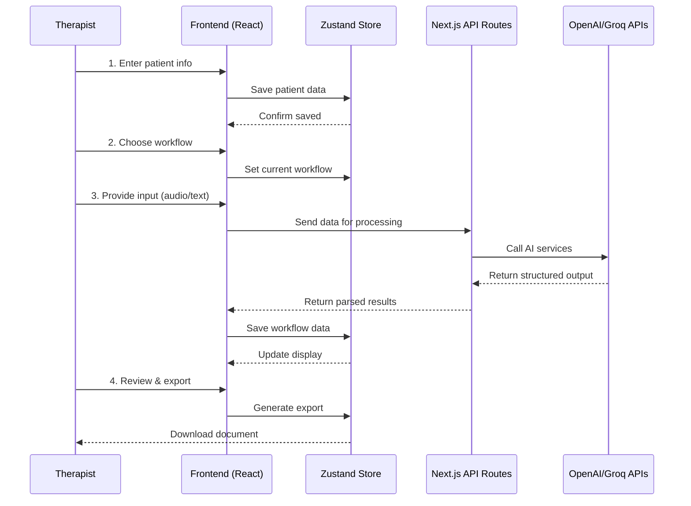
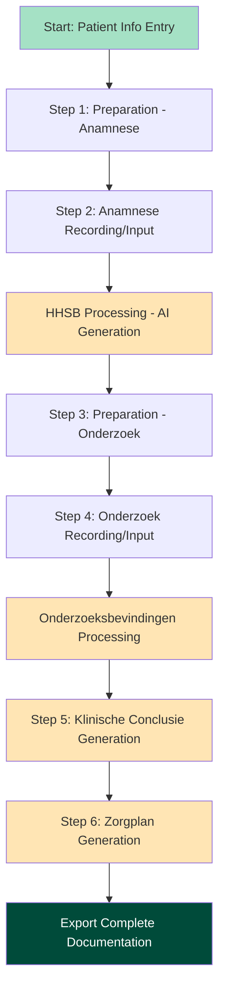
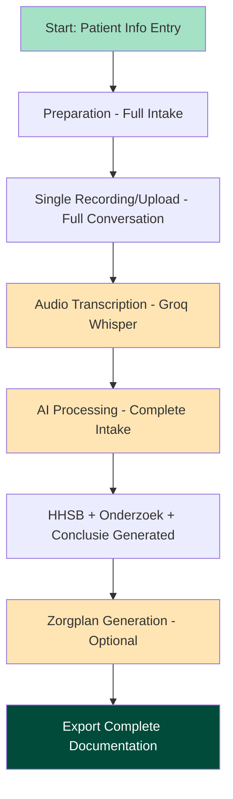
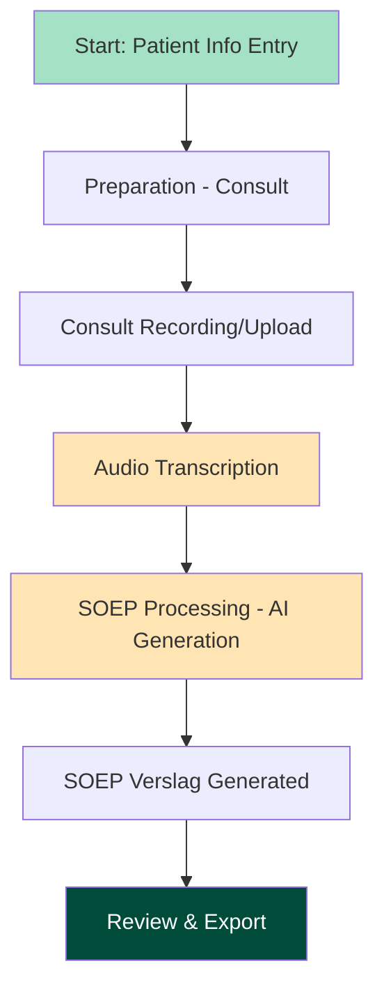
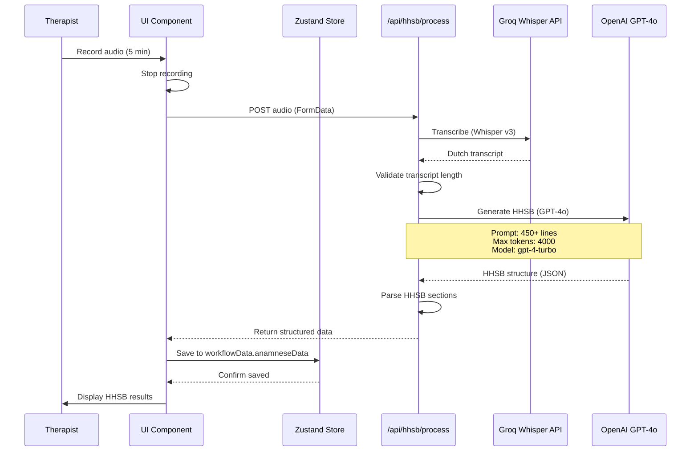
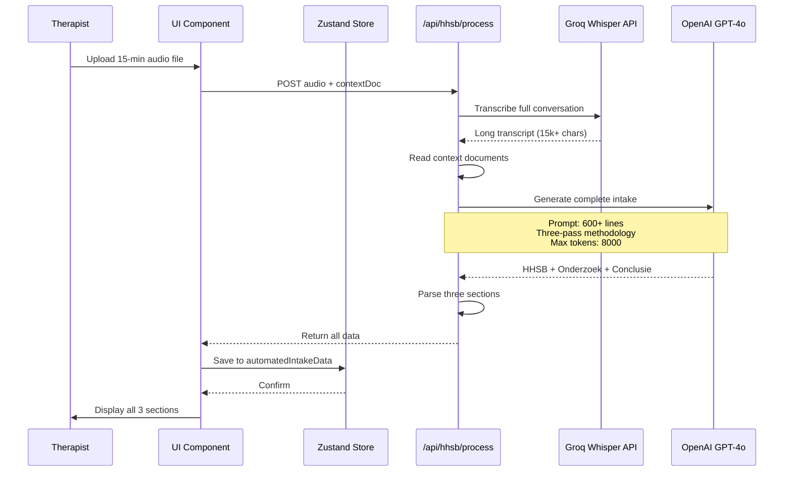

# User Lifecycles: Complete Journey Maps

**Document Version**: 1.0
**Last Updated**: 2025-10-02
**Purpose**: Comprehensive user journey documentation for all Hysio workflows

---

## Overview

This document maps the complete user journey for every workflow in Hysio Medical Scribe. Understanding these lifecycles is essential for:
- Grasping how data flows through the system
- Identifying optimization opportunities
- Debugging workflow issues
- Designing new features that integrate seamlessly

**Three Core Workflows**:
1. **Intake Stapsgewijs** (Step-by-Step Intake) - Controlled, detailed documentation
2. **Intake Automatisch** (Automated Intake) - Fast, single-upload processing
3. **Consult (SOEP)** - Follow-up consultation documentation

Each workflow follows a similar pattern but with distinct steps, state transitions, and AI processing pipelines.

---

## Universal Journey Pattern

All workflows share this high-level structure:



---

## Lifecycle 1: Intake Stapsgewijs (Step-by-Step Intake)

### Overview

**Purpose**: Detailed, controlled intake process for complex cases or learning therapists
**Steps**: 6 distinct phases
**Duration**: 15-30 minutes
**Output**: Complete HHSB documentation + Onderzoek + Conclusie + Zorgplan

### Journey Map



### Detailed Step-by-Step Flow

#### Step 0: Patient Information Entry

**Location**: `/scribe/patient-info`
**Component**: `PatientInfoForm`
**State**: `scribe-store.ts → patientInfo`

**User Actions**:
1. Enter initials (required)
2. Enter birth year (required, 4 digits)
3. Select gender (male/female/other)
4. Enter chief complaint (hoofdklacht) - detailed description

**Validation**:
- Initials: 1-10 characters
- Birth year: Valid 4-digit year (1900-current year)
- Chief complaint: Min 10 characters

**API Calls**: None (all client-side)

**State Transitions**:
```typescript
// Before
patientInfo: null

// After
patientInfo: {
  initials: "J.D.",
  birthYear: "1985",
  gender: "male",
  chiefComplaint: "Schouderpijn rechts na val tijdens sporten"
}
```

**Navigation**: User clicks "Kies uw workflow" → `/scribe/workflow`

---

#### Step 1: Anamnese Voorbereiding (Preparation)

**Location**: `/scribe/intake-stapsgewijs/anamnese`
**Component**: `AnamnesePreparationPage`
**Prompt**: `stap1-voorbereiding-anamnese.ts`

**User Actions**:
1. Page loads → Auto-generates preparation suggestions
2. Review suggested anamnesis questions
3. Choose input method:
   - Live recording (AudioRecorder)
   - Upload audio file
   - Manual text input

**AI Processing** (Preparation Generation):
- **Input**: Patient info (initials, age, chief complaint)
- **Prompt**: INTAKE_STAPSGEWIJS_VOORBEREIDING_ANAMNESE_PROMPT
- **Model**: GPT-4o
- **Max Tokens**: 1500
- **Output**: Strategic anamnesis preparation with:
  - Suggested questions (LOFTIG framework)
  - Red flags to watch for
  - Key assessment areas

**API Call**:
```typescript
POST /api/preparation
{
  workflowType: "intake-stapsgewijs-anamnese",
  patientInfo: { ... }
}

Response: {
  preparation: "Strategische Anamnese Voorbereiding..."
}
```

**State Transitions**:
```typescript
// workflowData.preparationData updated
{
  text: "Voorbereiding content...",
  generatedAt: timestamp
}
```

---

#### Step 2: Anamnese Recording & HHSB Processing

**Location**: Same page (`/scribe/intake-stapsgewijs/anamnese`)
**Prompt**: `stap2-verwerking-hhsb-anamnesekaart.ts` (v7.0 with Grounding Protocol)

**User Actions**:
1. **Option A**: Record audio
   - Click "Start Opname"
   - Conduct anamnesis conversation
   - Click "Stop Opname"
   - Audio transcribed via Groq Whisper v3

2. **Option B**: Upload audio file
   - Select .mp3/.wav file (max 25MB)
   - File validated and transcribed

3. **Option C**: Manual text input
   - Type/paste anamnesis notes
   - Min 50 characters

4. Click "Verwerk" button

**Audio Transcription** (if audio used):
- **Service**: Groq Whisper Large v3 Turbo
- **API**: `POST /api/transcribe`
- **Input**: Audio file (FormData)
- **Output**: Dutch text transcript
- **Processing Time**: 5-15 seconds for 5-minute audio

**AI Processing** (HHSB Generation):
- **Input**:
  - Transcript or manual notes
  - Patient info
  - Optional klinimetrie data (NPRS, PSK scores)
- **Prompt**: INTAKE_STAPSGEWIJS_VERWERKING_HHSB_PROMPT (450+ lines)
- **Model**: GPT-4o
- **Max Tokens**: 4000
- **Output**: Structured HHSB Anamnesekaart
  - **H**: Hulpvraag (patient goals)
  - **H**: Historie (history, onset, development)
  - **S**: Stoornissen (impairments - pain, ROM, strength)
  - **B**: Beperkingen (limitations - ADL, work, participation)
  - Anamnese summary
  - Red flags detection

**API Call**:
```typescript
POST /api/hhsb/process
{
  patientInfo: { ... },
  inputData: {
    transcript: "Patiënt meldt pijn bij...",
    manualNotes: "", // if manual input
    source: "recording" | "file" | "manual",
    klinimetrie: { nprs: 7, psk: 60 } // optional
  }
}

Response: {
  hhsbStructure: {
    hulpvraag: "Hoofddoel: Weer pijnvrij kunnen tennissen...",
    historie: "Ontstaansmoment: Acuut na val op 2025-09-15...",
    stoornissen: "Pijn locatie: Anterolaterale rechter schouder...",
    beperkingen: "ADL: Moeite met aankleden...",
    samenvatting: "45-jarige mannelijke patiënt...",
    redFlags: ["Nachtelijke pijn", ...]
  }
}
```

**State Transitions**:
```typescript
// workflowData.anamneseData updated
{
  recording: blob, // if recorded
  transcript: "Full transcript text...",
  hhsbStructure: { ... },
  processedAt: timestamp
}

// completedSteps updated
completedSteps: ["patient-info", "anamnese"]
```

**Navigation**: Auto-redirect to `/scribe/intake-stapsgewijs/anamnese-resultaat`

---

#### Step 3: Anamnese Results Review

**Location**: `/scribe/intake-stapsgewijs/anamnese-resultaat`
**Component**: `AnamneseResultaatPage`

**User Actions**:
1. Review generated HHSB structure
2. View in two modes:
   - **Volledig** (Full): All sections expanded
   - **Verdelen** (Divided): Collapsible sections (H/H/S/B)
3. Copy individual sections to clipboard
4. Edit if needed (in-place editing)
5. Click "Ga naar Onderzoek" to continue

**Display**:
- Patient info card (read-only)
- HHSB results panel with:
  - Hulpvraag section (expandable)
  - Historie section (expandable)
  - Stoornissen section (expandable)
  - Beperkingen section (expandable)
  - Anamnese summary (highlighted card)
  - Red flags warnings (if detected)

**Navigation**: User clicks "Ga naar Onderzoek" → `/scribe/intake-stapsgewijs/onderzoek`

---

#### Step 4: Onderzoek Voorbereiding (Examination Preparation)

**Location**: `/scribe/intake-stapsgewijs/onderzoek`
**Prompt**: `stap3-voorbereiding-onderzoek.ts`

**User Actions**:
1. Page loads → Auto-generates onderzoek preparation
2. Review suggested examination tests
3. View HHSB context (collapsible card with previous data)
4. Choose input method (same as anamnese)

**AI Processing** (Onderzoek Preparation):
- **Input**:
  - Patient info
  - HHSB structure from Step 2
- **Prompt**: INTAKE_STAPSGEWIJS_VOORBEREIDING_ONDERZOEK_PROMPT
- **Model**: GPT-4o
- **Max Tokens**: 1500
- **Output**: Evidence-based examination proposal with:
  - Suggested physical tests (e.g., Hawkins-Kennedy, Neer)
  - ROM measurements to perform
  - Strength testing recommendations
  - Palpation areas
  - Functional tests

**API Call**:
```typescript
POST /api/preparation
{
  workflowType: "intake-stapsgewijs-onderzoek",
  patientInfo: { ... },
  previousData: {
    hhsbAnamneseKaart: "..."
  }
}

Response: {
  preparation: "Evidence-Based Onderzoeksvoorstel..."
}
```

---

#### Step 5: Onderzoek Recording & Processing

**Location**: Same page (`/scribe/intake-stapsgewijs/onderzoek`)
**Prompt**: `stap4-verwerking-onderzoeksbevindingen.ts` (v7.0)

**User Actions**:
1. Record/upload/type examination findings
2. Click "Verwerk"

**AI Processing** (Onderzoeksbevindingen Generation):
- **Input**:
  - Onderzoek transcript/notes
  - Patient info
  - HHSB anamnese (context)
  - Onderzoeksvoorstel (context)
- **Prompt**: INTAKE_STAPSGEWIJS_VERWERKING_ONDERZOEKSBEVINDINGEN_PROMPT (400+ lines)
- **Model**: GPT-4o
- **Max Tokens**: 4000
- **Output**: Structured examination findings
  - **Inspectie en Palpatie**: Visual observations, palpation findings
  - **Bewegingsonderzoek**: ROM (active/passive), painful arc
  - **Fysieke Testen**: Special tests results (positive/negative)
  - **Klinimetrie**: Objective measurements (SPADI, NPRS, etc.)
  - **Functionele Testen**: Functional movement assessment
  - **Samenvatting**: Concise summary of key findings

**API Call**:
```typescript
POST /api/hhsb/process
{
  step: "onderzoek",
  patientInfo: { ... },
  inputData: {
    transcript: "Inspectie toont...",
    onderzoekNotes: ""
  },
  previousData: {
    hhsbAnamneseKaart: "...",
    onderzoeksvoorstel: "..."
  }
}

Response: {
  onderzoeksbevindingen: {
    inspectieEnPalpatie: "Geen zichtbare zwelling...",
    bewegingsonderzoek: "ROM schouder elevatie 110°...",
    specifiekeTests: "Hawkins-Kennedy: Positief (+)...",
    klinimetrie: "SPADI: 55/100...",
    functionaleTesten: "...",
    samenvatting: "De belangrijkste bevindingen..."
  }
}
```

**State Transitions**:
```typescript
// workflowData.onderzoekData updated
{
  recording: blob,
  transcript: "...",
  onderzoeksbevindingen: { ... },
  processedAt: timestamp
}

completedSteps: ["patient-info", "anamnese", "onderzoek"]
```

**Navigation**: Auto-redirect to `/scribe/intake-stapsgewijs/onderzoek-resultaat`

---

#### Step 6: Onderzoek Results Review

**Location**: `/scribe/intake-stapsgewijs/onderzoek-resultaat`

**User Actions**:
1. Review examination findings
2. View structured display of all onderzoek sections
3. View HHSB context card (collapsible)
4. Copy sections to clipboard
5. Click "Ga naar Klinische Conclusie"

**Navigation**: User clicks button → `/scribe/intake-stapsgewijs/klinische-conclusie`

---

#### Step 7: Klinische Conclusie Generation

**Location**: `/scribe/intake-stapsgewijs/klinische-conclusie`
**Prompt**: `stap5-verwerking-klinische-conclusie.ts` (v7.0)

**User Actions**:
1. Review context cards (anamnese + onderzoek data)
2. Click "Genereer Klinische Conclusie"

**AI Processing**:
- **Input**:
  - Patient info
  - Complete HHSB structure
  - Complete onderzoeksbevindingen
- **Prompt**: INTAKE_STAPSGEWIJS_VERWERKING_KLINISCHE_CONCLUSIE_PROMPT (500+ lines)
- **Model**: GPT-4o
- **Max Tokens**: 3500
- **Output**: Clinical conclusion with:
  - **Fysiotherapeutische Diagnose**: Primary diagnosis (ICF classification)
  - **Behandelplan**: Evidence-based treatment approach
  - **Prognose**: Expected outcome and timeline
  - **Behandeladvies**: Specific recommendations
  - **Vervolgafspraken**: Follow-up planning
  - **Patiënt Educatie**: Patient education points

**API Call**:
```typescript
POST /api/hhsb/process
{
  step: "klinische-conclusie",
  patientInfo: { ... },
  previousData: {
    hhsbAnamneseKaart: "...",
    onderzoeksbevindingen: "..."
  }
}

Response: {
  klinischeConclusie: {
    fysiotherapeutischeDiagnose: "Subacromiaal Pijnsyndroom (SAPS) rechts...",
    behandelplan: "Gefaseerde behandeling...",
    prognose: "6-8 weken herstel...",
    behandeladvies: "...",
    vervolgafspraken: "...",
    patientEducatie: "..."
  }
}
```

**State Transitions**:
```typescript
// workflowData.klinischeConclusieData updated
{
  klinischeConclusie: { ... },
  generatedAt: timestamp
}

completedSteps: ["patient-info", "anamnese", "onderzoek", "klinische-conclusie"]
```

---

#### Step 8: Zorgplan Generation

**Location**: `/scribe/intake-stapsgewijs/zorgplan`
**Prompt**: `stap6-verwerking-zorgplan.ts` (v7.0)

**User Actions**:
1. Review all context (anamnese + onderzoek + conclusie)
2. Click "Genereer Zorgplan"

**AI Processing**:
- **Input**:
  - Patient info
  - Complete klinische conclusie
  - HHSB anamnese (context)
  - Onderzoeksbevindingen (context)
- **Prompt**: INTAKE_STAPSGEWIJS_VERWERKING_ZORGPLAN_PROMPT (500+ lines)
- **Model**: GPT-4o
- **Max Tokens**: 4000
- **Output**: Comprehensive care plan
  - **Prognose & Beïnvloedende Factoren**: Realistic timeline, positive/negative factors
  - **Behandeldoelen**: SMART goals (short-term + long-term)
  - **Behandelstrategie & Fasering**: 3-phase treatment plan
    - Phase 1: Acute (pain management)
    - Phase 2: Subacute (function restoration)
    - Phase 3: Return-to-activity (work/sport-specific)
  - **Huiswerkoefeningen**: Home exercise program
  - **Zelfmanagement**: Self-management strategies
  - **Communicatie & Evaluatieplan**: Evaluation schedule

**API Call**:
```typescript
POST /api/hhsb/process
{
  step: "zorgplan",
  patientInfo: { ... },
  previousData: {
    klinischeConclusie: "...",
    hhsbAnamneseKaart: "...",
    onderzoeksbevindingen: "..."
  }
}

Response: {
  zorgplan: {
    prognose: "6-8 weken...",
    behandeldoelen: ["Doel 1: ...", "Doel 2: ..."],
    behandelstrategie: {
      fase1: "...",
      fase2: "...",
      fase3: "..."
    },
    huiswerkoefeningen: "...",
    zelfmanagement: "...",
    evaluatieplan: "..."
  }
}
```

**State Transitions**:
```typescript
// workflowData.zorgplanData updated
{
  zorgplan: { ... },
  generatedAt: timestamp
}

completedSteps: ["patient-info", "anamnese", "onderzoek", "klinische-conclusie", "zorgplan"]
```

---

#### Step 9: Export Complete Documentation

**User Actions**:
1. Review complete zorgplan
2. Click export button (TXT/HTML/PDF/DOCX)

**Export Processing**:
- **Service**: `document-export.ts`
- **Input**: All workflow data (patient + anamnese + onderzoek + conclusie + zorgplan)
- **Output Formats**:
  - **TXT**: Plain text, clipboard-ready
  - **HTML**: Styled webpage, printer-friendly
  - **PDF**: Browser print dialog → Save as PDF
  - **DOCX**: Word-compatible document

**Export Structure**:
```
Hysio Intake Stapsgewijs - [Initials] - [Date]

═══════════════════════════════════════
PATIËNTINFORMATIE
═══════════════════════════════════════
[Patient info section]

═══════════════════════════════════════
HHSB ANAMNESEKAART
═══════════════════════════════════════
[Complete HHSB structure]

═══════════════════════════════════════
ONDERZOEKSBEVINDINGEN
═══════════════════════════════════════
[Complete examination findings]

═══════════════════════════════════════
KLINISCHE CONCLUSIE
═══════════════════════════════════════
[Complete clinical conclusion]

═══════════════════════════════════════
FYSIOTHERAPEUTISCH ZORGPLAN
═══════════════════════════════════════
[Complete care plan]
```

---

### Error Paths & Recovery

**Common Issues**:

1. **AI Generation Failure**
   - **Symptom**: 500 error from API
   - **Recovery**: Error toast displays, retry button appears
   - **User Action**: Click retry or refresh page
   - **State**: Data preserved in Zustand store with persist middleware

2. **Navigation Race Condition** (FIXED in v7.0)
   - **Symptom**: Phantom redirect, user bounces back
   - **Root Cause**: State not stabilized before navigation
   - **Fix**: `navigateWithStateWait()` utility with 2-second delay
   - **Implementation**: All workflow pages use state-aware navigation

3. **Transcript Truncation** (FIXED in v8.5)
   - **Symptom**: Incomplete AI output
   - **Root Cause**: Transcript limited to 2000 chars
   - **Fix**: Removed truncation, send full transcript
   - **Verification**: Comprehensive logging shows full input

4. **Invalid Model Name** (FIXED in v8.5)
   - **Symptom**: AI errors or fallback to wrong model
   - **Root Cause**: `gpt-4-turbo-preview` (invalid) used
   - **Fix**: Updated to `gpt-4-turbo`

---

## Lifecycle 2: Intake Automatisch (Automated Intake)

### Overview

**Purpose**: Fast, single-upload intake processing for experienced therapists
**Steps**: 2 phases (Preparation → Processing)
**Duration**: 5-10 minutes
**Output**: Complete HHSB + Onderzoek + Conclusie in one pass

### Journey Map



### Detailed Flow

#### Step 1: Preparation

**Location**: `/scribe/intake-automatisch`
**Prompt**: `intake-automatisch-voorbereiding.ts`

**User Actions**:
1. Enter patient info (same as step-by-step)
2. Navigate to automated intake
3. View auto-generated preparation

**AI Processing**:
- **Input**: Patient info + optional context documents
- **Prompt**: INTAKE_AUTOMATISCH_VOORBEREIDING_PROMPT
- **Output**: Strategic intake preparation combining anamnese + onderzoek guidance

**Context Documents** (Optional):
- Upload referral letters (verwijsbrieven)
- Upload previous reports
- Upload Hysio Pre-Intake results
- Max 10MB per file (PDF, DOC, DOCX, TXT)

---

#### Step 2: Complete Intake Processing

**Location**: Same page
**Prompt**: `intake-automatisch-prompt.ts` (v7.0)

**User Actions**:
1. Record or upload COMPLETE intake conversation (anamnese + onderzoek combined)
2. Upload optional context documents
3. Click "Verwerk"

**Audio Transcription**:
- Same as step-by-step (Groq Whisper)
- Longer audio supported (up to 25MB file)

**AI Processing** (Single-Pass Complete Intake):
- **Input**:
  - Full intake transcript (10,000-20,000 chars typical)
  - Patient info
  - Optional context documents
- **Prompt**: INTAKE_AUTOMATISCH_VERWERKING_CONCLUSIE_PROMPT (600+ lines)
- **Model**: GPT-4o
- **Max Tokens**: 8000 (higher for complete output)
- **Output**: Three-section document
  1. **HHSB Anamnesekaart** (complete)
  2. **Onderzoeksbevindingen** (complete)
  3. **Klinische Conclusie** (complete)

**API Call**:
```typescript
POST /api/hhsb/process
{
  workflowType: "intake-automatisch",
  patientInfo: { ... },
  inputData: {
    transcript: "Very long transcript...",
    contextDocument: "Referral letter content...",
    source: "recording"
  }
}

Response: {
  automatedIntakeData: {
    hhsbStructure: { ... },
    onderzoeksbevindingen: { ... },
    klinischeConclusie: { ... }
  }
}
```

**State Transitions**:
```typescript
// workflowData.automatedIntakeData updated
{
  recording: blob,
  transcript: "...",
  contextDocument: "...",
  hhsbStructure: { ... },
  onderzoeksbevindingen: { ... },
  klinischeConclusie: { ... },
  processedAt: timestamp
}

completedSteps: ["patient-info", "automated-intake"]
```

---

#### Step 3: Results Review & Export

**User Actions**:
1. Review three-section output
2. Optionally generate zorgplan (separate AI call)
3. Export all documentation

**Zorgplan Generation** (Optional):
- **Trigger**: User clicks "Genereer Zorgplan"
- **Prompt**: INTAKE_AUTOMATISCH_VERWERKING_ZORGPLAN_PROMPT
- **Input**: Complete intake data (all 3 sections)
- **Output**: Same zorgplan structure as step-by-step

---

### Key Differences from Step-by-Step

1. **Single Recording**: Anamnese + Onderzoek combined in one conversation
2. **Single AI Call**: All three sections generated in one pass (more efficient)
3. **Context Documents**: Support for uploading referral letters, previous reports
4. **Faster**: 5-10 minutes vs 15-30 minutes
5. **Less Control**: No intermediate review points
6. **Higher Skill Required**: Therapist must conduct complete intake efficiently

---

## Lifecycle 3: Consult (SOEP) - Follow-Up Session

### Overview

**Purpose**: Document follow-up consultations using SOEP methodology
**Steps**: 2 phases (Preparation → Processing)
**Duration**: 3-7 minutes
**Output**: SOEP-verslag (Subjectief, Objectief, Evaluatie, Plan)

### Journey Map



### Detailed Flow

#### Step 1: Consult Preparation

**Location**: `/scribe/consult`
**Prompt**: `consult-voorbereiding.ts`

**User Actions**:
1. Enter patient info (initials, age, chief complaint = "Vervolgconsult [condition]")
2. View auto-generated consult preparation

**AI Processing**:
- **Input**: Patient info + optional context (previous SOEP reports)
- **Prompt**: CONSULT_VOORBEREIDING_PROMPT
- **Output**: Suggested consult structure:
  - Questions about progress since last session
  - Tests to re-evaluate
  - Treatment effectiveness assessment
  - Next steps planning

---

#### Step 2: Consult Recording & SOEP Processing

**Location**: Same page
**Prompt**: `stap1-verwerking-soep-verslag.ts` (v9.0 GOLDEN STANDARD)

**User Actions**:
1. Record or upload consult conversation
2. Optionally upload context (previous reports)
3. Click "Verwerk"

**AI Processing** (SOEP Generation):
- **Input**:
  - Consult transcript
  - Patient info
  - Optional previous SOEP reports (context)
- **Prompt**: CONSULT_VERWERKING_SOEP_PROMPT (242 lines, v9.0)
- **Model**: GPT-4o
- **Max Tokens**: 3500
- **Output**: Structured SOEP report
  - **S (Subjectief)**: 300-600 words - Patient's subjective experience, changes since last visit
  - **O (Objectief)**: 400-700 words - Examination findings, tests performed, interventions applied
  - **E (Evaluatie)**: 200-400 words - Clinical interpretation, progression analysis
  - **P (Plan)**: 200-400 words - Treatment plan, next steps, follow-up
  - **Consult Summary**: 100-word coherent overview (v9.1)
  - **EPD-KLAAR**: Ultra-concise version (2-4 sentences per section)

**v9.0 GOLDEN STANDARD Features**:
- Strict conciseness (no verbosity)
- Bullet points for tests/interventions
- Absolute anonymization (privacy protocol)
- EPD-ready formatting
- Dual output (detailed + concise)

**API Call**:
```typescript
POST /api/soep/process
{
  patientInfo: { ... },
  inputData: {
    transcript: "Patiënt meldt progressie...",
    source: "recording",
    contextDocument: "Previous SOEP report..."
  }
}

Response: {
  soepData: {
    subjectief: "Patiënt rapporteert...",
    objectief: "Inspectie: ...\n\nBeweging:\n• ROM elevatie 140°...",
    evaluatie: "Duidelijke positieve progressie...",
    plan: "Behandeling continueren:\n• Oefening 1...",
    consultSummary: "Vervolgconsult schouder: significante verbetering pijn en ROM...",
    epdKlaar: "S: ...\nO: ...\nE: ...\nP: ..."
  }
}
```

**State Transitions**:
```typescript
// workflowData.consultData updated
{
  recording: blob,
  transcript: "...",
  soepData: { ... },
  processedAt: timestamp
}

completedSteps: ["patient-info", "consult"]
```

**Navigation**: Auto-redirect to `/scribe/consult/soep-verslag`

---

#### Step 3: SOEP Results Review & Export

**Location**: `/scribe/consult/soep-verslag`

**User Actions**:
1. Review SOEP report in two viewing modes:
   - **Volledig** (Continuous): All sections in single scrollable view
   - **Verdelen** (Divided): Collapsible sections (S/O/E/P separate)
2. View consultation summary (highlighted orange card)
3. View EPD-KLAAR version (copy-paste ready)
4. In-place editing if needed
5. Export (TXT/HTML/PDF/DOCX)

**Display Features** (v9.1 UX Polish):
- Proper bullet point alignment (Tailwind prose classes)
- Emoji alignment fixed
- Summary as separate section (not embedded in Plan)
- Professional typography

---

### SOEP Evolution Timeline

**v7.0**: Grounding Protocol added (absolute data fidelity)
**v8.0**: Initial SOEP implementation
**v8.5**: Transcript truncation bug fixed, logging added
**v9.0**: GOLDEN STANDARD redesign (conciseness, structure, privacy)
**v9.1**: UX polish (summary placement, bullet alignment, coherent overview)

---

## Common State Management Patterns

### Zustand Store Structure

**File**: `hysio/src/lib/state/scribe-store.ts`

```typescript
interface ScribeStoreState {
  // Patient info (persisted)
  patientInfo: PatientInfo | null;

  // Current workflow (persisted)
  currentWorkflow: WorkflowType | null;

  // Workflow data (persisted)
  workflowData: {
    preparationData?: PreparationData;
    anamneseData?: AnamneseData;
    onderzoekData?: OnderzoekData;
    klinischeConclusieData?: ConclusieData;
    zorgplanData?: ZorgplanData;
    automatedIntakeData?: AutomatedIntakeData;
    consultData?: ConsultData;
  };

  // Session data (not persisted)
  sessionData: {
    isProcessing: boolean;
    error: string | null;
    lastSaved: number | null;
  };

  // Completed steps (persisted)
  completedSteps: string[];

  // SOEP data (persisted)
  soepData: SOEPData | null;
}
```

### State Isolation Between Workflows

**Critical Feature**: `resetWorkflowState()` function

**Purpose**: Ensure each new workflow starts with clean state

**Implementation**:
```typescript
resetWorkflowState: () => set((state) => {
  state.workflowData = {};
  state.sessionData = {};
  state.completedSteps = [];
  state.soepData = null;
  state.currentWorkflow = null;
  // patientInfo is PRESERVED
});
```

**Trigger Points**:
- User navigates to `/scribe/workflow` (workflow selection page)
- useEffect hook automatically resets state on component mount

**Result**: No cross-contamination between sessions

---

### State Persistence

**Middleware**: Zustand persist with localStorage

**Persisted Data**:
- Patient info
- Workflow type
- All workflow data (anamnese, onderzoek, conclusie, zorgplan, etc.)
- Completed steps
- SOEP data

**NOT Persisted** (session-only):
- Processing status (isProcessing)
- Error messages
- Last saved timestamp
- Temporary audio blobs (too large for localStorage)

**Benefits**:
- Recovery from page refresh
- Recovery from browser crash
- Resume workflows mid-process

**Limitations**:
- Single-user only (localStorage is per-browser)
- No cross-device sync
- No audit trail
- No backup

---

## Data Flow Diagrams

### Anamnese Processing Flow



### Complete Intake Flow (Intake Automatisch)



---

## Performance Metrics

### Typical Processing Times

| Workflow Step | Audio Duration | Transcription | AI Generation | Total |
|--------------|----------------|---------------|---------------|-------|
| Anamnese (Stapsgewijs) | 5 min | 8 sec | 15 sec | ~23 sec |
| Onderzoek (Stapsgewijs) | 5 min | 8 sec | 12 sec | ~20 sec |
| Klinische Conclusie | N/A | N/A | 10 sec | ~10 sec |
| Zorgplan | N/A | N/A | 12 sec | ~12 sec |
| Consult (SOEP) | 5 min | 8 sec | 15 sec | ~23 sec |
| Intake Automatisch | 15 min | 25 sec | 35 sec | ~60 sec |

**Bottlenecks**:
1. **Groq Whisper**: 5-30 seconds depending on audio length
2. **OpenAI GPT-4o**: 10-35 seconds depending on output complexity
3. **Network latency**: 1-3 seconds per API call

**Optimization Opportunities**:
- Parallel transcription + preparation (currently sequential)
- Streaming AI responses (currently waits for complete response)
- Client-side caching of preparation prompts

---

## Error Handling Patterns

### 1. Network Errors

**Scenario**: API unreachable, timeout

**Detection**: API call fails with network error

**Recovery**:
```typescript
try {
  const response = await fetch('/api/hhsb/process', { ... });
} catch (error) {
  // Show toast notification
  toast.error("Netwerkfout. Controleer uw verbinding.");
  // Enable retry button
  setShowRetry(true);
  // Preserve user input (already in Zustand store)
}
```

**User Experience**:
- Error toast appears
- Retry button shown
- Input data preserved
- No data loss

---

### 2. AI Generation Errors

**Scenario**: OpenAI returns error or invalid JSON

**Detection**: API returns 500 or malformed response

**Recovery**:
```typescript
// Server-side (API route)
try {
  const aiResponse = await openaiClient.chat.completions.create({ ... });
  const parsedData = parseHHSBText(aiResponse.choices[0].message.content);
  return NextResponse.json({ hhsbStructure: parsedData });
} catch (error) {
  console.error("AI generation error:", error);
  return NextResponse.json(
    { error: "Fout bij verwerking. Probeer opnieuw." },
    { status: 500 }
  );
}
```

**User Experience**:
- Error message displayed
- Retry option available
- Logging for debugging (v8.5 comprehensive logs)

---

### 3. Parsing Errors

**Scenario**: AI generates unexpected output format

**Detection**: Regex parsing fails

**Recovery**:
```typescript
function parseHHSBText(text: string): HHSBStructure {
  try {
    const hulpvraag = extractSection(text, /Hulpvraag:(.*?)(?=Historie:|$)/s);
    const historie = extractSection(text, /Historie:(.*?)(?=Stoornissen:|$)/s);
    // ... etc

    if (!hulpvraag || !historie) {
      throw new Error("Incomplete HHSB structure");
    }

    return { hulpvraag, historie, stoornissen, beperkingen };
  } catch (error) {
    // Fallback: Return raw text
    return {
      hulpvraag: "Parsing failed - see raw output",
      historie: text,
      stoornissen: "",
      beperkingen: ""
    };
  }
}
```

**User Experience**:
- User sees raw AI output (better than nothing)
- Can manually copy sections
- Issue logged for debugging

---

### 4. Workflow State Corruption

**Scenario**: User navigates away mid-process, state corrupted

**Prevention**:
- Persist middleware saves state continuously
- `resetWorkflowState()` clears corrupted state
- Workflow selection page auto-resets state

**Recovery**:
```typescript
// On workflow selection page mount
useEffect(() => {
  resetWorkflowState(); // Clean slate
}, [resetWorkflowState]);
```

---

## Future Enhancements

### Planned Improvements

1. **Real-time Transcription**: Stream audio to Groq, show live transcript
2. **Parallel Processing**: Transcribe + generate preparation simultaneously
3. **Draft Auto-save**: Save draft every 30 seconds during recording
4. **Offline Mode**: Queue AI requests when offline, process when back online
5. **Multi-language Support**: English, German, French SOEP templates
6. **Voice Commands**: "Hysio, save section" during recording
7. **Mobile App**: React Native version for on-the-go documentation

### Database Migration Impact

**Current**: All state in browser localStorage
**Future**: PostgreSQL + Prisma ORM

**Workflow Changes**:
- User authentication required (NextAuth.js)
- Session saved to database (resume from any device)
- Version history (track edits over time)
- Team collaboration (multiple therapists, shared patients)
- Audit logs (compliance requirement)

**Migration Path**:
```typescript
// Current
const state = useScribeStore();

// Future
const { data: session } = useSession(); // NextAuth
const { data: workflow } = useQuery(['workflow', session.id]);
```

---

## Conclusion

These three workflows represent the core value proposition of Hysio Medical Scribe:
1. **Intake Stapsgewijs**: Control + learning
2. **Intake Automatisch**: Speed + efficiency
3. **Consult (SOEP)**: Follow-up documentation

Understanding these lifecycles is essential for:
- Debugging workflow issues
- Designing new features
- Optimizing performance
- Training new users

**Next Steps for Bernard**:
1. Run each workflow end-to-end locally
2. Trace state transitions in React DevTools
3. Monitor API calls in Network tab
4. Review AI prompts (they define output quality)
5. Identify one optimization opportunity

**Key Files to Read**:
- `hysio/src/lib/state/scribe-store.ts` (316 lines - state management)
- `hysio/src/app/api/hhsb/process/route.ts` (HHSB API endpoint)
- `hysio/src/app/api/soep/process/route.ts` (SOEP API endpoint)
- `hysio/src/lib/prompts/*` (all AI prompts - core intelligence)

This document provides complete visibility into user journeys. Use it as your reference for understanding how Hysio works from a user's perspective.
