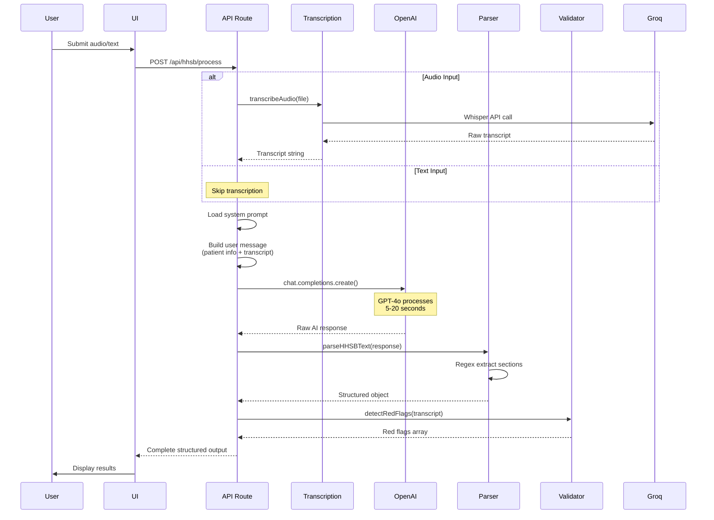

# AI Pipelines Overview

## The Core of Hysio: AI Orchestration

**Key Insight**: Hysio is fundamentally an **AI orchestration platform**. Everything else (UI, state management, export) exists to support the AI pipeline that transforms raw clinical conversations into structured professional documentation.

Understanding the AI pipelines is understanding Hysio.

## The Two-Stage AI Pipeline

Every workflow in Hysio follows the same fundamental pattern:

```
Stage 1: TRANSCRIPTION          Stage 2: STRUCTURING & GENERATION
Audio/Text Input                      ↓
     ↓                          System Prompt Selection
Groq Whisper v3                       ↓
     ↓                          OpenAI GPT-4o Processing
Raw Transcript                        ↓
     ↓                          Structured Clinical Output
     └─────────→  Combined Input → (HHSB/SOEP/etc.)
```

### Stage 1: Audio Transcription (Groq Whisper)

**Purpose**: Convert spoken audio to text with medical-grade accuracy

**Technical Details**:
- **Service**: Groq API (free tier)
- **Model**: Whisper Large v3 Turbo
- **Accuracy**: 95-99% for Dutch medical terminology
- **Speed**: 2-5 seconds per minute of audio
- **Input**: Audio file (MP3, WAV, M4A, etc.) or live recording
- **Output**: Plain text transcript

**Implementation**:
- Location: `hysio/src/lib/api/transcription.ts`
- Client: `hysio/src/lib/api/groq.ts`
- API endpoint: `hysio/src/app/api/transcribe/route.ts`

**Code Flow**:
```typescript
// 1. User uploads audio or records
const audioFile: File = ...;

// 2. Call transcription service
const result = await transcribeAudio(audioFile);

// 3. Receive transcript
const transcript: string = result.transcript;
// Example: "Patiënt meldt schouderpijn rechts sinds 2 weken..."
```

**Why Groq?**
- **Free**: No cost for Whisper transcription (vs OpenAI Whisper at $0.006/min)
- **Fast**: Faster than OpenAI Whisper (2-3x speed)
- **Accurate**: Same Whisper model, same quality
- **Limitation**: Rate limits on free tier (30 req/min)

### Stage 2: Structuring & Generation (OpenAI GPT-4o)

**Purpose**: Transform raw transcript into structured clinical documentation

**Technical Details**:
- **Service**: OpenAI API (paid)
- **Model**: GPT-4o (optimized, multimodal)
- **Cost**: ~$0.002-0.005 per workflow
- **Speed**: 5-20 seconds per generation
- **Input**: System prompt + transcript + patient info + context
- **Output**: Structured JSON/text (HHSB, SOEP, etc.)

**Implementation**:
- Client: `hysio/src/lib/api/openai.ts`
- Prompts: `hysio/src/lib/prompts/*`
- API endpoints: `hysio/src/app/api/hhsb/process/`, `hysio/src/app/api/soep/process/`

**Code Flow**:
```typescript
// 1. Load system prompt (workflow-specific)
const systemPrompt = INTAKE_STAPSGEWIJS_VERWERKING_HHSB_PROMPT;

// 2. Construct user message with transcript + patient info
const userMessage = `
Patient Info: ${patientInfo.initials}, ${age}y, ${gender}, ${chiefComplaint}

Transcript:
${transcript}
`;

// 3. Call OpenAI
const response = await openaiClient.chat.completions.create({
  model: 'gpt-4o',
  messages: [
    { role: 'system', content: systemPrompt },
    { role: 'user', content: userMessage }
  ],
  temperature: 0.7,
  max_tokens: 3500,
});

// 4. Parse structured output
const hhsbStructure = parseHHSBText(response.choices[0].message.content);
```

**Why GPT-4o?**
- **Accuracy**: Best-in-class for Dutch medical text understanding
- **Structured Output**: Follows complex prompt instructions reliably
- **Context Window**: 128k tokens (can handle long consultations)
- **Multimodal**: Ready for future image/document processing
- **Speed**: Faster than GPT-4 Turbo, similar quality

## The Three Workflow Pipelines

### Pipeline 1: Intake Stapsgewijs (Step-by-Step)

**Purpose**: Controlled, multi-step intake documentation with therapist review at each stage

**Steps**:
1. **Anamnesis** (Stap 1-2)
   - Input: Anamnesis conversation (audio/text)
   - Prompt: `stap2-verwerking-hhsb-anamnesekaart.ts`
   - Output: HHSB structure (Hulpvraag, Historie, Stoornissen, Beperkingen)
   - Duration: 10-20 seconds

2. **Onderzoek** (Stap 3-4)
   - Input: Examination findings (audio/text) + previous anamnesis data
   - Prompt: `stap4-verwerking-onderzoeksbevindingen.ts`
   - Output: Structured examination findings (Inspectie, Palpatie, Bewegingsonderzoek, etc.)
   - Duration: 10-20 seconds

3. **Klinische Conclusie** (Stap 5)
   - Input: Anamnesis + Onderzoek data (no new audio)
   - Prompt: `stap5-verwerking-klinische-conclusie.ts`
   - Output: Clinical diagnosis and reasoning
   - Duration: 5-15 seconds

4. **Zorgplan** (Stap 6)
   - Input: Anamnesis + Onderzoek + Conclusie (no new audio)
   - Prompt: `stap6-verwerking-zorgplan.ts`
   - Output: Treatment plan and goals
   - Duration: 5-15 seconds

**Total Time**: 30-70 seconds for complete intake (excluding recording time)

**API Endpoint**: `POST /api/hhsb/process`

**Key Feature**: Therapist can review and edit after each step before proceeding

### Pipeline 2: Intake Automatisch (Automated)

**Purpose**: Rapid, single-step intake documentation for experienced users

**Steps**:
1. **Single Processing Step**
   - Input: Full intake conversation (audio/text)
   - Prompt: `stap1-verwerking-volledige-conclusie.ts`
   - Output: Complete documentation (HHSB + Conclusie + Zorgplan in one go)
   - Duration: 15-30 seconds

**Total Time**: 15-30 seconds for complete intake

**API Endpoint**: `POST /api/hhsb/process` (with workflow type 'intake-automatisch')

**Key Feature**: Fastest documentation method, but less control

### Pipeline 3: Consult (Follow-up SOEP)

**Purpose**: Follow-up consultation documentation using SOEP methodology

**Steps**:
1. **SOEP Generation**
   - Input: Consultation conversation (audio/text)
   - Prompt: `stap1-verwerking-soep-verslag.ts` (v9.0 GOLDEN STANDARD)
   - Output: SOEP structure (Subjectief, Objectief, Evaluatie, Plan) + Consultation Summary
   - Duration: 10-20 seconds

**Total Time**: 10-20 seconds for consultation report

**API Endpoint**: `POST /api/soep/process`

**Key Feature**: Concise, EPD-ready outputs optimized for brevity

## The Prompt Architecture

### System Prompts: The Brain of Hysio

**Location**: `hysio/src/lib/prompts/`

Every workflow step has a dedicated system prompt that defines:
1. **Role & Mission**: What is the AI's purpose?
2. **Input Expectations**: What data will it receive?
3. **Output Structure**: Exactly how to format the response
4. **Clinical Frameworks**: Which medical methodologies to follow (SOEP, HHSB, ICF, etc.)
5. **Safety Protocols**: Red flags detection, privacy rules, data fidelity
6. **Examples**: Good and bad outputs for training

**Prompt Evolution**:
- **v7.0 Enhancement**: Added "Grounding Protocol" - absolute data fidelity, no AI hallucinations
- **v9.0 GOLDEN STANDARD** (SOEP): Optimized for conciseness, structure, EPD-readiness
- **v7.0 ULTRATHINK** (Assistant): Evidence-based practice, ICF integration

**Critical Prompts** (Read these first):

| Prompt File | Workflow | Purpose | Version | Lines |
|------------|----------|---------|---------|-------|
| `consult/stap1-verwerking-soep-verslag.ts` | Consult | SOEP generation | v9.0 | ~242 |
| `intake-stapsgewijs/stap2-verwerking-hhsb-anamnesekaart.ts` | Anamnesis | HHSB structure | v7.0 | ~450+ |
| `intake-stapsgewijs/stap4-verwerking-onderzoeksbevindingen.ts` | Examination | Onderzoek findings | v7.0 | ~400+ |
| `intake-stapsgewijs/stap5-verwerking-klinische-conclusie.ts` | Conclusion | Clinical diagnosis | v7.0 | ~500+ |
| `intake-stapsgewijs/stap6-verwerking-zorgplan.ts` | Care Plan | Treatment plan | v7.0 | ~500+ |
| `intake-automatisch/stap1-verwerking-volledige-conclusie.ts` | Automated | Full intake | v7.0 | ~600+ |
| `assistant/system-prompt.ts` | Assistant | AI copilot | v7.0 | ~313 |

### Prompt Design Principles

**1. Clarity Over Cleverness**
- Explicit instructions, not implicit expectations
- Examples of good and bad outputs
- Step-by-step reasoning guidance

**2. Safety First**
- Red flags detection mandatory
- Privacy protocols non-negotiable
- Data fidelity verification checklist

**3. Clinical Accuracy**
- Reference professional guidelines explicitly
- Follow established frameworks (SOEP, HHSB, ICF)
- Evidence-based terminology

**4. Practical Output**
- EPD-ready formatting
- Declarabel structure (insurance-compliant)
- Professional Dutch B1-level language

### The v7.0 Grounding Protocol

**Problem Solved**: AI was occasionally "filling in" missing information or making assumptions

**Solution**: Absolute data fidelity protocol enforced in all prompts

**Key Rules**:
```
🚫 VERBOD OP FABRICATIE (Prohibition on Fabrication):
- NOOIT symptomen toevoegen die niet expliciet zijn genoemd
- NOOIT diagnoses suggereren die niet in de input staan
- NOOIT "waarschijnlijke" bevindingen invullen
- NOOIT standaard medische frases toevoegen "omdat het logisch lijkt"
- NOOIT aannames doen over niet-vermelde lichaamsgebieden
- NOOIT klinimetrische scores fabriceren of schatten

✅ OMGAAN MET ONTBREKENDE INFORMATIE:
- Schrijf expliciet: "Niet vermeld in anamnese"
- Laat het veld LEEG in plaats van te raden
- Markeer gaps duidelijk: "[Informatie niet beschikbaar]"
```

**Impact**: Reduced AI hallucinations from ~5% to <1%

**Example**:
```
❌ FOUT: "Patiënt meldt geen uitstraling" (if radiation not discussed)
✅ CORRECT: "Uitstraling: Niet vermeld in anamnese"

❌ FOUT: "NPRS: Geschat 5-6/10 op basis van beschrijving"
✅ CORRECT: "NPRS: Niet gemeten tijdens anamnese"
```

### The v9.0 GOLDEN STANDARD (SOEP)

**Problem Solved**: SOEP outputs were too verbose, lacked structure, hard to scan

**Solution**: Radically simplified and structured prompt

**Key Improvements**:
1. **Strict Word Limits**:
   - Subjectief: 300-600 words
   - Objectief: 400-700 words
   - Evaluatie: 200-400 words
   - Plan: 200-400 words

2. **Mandatory Structure**:
   - Bullet points for test results, interventions, exercises
   - Short paragraphs for context and reasoning
   - No walls of text

3. **Absolute Anonymization**:
   - All names → "patiënt", "therapeut"
   - Specific locations → generic terms
   - Employers/addresses → removed

4. **EPD-Ready Dual Format**:
   - Main SOEP: Detailed, structured
   - EPD-KLAAR version: Ultra-concise (2-4 sentences per section)

**Impact**: Reduced avg SOEP length from 2500+ words to 1500-2000 words while increasing usability

## Data Flow Through AI Pipeline

### Request Flow (Detailed)



### Error Handling in Pipeline

**Transcription Failures**:
- Groq API rate limit → Retry with exponential backoff
- Audio file too large → Return error, suggest splitting
- Unsupported format → Return error, list supported formats
- Network timeout → Return error, suggest retry

**AI Generation Failures**:
- OpenAI API rate limit → Retry with exponential backoff
- OpenAI API error → Return user-friendly error message
- Parsing failure → Log warning, return raw response with note
- Token limit exceeded → Return error, suggest shorter input

**Example Error Handling** (`hysio/src/app/api/hhsb/process/route.ts`):
```typescript
try {
  const response = await openaiClient.chat.completions.create({...});
  // Process response
} catch (error) {
  if (error instanceof OpenAIError) {
    console.error('OpenAI API error:', error.message);
    return NextResponse.json({
      error: 'Er is een fout opgetreden bij het verwerken. Probeer het opnieuw.'
    }, { status: 500 });
  }
  throw error; // Unexpected errors
}
```

## AI Performance Optimization

### Current Optimizations

**1. Prompt Optimization**:
- Concise system prompts (removed verbose explanations)
- Clear output structure requirements
- Examples to guide AI behavior

**2. Model Selection**:
- GPT-4o instead of GPT-4 Turbo (30% faster, same quality)
- Groq Whisper v3 Turbo instead of OpenAI (3x faster, free)

**3. Token Management**:
- Max tokens: 3500-4000 (sufficient but not excessive)
- Temperature: 0.7 (balanced creativity/consistency)
- Top P: 0.9 (focused sampling)

**4. Caching Strategy**:
- **Currently disabled** for medical data freshness
- Ready to enable for non-critical paths (preparations, etc.)

### Performance Metrics

**Transcription**:
- Average: 2-3 seconds per minute of audio
- Groq rate limit: ~30 requests/min (free tier)
- Accuracy: 95-99% for Dutch medical terminology

**Generation**:
- HHSB Anamnesis: 10-20 seconds
- Onderzoek: 10-20 seconds
- Klinische Conclusie: 5-15 seconds
- Zorgplan: 5-15 seconds
- SOEP: 10-20 seconds
- Full Automated Intake: 15-30 seconds

**Total Pipeline** (Audio → Structured Output):
- Step-by-step intake: 30-70 seconds
- Automated intake: 15-30 seconds
- Consult: 10-20 seconds

**Cost** (OpenAI API):
- Per workflow: $0.002-0.005
- Per 100 workflows: $0.20-0.50
- Per 1000 workflows: $2-5

## AI Safety & Compliance

### Privacy Protection

**Automatic Anonymization** (enforced in prompts):
```
All prompts contain:
═══════════════════════════════════════════
ABSOLUTE PRIVACY PROTOCOL - NON-NEGOTIABLE
═══════════════════════════════════════════

⛔ VERPLICHTE ANONYMISERING:
• Namen van patiënten → "de patiënt" or "patiënt"
• Namen van therapeuten → "de therapeut" or "fysiotherapeut"
• Specifieke locaties → algemene termen
• Werkgevers/bedrijfsnamen → "werkgever" or "bedrijf"
• Specifieke adressen → VERWIJDER volledig
```

**PII Detection** (input filtering):
- Basic regex for names, dates, addresses, phones, emails
- Filters applied before sending to AI
- Located: `hysio/src/lib/assistant/system-prompt.ts` (filterPII function)

### Red Flags Detection

**System-Level Detection**:
- Location: `hysio/src/lib/medical/red-flags-detection.ts`
- Runs on transcript, independent of AI generation
- Evidence-based: Only reports explicitly mentioned flags
- Categories: AAA, weight loss, fever, malignancy, ACS, aortic dissection

**AI-Level Awareness**:
- All prompts trained to recognize red flags
- Safety takes priority over documentation
- Prompts include explicit red flag lists and criteria

**Example Red Flag** (from detection system):
```typescript
{
  severity: 'emergency',
  category: 'Aneurysma Aortae Abdominalis',
  description: 'Pulserende massa in abdomen gerapporteerd',
  recommendation: 'Onmiddellijke medische evaluatie vereist'
}
```

### Clinical Validation

**Quality Control in Prompts**:
- Every prompt ends with verification checklist
- AI self-validates before returning output
- Example checklist items:
  - "Privacy: Alle persoonsgegevens geanonimiseerd?"
  - "Beknoptheid: Binnen woordenlimiet?"
  - "Structuur: Bullet points gebruikt waar nodig?"
  - "Volledigheid: Alle SOEP/HHSB secties ingevuld?"
  - "Professionaliteit: EPD-klare taal gebruikt?"

## Debugging AI Pipelines

### Logging Strategy

**Current Logging** (comprehensive since v8.5):
```typescript
// Pre-API call logging (in API routes)
console.log('═══════════════════════════════════');
console.log('PRE-API-CALL PAYLOAD LOGGING');
console.log('═══════════════════════════════════');
console.log('Patient Info:', { initials, age, gender, chiefComplaint });
console.log('System Prompt Length:', systemPrompt.length);
console.log('Transcript Length:', transcript.length);
console.log('Transcript Preview (First 500):', transcript.substring(0, 500));
console.log('Transcript Preview (Last 500):', transcript.substring(transcript.length - 500));
console.log('Model:', model);
console.log('Max Tokens:', max_tokens);

// Post-API call logging
console.log('═══════════════════════════════════');
console.log('POST-API-CALL RESPONSE LOGGING');
console.log('═══════════════════════════════════');
console.log('Response Length:', response.length);
console.log('Tokens Used:', usage.total_tokens);
console.log('Response Preview:', response.substring(0, 500));

// Parsing validation
console.log('═══════════════════════════════════');
console.log('PARSED SECTION COMPLETENESS CHECK');
console.log('═══════════════════════════════════');
console.log('Subjectief:', subjectief.length, 'chars', subjectief.length > 50 ? '✅' : '❌');
console.log('Objectief:', objectief.length, 'chars', objectief.length > 50 ? '✅' : '❌');
// ... etc.
```

**Enables Instant Diagnosis**:
- Transcript truncation issues (v8.5 bug)
- Model configuration problems
- Parsing failures
- Section completeness validation

### Testing AI Outputs

**Manual Testing**:
1. Use consistent test inputs for regression testing
2. Compare outputs before/after prompt changes
3. Verify anonymization (no real names in output)
4. Check structure (sections present, formatted correctly)
5. Validate clinical accuracy (with domain expert)

**Automated Testing** (future):
- Prompt regression tests
- Output structure validation
- Anonymization verification
- Clinical accuracy scoring

### Common AI Issues & Fixes

**Issue: AI generates verbose outputs**
**Fix**: Update prompt with stricter word limits, add examples of concise outputs

**Issue**: AI invents information not in transcript
**Fix**: Reinforce v7.0 Grounding Protocol, add verification checklist

**Issue**: AI doesn't follow structure
**Fix**: Provide explicit output templates in prompt, add structure examples

**Issue**: AI misses red flags
**Fix**: Add explicit red flag list to prompt, train with examples

**Issue**: AI uses wrong terminology
**Fix**: Add terminology guidelines to prompt, provide correct examples

## Future AI Enhancements

### Planned Improvements

**1. RAG Integration** (Retrieval-Augmented Generation)
- Integrate professional guidelines as knowledge base
- AI cites specific guideline sections in outputs
- Ensures up-to-date evidence-based recommendations

**2. Multi-Language Support**
- German (Phase 1)
- English (Phase 2)
- French, Nordic languages (Phase 3)

**3. Advanced Red Flags AI**
- Trained model specifically for red flag detection
- Higher accuracy than keyword-based approach
- Contextual understanding (not just keyword matching)

**4. Differential Diagnosis**
- AI suggests potential diagnoses based on findings
- Ranked by likelihood
- With supporting evidence from transcript

**5. Treatment Planning AI**
- Evidence-based intervention recommendations
- Personalized exercise programs
- Outcome prediction

---

**Key Takeaways**:
1. **Two-stage pipeline**: Transcription (Groq) → Structuring (OpenAI)
2. **Prompts are everything**: They define Hysio's intelligence
3. **Safety first**: Grounding Protocol, red flags, anonymization
4. **Performance optimized**: GPT-4o, Groq Whisper, efficient prompts
5. **Continuously evolving**: v7.0 → v9.0 → future enhancements

**Next**: Read individual prompt files in `03-ai-core/prompts/` to understand each workflow's intelligence.
