# Hysio AI Integration - Complete Technical Guide

**Version**: 7.1
**Last Updated**: 2025-10-02
**Author**: Adam Hysio Development Team
**Purpose**: Complete reference documentation for all AI integrations in Hysio platform

---

## 📋 Inhoudsopgave

1. [Executive Summary](#1-executive-summary)
2. [AI Architecture Overview](#2-ai-architecture-overview)
3. [Model Configuration & Pricing](#3-model-configuration--pricing)
4. [Module-by-Module Breakdown](#4-module-by-module-breakdown)
5. [Token Usage & Cost Analysis](#5-token-usage--cost-analysis)
6. [Workflow Diagrams](#6-workflow-diagrams)
7. [Model Inconsistency Issues](#7-model-inconsistency-issues)
8. [Troubleshooting & Optimization](#8-troubleshooting--optimization)
9. [Code References](#9-code-references)

---

## 1. Executive Summary

### 1.1 Platform Overview

Hysio is een enterprise fysiotherapie platform dat gebruik maakt van **twee AI providers** voor verschillende taken:

| Provider | Model | Primair Gebruik | Locatie in Code |
|----------|-------|----------------|-----------------|
| **OpenAI** | `gpt-4.1-mini` | Alle tekstgeneratie (SOEP, HHSB, emails, diagnoses, education, assistant) | `hysio/src/lib/api/openai.ts:23` |
| **Groq** | `whisper-large-v3-turbo` | Audio transcriptie | `hysio/src/lib/api/groq.ts:118` |

### 1.2 Cost Summary

**Totale maandelijkse AI kosten** (gebaseerd op scenario: 50 intakes, 100 consults, 100 SmartMails, 50 EduPacks, 100 Diagnosecodes, 500 Assistant vragen):

| Provider | Maandelijks Verbruik | Totale Kosten |
|----------|---------------------|---------------|
| OpenAI GPT-4.1-mini | ~3,285,000 input tokens<br>~2,190,000 output tokens | **$1.81** |
| Groq Whisper Large v3 Turbo | ~25 uur audio | **$1.00** |
| **TOTAAL** | | **$2.81/maand** |

**Per patiënt/sessie gemiddelde kosten**: $0.0112 (ongeveer 1 cent per interactie)

### 1.3 Key Findings

✅ **POSITIEF**:
- Zeer kostenefficiënte AI-integratie ($2.81/maand voor 800+ AI calls)
- Gebruik van geavanceerde modellen (GPT-4.1-mini, Whisper Large v3 Turbo)
- Uitgebreide monitoring en rate limiting aanwezig
- Goede token efficiency (gemiddeld 1,500-2,000 tokens per call)

⚠️ **AANDACHTSPUNTEN**:
- **Model Inconsistentie**: Sommige API routes gebruiken nog `gpt-4o-mini` in plaats van centrale `gpt-4.1-mini` configuratie
- Inconsistente model keuzes in `hysio/src/app/api/hhsb/process/route.ts` (regel 249, 293, 489)
- Groq WAF bypass nodig voor server-side requests (al geïmplementeerd)

---

## 2. AI Architecture Overview

### 2.1 System Architecture

```mermaid
graph TB
    subgraph "Client Layer"
        A[Browser/App]
    end

    subgraph "Next.js API Routes"
        B[/api/preparation]
        C[/api/transcribe]
        D[/api/hhsb/process]
        E[/api/soep/process]
        F[/api/smartmail/simple]
        G[/api/diagnosecode/find]
        H[/api/edu-pack/generate]
        I[/api/assistant]
    end

    subgraph "AI Integration Layer"
        J[openai.ts<br>Central Config]
        K[groq.ts<br>Transcription]
    end

    subgraph "External AI Providers"
        L[OpenAI API<br>gpt-4.1-mini]
        M[Groq API<br>whisper-large-v3-turbo]
    end

    A --> B
    A --> C
    A --> D
    A --> E
    A --> F
    A --> G
    A --> H
    A --> I

    B --> J
    D --> J
    E --> J
    F --> J
    G --> J
    H --> J
    I --> J

    C --> K

    J --> L
    K --> M

    style J fill:#4CAF50,stroke:#2E7D32,stroke-width:3px
    style K fill:#2196F3,stroke:#1565C0,stroke-width:3px
    style L fill:#FF9800,stroke:#E65100,stroke-width:2px
    style M fill:#9C27B0,stroke:#4A148C,stroke-width:2px
```

### 2.2 Data Flow

**Voor tekst-generatie (OpenAI)**:
1. User input → API route
2. API route → openai.ts helper
3. Rate limiter check
4. Token estimation
5. OpenAI API call
6. Response parsing & validation
7. Cost calculation & logging
8. Return to client

**Voor audio transcriptie (Groq)**:
1. Audio file → /api/transcribe
2. File size check (>25MB = auto-split)
3. Format validation
4. groq.ts helper with WAF bypass headers
5. Groq Whisper API call
6. Transcription aggregation (if split)
7. Return text to client

---

## 3. Model Configuration & Pricing

### 3.1 OpenAI Configuration

**Model**: `gpt-4.1-mini`
**Location**: `hysio/src/lib/api/openai.ts:23`

```typescript
export const HYSIO_LLM_MODEL = 'gpt-4.1-mini' as const;
```

**Specificaties**:
- **Context Window**: 128,000 tokens
- **Max Output**: Configureerbaar per call (meestal 1,500-4,000 tokens)
- **Temperature Range**: 0.0 - 2.0 (meestal 0.3-0.8)
- **Default Temperature**: 0.8 (optimaal voor klinische content)

**Pricing Configuration** (`openai.ts:26-31`):
```typescript
export const MODEL_PRICING = {
  'gpt-4.1-mini': {
    inputPer1K: 0.00015,   // $0.15 per 1M tokens
    outputPer1K: 0.0006    // $0.60 per 1M tokens
  }
}
```

**Cost Breakdown**:
- **Input**: $0.15 per 1 million tokens ($0.00015 per 1K tokens)
- **Output**: $0.60 per 1 million tokens ($0.0006 per 1K tokens)
- **Ratio**: Output is 4x duurder dan input

**Token Counting** (`openai.ts:675-706`):
```typescript
export function estimateTokenCount(text: string, modelName: string): number {
  // Uses gpt-tokenizer package for accurate counting
  const tokens = encode(text);
  return tokens.length;
}
```

### 3.2 Groq Configuration

**Model**: `whisper-large-v3-turbo`
**Location**: `hysio/src/lib/api/groq.ts:118`

```typescript
model: 'whisper-large-v3-turbo'
```

**Specificaties**:
- **Real-time Speed Factor**: 216x (zeer snel)
- **Accuracy**: High-quality multilingual recognition
- **Max File Size**: 25MB per request (auto-split voor grotere files)
- **Supported Formats**: MP3, M4A, WAV, WebM, OGG, FLAC
- **Minimum Charge**: 10 seconds per request

**Pricing** (Verified 2025-10-02):
```
$0.04 per hour of audio
```

**WAF Bypass Implementation** (`groq.ts:58-100`):
```typescript
fetch: async (url: any, options: any) => {
  // Add browser-like headers to bypass Cloudflare WAF
  options.headers['User-Agent'] = 'HysioScribe/1.0 (Medical Software; Node.js)';
  options.headers['Accept'] = 'application/json';
  options.headers['Accept-Language'] = 'en-US,en;q=0.9,nl;q=0.8';
  // ... more headers
  options.duplex = 'half'; // Critical for file uploads
  return fetchImpl(url, options);
}
```

**Cost Calculator** (`groq.ts:444-448`):
```typescript
export function estimateTranscriptionCost(durationInSeconds: number): number {
  return (durationInSeconds / 3600) * 0.04;
}
```

---

## 4. Module-by-Module Breakdown

### 4.1 Overview van Alle Modules

| Module | AI Calls | Avg Input Tokens | Avg Output Tokens | Cost per Use |
|--------|----------|------------------|-------------------|--------------|
| **Intake Stapsgewijs** | 8 | 650 | 950 | $0.00067 |
| **Intake Automatisch** | 3 | 800 | 1,100 | $0.00078 |
| **Consult (SOEP)** | 3 | 600 | 850 | $0.00060 |
| **Assistant** | 1 | 400 | 500 | $0.00036 |
| **SmartMail** | 1 | 300 | 400 | $0.00029 |
| **DiagnoseCode** | 1-3 | 500 | 600 | $0.00044 |
| **EduPack** | 1-7 | 700 | 900 | $0.00065 |
| **Pre-Intake** | 1 | 200 | 300 | $0.00024 |

### 4.2 Intake Stapsgewijs (Medical Scribe)

**File**: `hysio/src/app/api/hhsb/process/route.ts`

**Workflow**: Patient intake in 6 stappen met AI-assistentie per stap

#### AI Call #1: Voorbereiding Anamnese
**API**: `POST /api/preparation`
**File**: `hysio/src/app/api/preparation/route.ts`
**Prompt**: `hysio/src/lib/prompts/intake-stapsgewijs/stap1-voorbereiding-anamnese.ts`

**Input**:
```typescript
{
  workflowType: 'intake-stapsgewijs',
  step: 'anamnese',
  patientInfo: {
    initials: string,
    birthYear: string,
    gender: 'male' | 'female',
    chiefComplaint: string
  }
}
```

**Model Config** (`preparation/route.ts:49-56`):
```typescript
model: 'gpt-4.1-mini',
temperature: 0.7,
max_tokens: 2000
```

**Token Analysis**:
- System Prompt: ~1,800 tokens (zeer uitgebreid met HHSB-structuur)
- User Prompt: ~150 tokens (patient info + hoofdklacht)
- **Total Input**: ~1,950 tokens
- **Expected Output**: ~800 tokens (gestructureerde voorbereiding)
- **Cost per call**: (1,950 × $0.00015) + (800 × $0.0006) = **$0.00077**

#### AI Call #2: Transcriptie Anamnese
**API**: `POST /api/transcribe`
**File**: `hysio/src/app/api/transcribe/route.ts`
**Provider**: Groq Whisper Large v3 Turbo

**Input**: Audio file (MP3/M4A/WAV/WebM)

**Config** (`transcribe/route.ts:75-81`):
```typescript
{
  language: 'nl',
  model: 'whisper-large-v3-turbo',
  response_format: 'verbose_json',
  temperature: 0.0
}
```

**Token Analysis**:
- N/A (audio transcription, priced per hour)
- **Average Duration**: 10 minuten (intake anamnese gesprek)
- **Cost per transcription**: (10/60) × $0.04 = **$0.00667**

#### AI Call #3: HHSB Verwerking
**API**: `POST /api/hhsb/process` (step: anamnese)
**File**: `hysio/src/app/api/hhsb/process/route.ts:396-627`
**Prompt**: `hysio/src/lib/prompts/intake-stapsgewijs/stap2-verwerking-hhsb-anamnesekaart.ts`

⚠️ **MODEL INCONSISTENTIE GEVONDEN**: Route gebruikt direct `openaiClient()` call zonder centrale configuratie.

**Config** (`hhsb/process/route.ts:488-495`):
```typescript
model: 'gpt-4.1-mini',  // ✅ Correct
temperature: 0.3,
max_tokens: 4000
```

**Token Analysis**:
- System Prompt: ~3,000 tokens (zeer gedetailleerd met HHSB format)
- User Prompt: ~2,500 tokens (patient info + complete transcript + voorbereiding)
- **Total Input**: ~5,500 tokens
- **Expected Output**: ~2,000 tokens (gestructureerde HHSB anamnesekaart)
- **Cost per call**: (5,500 × $0.00015) + (2,000 × $0.0006) = **$0.00203**

#### AI Call #4: Voorbereiding Onderzoek
**API**: `POST /api/preparation`
**Similar to Call #1 but with `step: 'onderzoek'` and previous anamnese data**

**Token Analysis**:
- System Prompt: ~1,500 tokens
- User Prompt: ~200 tokens + previous data context
- **Total Input**: ~2,200 tokens
- **Expected Output**: ~700 tokens
- **Cost per call**: (2,200 × $0.00015) + (700 × $0.0006) = **$0.00075**

#### AI Call #5: Transcriptie Onderzoek
**Same as Call #2**
**Average Duration**: 8 minuten (onderzoek meestal korter)
**Cost**: (8/60) × $0.04 = **$0.00533**

#### AI Call #6: Onderzoek Verwerking
**API**: `POST /api/hhsb/process` (onderzoek sectie in combined call)

**Token Analysis**:
- Input: ~4,000 tokens (includes anamnese + onderzoek transcript)
- Output: ~1,500 tokens
- **Cost**: (4,000 × $0.00015) + (1,500 × $0.0006) = **$0.00150**

#### AI Call #7: Klinische Conclusie Generatie
**API**: `POST /api/hhsb/process` (step: 'klinische-conclusie')
**File**: `hysio/src/app/api/hhsb/process/route.ts:222-270`

⚠️ **MODEL INCONSISTENTIE**: Gebruikt `gpt-4o-mini` in plaats van `gpt-4.1-mini`

**Config** (`hhsb/process/route.ts:248-256`):
```typescript
model: 'gpt-4o-mini',  // ❌ FOUT - Moet 'gpt-4.1-mini' zijn
temperature: 0.3,
max_tokens: 3000
```

**Token Analysis**:
- Input: ~3,500 tokens (patient info + anamnese + onderzoek)
- Output: ~1,200 tokens
- **Cost**: (3,500 × $0.00015) + (1,200 × $0.0006) = **$0.00145**

#### AI Call #8: Zorgplan Generatie
**API**: `POST /api/hhsb/process` (step: 'zorgplan')
**File**: `hysio/src/app/api/hhsb/process/route.ts:272-314`

⚠️ **MODEL INCONSISTENTIE**: Gebruikt `gpt-4o-mini` in plaats van `gpt-4.1-mini`

**Config** (`hhsb/process/route.ts:292-300`):
```typescript
model: 'gpt-4o-mini',  // ❌ FOUT - Moet 'gpt-4.1-mini' zijn
temperature: 0.3,
max_tokens: 4000
```

**Token Analysis**:
- Input: ~4,500 tokens (alle voorgaande data)
- Output: ~1,500 tokens
- **Cost**: (4,500 × $0.00015) + (1,500 × $0.0006) = **$0.00158**

#### **TOTAAL Intake Stapsgewijs**:
- **Total AI Calls**: 8 (2 text + 1 audio + 2 text + 1 audio + 2 text)
- **Total Input Tokens**: ~23,650 tokens
- **Total Output Tokens**: ~8,200 tokens
- **Total Audio**: ~18 minuten
- **Total Cost per Intake**: (23,650 × $0.00015) + (8,200 × $0.0006) + (18/60 × $0.04) = **$0.01126**

---

### 4.3 Consult (SOEP Verslag)

**File**: `hysio/src/app/api/soep/process/route.ts`

**Workflow**: Follow-up consult met SOEP-gestructureerd verslag

#### AI Call #1: Voorbereiding Consult (Optional)
**API**: `POST /api/preparation`
**Prompt**: `hysio/src/lib/prompts/consult/stap0-voorbereiding-consult.ts`

**Token Analysis**:
- Input: ~1,800 tokens
- Output: ~600 tokens
- **Cost**: (1,800 × $0.00015) + (600 × $0.0006) = **$0.00063**

#### AI Call #2: Transcriptie Consult
**API**: `POST /api/transcribe`
**Average Duration**: 5 minuten (consult is korter dan intake)
**Cost**: (5/60) × $0.04 = **$0.00333**

#### AI Call #3: SOEP Verwerking
**API**: `POST /api/soep/process`
**File**: `hysio/src/app/api/soep/process/route.ts:112-220`
**Prompt**: `hysio/src/lib/prompts/consult/stap1-verwerking-soep-verslag.ts`

⚠️ **MODEL INCONSISTENTIE**: Gebruikt `gpt-4-turbo` in plaats van `gpt-4.1-mini`

**Config** (`soep/process/route.ts:151-159`):
```typescript
model: 'gpt-4-turbo',  // ❌ FOUT - Model bestaat mogelijk niet meer, moet 'gpt-4.1-mini' zijn
temperature: 0.2,
max_tokens: 3500
```

**Token Analysis**:
- System Prompt: ~2,000 tokens
- User Prompt (with transcript): ~2,500 tokens
- **Total Input**: ~4,500 tokens
- **Expected Output**: ~1,800 tokens (SOEP structure: Subjectief, Objectief, Evaluatie, Plan)
- **Cost per call**: (4,500 × $0.00015) + (1,800 × $0.0006) = **$0.00176**

#### **TOTAAL Consult SOEP**:
- **Total AI Calls**: 3 (1 optional prep + 1 audio + 1 text)
- **Total Input Tokens**: ~6,300 tokens
- **Total Output Tokens**: ~2,400 tokens
- **Total Audio**: ~5 minuten
- **Total Cost per Consult**: (6,300 × $0.00015) + (2,400 × $0.0006) + (5/60 × $0.04) = **$0.00272**

---

### 4.4 Hysio Assistant

**File**: `hysio/src/app/api/assistant/route.ts`
**System Prompt**: `hysio/src/lib/assistant/system-prompt.ts`

**Workflow**: Real-time chat assistant voor fysiotherapeuten

#### AI Call: Chat Completion (Streaming)
**API**: `POST /api/assistant`
**File**: `hysio/src/app/api/assistant/route.ts:9-156`

**Config** (`system-prompt.ts:107-114`):
```typescript
{
  model: HYSIO_LLM_MODEL,  // ✅ 'gpt-4.1-mini'
  temperature: 0.8,         // Balanced for clinical content
  max_tokens: 1000,         // Focused responses
  top_p: 0.9,
  frequency_penalty: 0.1,
  presence_penalty: 0.1
}
```

**Token Analysis** (per vraag):
- System Prompt: ~2,800 tokens (zeer uitgebreid ultra-think prompt)
- User Question: ~150 tokens (average)
- Conversation History: ~300 tokens (3-5 previous turns)
- **Total Input**: ~3,250 tokens
- **Expected Output**: ~500 tokens (concise assistant response)
- **Cost per question**: (3,250 × $0.00015) + (500 × $0.0006) = **$0.00079**

**Streaming Implementation**:
```typescript
// assistant/route.ts:54-117
await generateContentStreamWithOpenAI(
  HYSIO_ASSISTANT_SYSTEM_PROMPT,
  messages,
  {
    onChunk: (chunk) => { /* send to client */ },
    onComplete: (content) => { /* add disclaimer if needed */ }
  }
)
```

#### **TOTAAL Assistant**:
- **Cost per vraag**: **$0.00079**
- **Cost voor 500 vragen/maand**: $0.395

---

### 4.5 SmartMail

**File**: `hysio/src/app/api/smartmail/simple/route.ts`

**Workflow**: Generate professionele emails voor patiënten of collega's

#### AI Call: Email Generatie
**API**: `POST /api/smartmail/simple`
**File**: `hysio/src/app/api/smartmail/simple/route.ts:5-153`

**Config** (`smartmail/simple/route.ts:81-92`):
```typescript
{
  model: HYSIO_LLM_MODEL,  // ✅ 'gpt-4.1-mini'
  max_tokens: 1500,
  temperature: 0.6  // Lower for consistent formal style
}
```

**Input Structure**:
```typescript
{
  recipientType: 'patient' | 'colleague',
  subject: string,
  context: string,
  length: 'kort' | 'gemiddeld' | 'lang',
  documentContext?: string  // Optional SOEP/HHSB data
}
```

**Token Analysis**:
- Base Prompt: ~200 tokens (simple instruction)
- Context: ~400 tokens (user input + optional document)
- **Total Input**: ~600 tokens
- **Expected Output**: ~400 tokens (kort), ~600 (gemiddeld), ~900 (lang)
- **Cost per email (average)**: (600 × $0.00015) + (600 × $0.0006) = **$0.00045**

#### **TOTAAL SmartMail**:
- **Cost per email**: **$0.00045**
- **Cost voor 100 emails/maand**: $0.045

---

### 4.6 DiagnoseCode (DCSPH Finder)

**File**: `hysio/src/app/api/diagnosecode/find/route.ts`
**AI Integration**: `hysio/src/lib/diagnosecode/ai-integration.ts`

**Workflow**: Conversational AI voor het vinden van DCSPH diagnosecodes

#### AI Calls: Query Processing (1-3 calls per diagnose)
**API**: `POST /api/diagnosecode/find`

**Note**: Gebruikt mock AI calls in huidige implementatie (`ai-integration.ts:182-367`). Real implementation zou OpenAI gebruiken.

**Planned Config** (from code comments):
```typescript
{
  model: HYSIO_LLM_MODEL,  // 'gpt-4.1-mini'
  temperature: 0.3,         // Low for consistent code matching
  max_tokens: 1000
}
```

**Token Analysis** (projected for real implementation):
- System Prompt: ~1,500 tokens (DCSPH knowledge + instructions)
- User Query: ~100 tokens
- Conversation Context: ~200 tokens (if clarification needed)
- **Total Input**: ~1,800 tokens
- **Expected Output**: ~600 tokens (3 code suggestions + rationales)
- **Cost per query**: (1,800 × $0.00015) + (600 × $0.0006) = **$0.00063**

**Clarification Workflow**:
- Initial query: 1 AI call
- Clarifying question: 1 AI call
- Final refined query: 1 AI call
- **Max Cost per diagnose**: $0.00189 (3 calls)

#### **TOTAAL DiagnoseCode**:
- **Cost per simple query**: **$0.00063**
- **Cost per complex (3 clarifications)**: **$0.00189**
- **Average cost**: **$0.00100**
- **Cost voor 100 diagnoses/maand**: $0.10

---

### 4.7 EduPack (Patient Education)

**File**: `hysio/src/app/api/edu-pack/generate/route.ts`
**Content Generator**: `hysio/src/lib/edupack/content-generator.ts`

**Workflow**: Genereer patiëntvriendelijke educatie documenten (B1 Nederlands niveau)

#### AI Calls: Section Generation (1-7 calls per EduPack)
**API**: `POST /api/edu-pack/generate`

**Available Sections**:
1. `introduction` - Welkom
2. `session_summary` - Samenvatting gesprek
3. `diagnosis` - Wat er aan de hand is
4. `treatment_plan` - Behandelplan
5. `self_care` - Zelfzorg instructies
6. `warning_signs` - Alarmsignalen
7. `follow_up` - Vervolgafspraken

**Config per Section** (`content-generator.ts:205-212`):
```typescript
{
  model: HYSIO_LLM_MODEL,  // ✅ 'gpt-4.1-mini'
  temperature: 0.8,         // Creative yet reliable
  max_tokens: wordCountTokens,  // Dynamic based on preference
  top_p: 0.9,
  frequency_penalty: 0.2,
  presence_penalty: 0.1
}
```

**Word Count to Token Mapping** (`content-generator.ts:242-253`):
```typescript
const totalWords = {
  kort: 300,    // ~390 tokens
  middel: 600,  // ~780 tokens
  lang: 1000    // ~1300 tokens
}
const wordsPerSection = totalWords / sectionCount;
const tokensPerSection = wordsPerSection * 1.3;  // Dutch token ratio
```

**Token Analysis per Section** (middel length, 4 sections):
- System Prompt: ~800 tokens (B1 Dutch + section-specific)
- User Prompt (with SOEP data): ~1,200 tokens
- **Total Input per Section**: ~2,000 tokens
- **Expected Output per Section**: ~195 tokens (600 words / 4 sections * 1.3)
- **Cost per section**: (2,000 × $0.00015) + (195 × $0.0006) = **$0.00042**

**Full EduPack Example** (all 7 sections, middel length):
- **Total Input**: 7 × 2,000 = 14,000 tokens
- **Total Output**: 7 × 110 = 770 tokens (1000 total words / 7 sections * 1.3)
- **Total Cost**: (14,000 × $0.00015) + (770 × $0.0006) = **$0.00256**

#### **TOTAAL EduPack**:
- **Cost voor minimal (3 sections)**: **$0.00126**
- **Cost voor full (7 sections)**: **$0.00256**
- **Average cost**: **$0.00190**
- **Cost voor 50 EduPacks/maand**: $0.095

---

### 4.8 Pre-Intake (Patient Self-Assessment)

**Files**:
- `hysio/src/app/api/pre-intake/submit/route.ts`
- `hysio/src/app/api/pre-intake/process-hhsb/route.ts`

**Workflow**: Patiënt vult online pre-intake formulier in, AI processt tot voorlopige HHSB

#### AI Call: Pre-Intake Processing
**API**: `POST /api/pre-intake/process-hhsb`

**Token Analysis** (estimated, based on similar HHSB processing):
- System Prompt: ~1,500 tokens
- User Prompt (structured form data): ~800 tokens
- **Total Input**: ~2,300 tokens
- **Expected Output**: ~1,000 tokens (simplified HHSB)
- **Cost per pre-intake**: (2,300 × $0.00015) + (1,000 × $0.0006) = **$0.00095**

#### **TOTAAL Pre-Intake**:
- **Cost per pre-intake**: **$0.00095**

---

## 5. Token Usage & Cost Analysis

### 5.1 Monthly Usage Scenario

**Aannames** (realistisch scenario voor medium praktijk):
- 50 Intakes (Stapsgewijs)
- 100 Consults (SOEP)
- 100 SmartMails
- 50 EduPacks (full, 7 sections)
- 100 Diagnosecodes
- 500 Assistant vragen
- 25 Pre-Intakes

### 5.2 Detailed Calculation Table

| Module | Calls/Action | Actions/Month | Total API Calls | Avg Input Tokens | Avg Output Tokens | Total Input Tokens | Total Output Tokens | Total Cost |
|--------|--------------|---------------|-----------------|------------------|-------------------|--------------------|--------------------|------------|
| **Intake Stapsgewijs** | 8 | 50 | 400 | 2,956 | 1,025 | 1,478,000 | 512,500 | $0.53 |
| **Consult SOEP** | 3 | 100 | 300 | 2,100 | 800 | 630,000 | 240,000 | $0.24 |
| **SmartMail** | 1 | 100 | 100 | 600 | 600 | 60,000 | 60,000 | $0.045 |
| **EduPack** | 7 | 50 | 350 | 2,000 | 110 | 700,000 | 38,500 | $0.13 |
| **DiagnoseCode** | 1.5 | 100 | 150 | 1,800 | 600 | 270,000 | 90,000 | $0.095 |
| **Assistant** | 1 | 500 | 500 | 3,250 | 500 | 1,625,000 | 250,000 | $0.39 |
| **Pre-Intake** | 1 | 25 | 25 | 2,300 | 1,000 | 57,500 | 25,000 | $0.024 |
| | | | | | | | | |
| **TOTAAL TEXT** | - | - | **1,825** | - | - | **4,820,500** | **1,216,000** | **$1.45** |

### 5.3 Audio Transcription Calculation

| Module | Avg Duration | Actions/Month | Total Hours | Cost per Hour | Total Cost |
|--------|--------------|---------------|-------------|---------------|------------|
| **Intake Anamnese** | 10 min | 50 | 8.33 hrs | $0.04 | $0.33 |
| **Intake Onderzoek** | 8 min | 50 | 6.67 hrs | $0.04 | $0.27 |
| **Consult SOEP** | 5 min | 100 | 8.33 hrs | $0.04 | $0.33 |
| | | | | | |
| **TOTAAL AUDIO** | - | - | **23.33 hrs** | **$0.04** | **$0.93** |

### 5.4 Grand Total Monthly Cost

```
┌─────────────────────────────────────────┐
│ HYSIO AI PLATFORM - MAANDELIJKSE KOSTEN │
├─────────────────────────────────────────┤
│                                          │
│ OpenAI GPT-4.1-mini:                    │
│   • Input:  4,820,500 tokens  → $0.723  │
│   • Output: 1,216,000 tokens  → $0.730  │
│   • Subtotal:                    $1.45  │
│                                          │
│ Groq Whisper Large v3 Turbo:            │
│   • Audio: 23.33 hours        → $0.93   │
│                                          │
├─────────────────────────────────────────┤
│ TOTAAL:                          $2.38  │
│                                          │
│ Per patiënt interactie:         $0.0095 │
│ Per dag (30 dagen):             $0.079  │
│                                          │
└─────────────────────────────────────────┘
```

**ROI Perspectief**:
- Gemiddelde tijdsbesparing per intake: 15 minuten
- Gemiddelde tijdsbesparing per consult: 8 minuten
- Totale tijdsbesparing per maand: (50 × 15) + (100 × 8) = 1,550 minuten = **25.8 uur**
- Als therapeut verdient €60/uur: **€1,548 bespaard per maand**
- AI kosten: **$2.38 = ~€2.20**
- **ROI: 70,364%** (€1,548 / €2.20 × 100)

---

## 6. Workflow Diagrams

### 6.1 Complete AI Integration Points


### 6.2 Intake Stapsgewijs Detailed Flow

```mermaid
sequenceDiagram
    participant U as User/Therapeut
    participant C as Client App
    participant API as API Routes
    participant OAI as OpenAI API
    participant GRQ as Groq API

    Note over U,GRQ: STAP 1: Anamnese Voorbereiding
    U->>C: Input patient info + hoofdklacht
    C->>API: POST /api/preparation (step: anamnese)
    API->>OAI: Generate voorbereiding (1,950 tokens in)
    OAI-->>API: Structured questions (800 tokens out)
    API-->>C: Voorbereiding klaar
    Note over C: Cost: $0.00077

    Note over U,GRQ: STAP 2: Anamnese Opnemen & Transcriberen
    U->>C: Record audio (10 min)
    C->>API: POST /api/transcribe + audio file
    API->>GRQ: Transcribe audio
    GRQ-->>API: Dutch transcript
    API-->>C: Text transcript
    Note over C: Cost: $0.00667

    Note over U,GRQ: STAP 3: HHSB Anamnesekaart Genereren
    C->>API: POST /api/hhsb/process (anamnese data)
    API->>OAI: Process transcript → HHSB (5,500 tokens in)
    OAI-->>API: Structured HHSB (2,000 tokens out)
    API-->>C: HHSB Anamnesekaart
    Note over C: Cost: $0.00203

    Note over U,GRQ: STAP 4: Onderzoek Voorbereiding
    C->>API: POST /api/preparation (step: onderzoek)
    API->>OAI: Generate onderzoek vragen (2,200 tokens in)
    OAI-->>API: Onderzoek protocol (700 tokens out)
    API-->>C: Onderzoek voorbereiding
    Note over C: Cost: $0.00075

    Note over U,GRQ: STAP 5: Onderzoek Uitvoeren & Transcriberen
    U->>C: Record onderzoek (8 min)
    C->>API: POST /api/transcribe + audio
    API->>GRQ: Transcribe
    GRQ-->>API: Transcript
    API-->>C: Text
    Note over C: Cost: $0.00533

    Note over U,GRQ: STAP 6: Onderzoeksbevindingen Verwerken
    C->>API: POST /api/hhsb/process (onderzoek)
    API->>OAI: Process (4,000 tokens in)
    OAI-->>API: Onderzoek sectie (1,500 tokens out)
    API-->>C: Onderzoeksbevindingen
    Note over C: Cost: $0.00150

    Note over U,GRQ: STAP 7: Klinische Conclusie
    C->>API: POST /api/hhsb/process (step: conclusie)
    API->>OAI: Generate conclusie (3,500 tokens in)
    OAI-->>API: Conclusie (1,200 tokens out)
    API-->>C: Klinische conclusie
    Note over C: Cost: $0.00145

    Note over U,GRQ: STAP 8: Zorgplan
    C->>API: POST /api/hhsb/process (step: zorgplan)
    API->>OAI: Generate zorgplan (4,500 tokens in)
    OAI-->>API: Zorgplan (1,500 tokens out)
    API-->>C: Complete zorgplan
    Note over C: Cost: $0.00158

    Note over U,C: TOTAAL KOSTEN INTAKE: $0.01008
```



### 6.3 Token Flow Architecture


---

## 7. Model Inconsistency Issues

### 7.1 Geïdentificeerde Inconsistenties

⚠️ **KRITIEKE BEVINDING**: Niet alle API routes gebruiken de centrale `HYSIO_LLM_MODEL` configuratie.

#### Inconsistentie #1: HHSB Processing Route

**File**: `hysio/src/app/api/hhsb/process/route.ts`

**Probleem**:
- Regel 249: `model: 'gpt-4o-mini'` (Klinische Conclusie)
- Regel 293: `model: 'gpt-4o-mini'` (Zorgplan)
- Regel 489: `model: 'gpt-4.1-mini'` ✅ (Complete Intake - correct)

**Impact**:
- Mogelijk verschillend gedrag tussen stappen
- `gpt-4o-mini` kan verouderd model zijn
- Pricing kan afwijken

**Recommended Fix**:
```typescript
// VOOR (line 249):
model: 'gpt-4o-mini',

// NA:
import { HYSIO_LLM_MODEL } from '@/lib/api/openai';
model: HYSIO_LLM_MODEL,  // Gebruik centrale config
```

#### Inconsistentie #2: SOEP Processing Route

**File**: `hysio/src/app/api/soep/process/route.ts`

**Probleem**:
- Regel 152: `model: 'gpt-4-turbo'`

**Impact**:
- `gpt-4-turbo` is mogelijk niet-bestaand of deprecated model
- Kan leiden tot API errors
- Inconsistent met rest van platform

**Recommended Fix**:
```typescript
// VOOR (line 152):
model: 'gpt-4-turbo',

// NA:
import { HYSIO_LLM_MODEL } from '@/lib/api/openai';
model: HYSIO_LLM_MODEL,
```

### 7.2 Migratie Plan

**Stap 1: Code Audit**
```bash
# Zoek alle hardcoded model references
grep -r "model: 'gpt-" hysio/src/app/api/
```

**Stap 2: Update Routes**
```typescript
// In elk bestand dat direct openaiClient() gebruikt:

// Add import
import { HYSIO_LLM_MODEL } from '@/lib/api/openai';

// Update alle model config
const completion = await openaiClient().chat.completions.create({
  model: HYSIO_LLM_MODEL,  // ✅ Uniform
  // ... rest of config
});
```

**Stap 3: Testing**
- Test elke module na migratie
- Vergelijk output kwaliteit
- Monitor costs (zouden gelijk moeten blijven)

**Stap 4: Documentation Update**
- Update code comments
- Mark deprecated patterns
- Add ESLint rule to prevent future hardcoding

### 7.3 Preventie van Toekomstige Inconsistenties

**ESLint Rule** (voorstel):
```javascript
// .eslintrc.js
module.exports = {
  rules: {
    'no-hardcoded-ai-models': {
      create(context) {
        return {
          Property(node) {
            if (node.key.name === 'model' &&
                typeof node.value.value === 'string' &&
                node.value.value.startsWith('gpt-')) {
              context.report({
                node,
                message: 'Use HYSIO_LLM_MODEL constant instead of hardcoded model name'
              });
            }
          }
        };
      }
    }
  }
};
```

---

## 8. Troubleshooting & Optimization

### 8.1 Common Issues

#### Issue 1: Model Inconsistency
**Problem**: Some routes use `gpt-4o-mini` or `gpt-4-turbo` instead of `gpt-4.1-mini`

**Impact**:
- Potential cost differences
- Inconsistent behavior
- Possible API errors for deprecated models

**Solution**:
1. Update all routes to use `HYSIO_LLM_MODEL` constant
2. Import from `@/lib/api/openai`
3. Test all affected modules

**Files to update**:
- `hysio/src/app/api/hhsb/process/route.ts` (lines 249, 293)
- `hysio/src/app/api/soep/process/route.ts` (line 152)

#### Issue 2: Token Limits Exceeded
**Problem**: Zeer lange transcripts kunnen context window overschrijden

**Current Solution** (`openai.ts:298`):
```typescript
const estimatedMaxTokens = Math.min(
  resolvedMaxTokens,
  estimatedPromptTokens + resolvedMaxTokens
);
```

**Monitoring**: Check metrics in `openai.ts:100-148`

**Optimization**:
```typescript
// Voor zeer lange transcripts, gebruik chunking:
if (transcript.length > 20000) {
  const chunks = splitIntoChunks(transcript, 15000);
  const results = await Promise.all(
    chunks.map(chunk => processChunk(chunk))
  );
  return mergeResults(results);
}
```

#### Issue 3: Rate Limiting
**Problem**: Te veel requests in korte tijd

**Current Solution**: Token bucket rate limiter (`openai.ts:59-97`)

**Config**:
```typescript
class TokenBucketRateLimiter {
  constructor(
    capacity = 100,      // Max requests
    refillRate = 1.67    // ~100 requests per minute
  )
}
```

**Monitoring**:
```typescript
const metrics = getAPIMetrics();
console.log('Rate limit status:', {
  requestCount: metrics.requestCount,
  errorRate: metrics.errorCount / metrics.requestCount
});
```

#### Issue 4: Groq 403 Errors (Cloudflare WAF)
**Problem**: Server-side requests to Groq blocked by WAF

**Solution**: Custom fetch with browser-like headers (`groq.ts:58-100`)

**Key Headers**:
```typescript
options.headers['User-Agent'] = 'HysioScribe/1.0 (Medical Software; Node.js)';
options.headers['Accept'] = 'application/json';
options.headers['Accept-Language'] = 'en-US,en;q=0.9,nl;q=0.8';
options.headers['Accept-Encoding'] = 'gzip, deflate, br';
options.headers['Sec-Fetch-Mode'] = 'cors';
options.duplex = 'half';  // CRITICAL for file uploads
```

#### Issue 5: Large Audio Files
**Problem**: Files > 25MB rejected by Groq

**Solution**: Automatic splitting (`transcribe/route.ts:54-139`)

```typescript
if (isFileSizeExceeded(audioBlob)) {
  const splitResult = await splitAudioFile(audioBlob);
  const segmentResults = await processAudioSegments(
    splitResult.segments,
    processSegment
  );
  finalTranscript = segmentResults.combinedTranscript;
}
```

### 8.2 Optimization Opportunities

#### Optimization 1: Reduce Preparation Calls
**Current**: Every intake/consult gets unique preparation AI call

**Proposal**: Cache common preparations per body region
```typescript
const preparationCache = new Map<string, string>();

async function getPreparation(region: string, chief: string) {
  const cacheKey = `${region}-${getCategoryFromChief(chief)}`;

  if (preparationCache.has(cacheKey)) {
    return preparationCache.get(cacheKey);
  }

  const prep = await generatePreparation(region, chief);
  preparationCache.set(cacheKey, prep);
  return prep;
}
```

**Potential Savings**: ~30% reduction in preparation costs
**Monthly Impact**: $0.53 × 0.30 = $0.159 saved

#### Optimization 2: Batch Short Consults
**Current**: Every 5-min consult = 1 full API call

**Proposal**: Batch process multiple short consults in single call
```typescript
if (consultQueue.length >= 3 && allConsultsShort(consultQueue)) {
  const batchResult = await processBatch(consultQueue);
  return splitBatchResult(batchResult);
}
```

**Potential Savings**: ~20% on API overhead
**Monthly Impact**: $0.24 × 0.20 = $0.048 saved

#### Optimization 3: Transcript Summarization
**Current**: Full transcript sent to HHSB/SOEP processing

**Proposal**: Pre-process long transcripts with extractive summarization
```typescript
if (transcript.length > 10000) {
  // Lightweight keyword extraction first
  const keyPhrases = extractKeyPhrases(transcript);

  // Then AI processing on reduced content
  const summary = await summarizeTranscript(transcript, keyPhrases);
  return processHHSB(summary);  // Reduced token usage
}
```

**Potential Savings**: ~25% on long transcripts (>15 min)
**Monthly Impact**: Minimal (most transcripts are <15 min)

#### Optimization 4: Model Fine-Tuning
**Current**: Use base GPT-4.1-mini for all tasks

**Proposal**: Fine-tune GPT-4.1-mini specifically for:
- Dutch medical terminology
- HHSB structure generation
- SOEP format consistency

**Benefits**:
- Better quality (fewer corrections needed)
- Potentially lower token usage (more concise outputs)
- Higher consistency across sessions

**Cost**: OpenAI fine-tuning is $8.00 per 1M tokens training
**Break-even**: After ~6 months if quality improvements reduce editing time

#### Optimization 5: Streaming for Long Responses
**Current**: Only Assistant uses streaming

**Proposal**: Implement streaming for EduPack generation
```typescript
// Show each section as it's generated
for (const section of sections) {
  const stream = await generateSection(section, { stream: true });

  for await (const chunk of stream) {
    sendToClient(chunk);  // Progressive UI update
  }
}
```

**Benefits**:
- Better UX (perceived performance)
- No cost impact (same token usage)

### 8.3 Cost Monitoring Dashboard

**Recommended Metrics to Track**:

```typescript
interface AIMetrics {
  // Request metrics
  requestCount: number;
  successRate: number;
  averageLatency: number;

  // Token metrics
  totalInputTokens: number;
  totalOutputTokens: number;
  averageTokensPerRequest: number;

  // Cost metrics
  totalCost: number;
  costPerModule: Record<string, number>;
  costPerDay: number[];

  // Quality metrics
  retryRate: number;
  errorRate: number;
  userSatisfaction?: number;
}
```

**Implementation** (`openai.ts:109-164`):
```typescript
class OpenAIMonitor {
  private metrics: APIMetrics;

  logRequest(duration, tokens, cost, success, model) {
    this.metrics.requestCount++;
    this.metrics.totalTokens += tokens;
    this.metrics.totalCost += cost;
    this.metrics.averageLatency =
      (this.metrics.averageLatency * 0.9) + (duration * 0.1);
  }

  getMetrics(): APIMetrics {
    return { ...this.metrics };
  }
}
```

**Access Metrics**:
```typescript
import { getAPIMetrics } from '@/lib/api/openai';

const metrics = getAPIMetrics();
console.log('AI Platform Metrics:', {
  requests: metrics.requestCount,
  tokens: metrics.totalTokens,
  cost: metrics.totalCost.toFixed(2),
  avgLatency: metrics.averageLatency.toFixed(0) + 'ms'
});
```

---

## 9. Code References

### 9.1 Central Configuration Files

| File | Purpose | Key Exports |
|------|---------|-------------|
| `hysio/src/lib/api/openai.ts` | OpenAI integration & config | `HYSIO_LLM_MODEL`, `generateContentWithOpenAI`, `estimateTokenCount` |
| `hysio/src/lib/api/groq.ts` | Groq Whisper integration | `transcribeAudioWithGroq`, `isSupportedAudioFormat` |
| `hysio/src/lib/assistant/system-prompt.ts` | Assistant configuration | `HYSIO_ASSISTANT_SYSTEM_PROMPT`, `ASSISTANT_MODEL_CONFIG` |

### 9.2 API Endpoints

| Endpoint | File | Primary Function |
|----------|------|-----------------|
| `POST /api/preparation` | `hysio/src/app/api/preparation/route.ts` | Generate intake/consult preparation |
| `POST /api/transcribe` | `hysio/src/app/api/transcribe/route.ts` | Audio → text transcription |
| `POST /api/hhsb/process` | `hysio/src/app/api/hhsb/process/route.ts` | Generate HHSB structure from transcript |
| `POST /api/soep/process` | `hysio/src/app/api/soep/process/route.ts` | Generate SOEP verslag from transcript |
| `POST /api/smartmail/simple` | `hysio/src/app/api/smartmail/simple/route.ts` | Generate professional emails |
| `POST /api/diagnosecode/find` | `hysio/src/app/api/diagnosecode/find/route.ts` | Find DCSPH codes with AI |
| `POST /api/edu-pack/generate` | `hysio/src/app/api/edu-pack/generate/route.ts` | Generate patient education content |
| `POST /api/assistant` | `hysio/src/app/api/assistant/route.ts` | Real-time assistant chat |

### 9.3 Prompt Files

| Prompt | File | Used By |
|--------|------|---------|
| Intake Voorbereiding Anamnese | `hysio/src/lib/prompts/intake-stapsgewijs/stap1-voorbereiding-anamnese.ts` | Preparation API |
| HHSB Verwerking | `hysio/src/lib/prompts/intake-stapsgewijs/stap2-verwerking-hhsb-anamnesekaart.ts` | HHSB Processing |
| Consult Voorbereiding | `hysio/src/lib/prompts/consult/stap0-voorbereiding-consult.ts` | Preparation API |
| SOEP Verwerking | `hysio/src/lib/prompts/consult/stap1-verwerking-soep-verslag.ts` | SOEP Processing |
| Assistant System Prompt | `hysio/src/lib/assistant/system-prompt.ts` | Assistant API |

### 9.4 Utility Functions

```typescript
// Token counting
import { estimateTokenCount } from '@/lib/api/openai';
const tokens = estimateTokenCount("Sample Dutch text", 'gpt-4.1-mini');

// Cost estimation
import { estimateCompletionCost } from '@/lib/api/openai';
const cost = estimateCompletionCost(1000, 500, 'gpt-4.1-mini');

// Transcription cost
import { estimateTranscriptionCost } from '@/lib/api/groq';
const audioCost = estimateTranscriptionCost(600); // 10 minutes

// Metrics
import { getAPIMetrics, healthCheck } from '@/lib/api/openai';
const metrics = getAPIMetrics();
const health = await healthCheck();
```

### 9.5 Environment Variables

```bash
# .env.local

# OpenAI
OPENAI_API_KEY=sk-...
OPENAI_ORG_ID=org-...
OPENAI_TIMEOUT=30000
OPENAI_MAX_RETRIES=3
OPENAI_DEFAULT_MAX_TOKENS=2000
OPENAI_RATE_LIMIT_REQUESTS=100
OPENAI_RATE_LIMIT_WINDOW=60000

# Optional: Custom pricing
PRICE_GPT41MINI_INPUT_PER_1K=0.00015
PRICE_GPT41MINI_OUTPUT_PER_1K=0.0006

# Groq
GROQ_API_KEY=gsk_...
```

---

## 10. Conclusie & Aanbevelingen

### 10.1 Samenvatting Bevindingen

✅ **Sterke Punten**:
1. **Zeer kostenefficiënte implementatie**: $2.38/maand voor 1,825 AI calls
2. **Moderne model keuzes**: GPT-4.1-mini en Whisper Large v3 Turbo zijn excellent
3. **Comprehensive monitoring**: Rate limiting, cost tracking, metrics all aanwezig
4. **Goed gedocumenteerde prompts**: Duidelijke, professionele system prompts
5. **WAF bypass oplossing**: Groq integration werkt goed met custom headers
6. **Automatic audio splitting**: >25MB files worden automatisch gesplitst

⚠️ **Aandachtspunten**:
1. **Model inconsistenties**: 3 API routes gebruiken nog oude/afwijkende model names
2. **Geen central prompt management**: Prompts zijn verspreid over verschillende files
3. **Limited caching**: Geen caching van preparations of frequent queries
4. **DiagnoseCode mock**: Gebruikt nog mock AI responses in plaats van real OpenAI calls

### 10.2 Prioriteiten voor Bernard

**HIGH PRIORITY** (Binnen 1 week):
1. ✅ Fix model inconsistencies in `hhsb/process/route.ts` en `soep/process/route.ts`
2. ✅ Test alle modules na model update
3. ✅ Verify Groq transcription costs blijven binnen budget

**MEDIUM PRIORITY** (Binnen 1 maand):
4. Implement DiagnoseCode real OpenAI integration
5. Add ESLint rule tegen hardcoded model names
6. Create monitoring dashboard voor AI costs

**LOW PRIORITY** (Nice to have):
7. Implement preparation caching voor cost optimization
8. Consider GPT-4.1-mini fine-tuning voor Dutch medical content
9. Add streaming to EduPack generation

### 10.3 Cost Projections

**Huidige situatie**: $2.38/maand voor 250 patiënt interacties

**Schaalscenario's**:

| Scenario | Intakes | Consults | Assistant | Maandelijkse Kosten | Cost/Patiënt |
|----------|---------|----------|-----------|---------------------|--------------|
| **Klein** | 25 | 50 | 250 | **$1.45** | $0.0116 |
| **Medium** (huidig) | 50 | 100 | 500 | **$2.38** | $0.0095 |
| **Groot** | 100 | 200 | 1000 | **$4.76** | $0.0079 |
| **Enterprise** | 250 | 500 | 2500 | **$11.90** | $0.0063 |

**Conclusie**: Platform schaalt excellent - kosten per patiënt dalen bij hogere volumes door economies of scale.

### 10.4 Next Steps voor Implementatie

1. **Review deze documentatie** met development team
2. **Plan model consistency fixes** (effort: 2 uur)
3. **Setup cost monitoring dashboard** (effort: 4 uur)
4. **Test alle modules** na fixes (effort: 3 uur)
5. **Create runbook** voor AI cost management (effort: 2 uur)

---

**Document Einde**
Voor module-specifieke details, zie de individuele documentatie files in `handover_bernard/03-ai-core/modules/`

**Vragen?** Contact development team voor technische details of Bernard voor business context.
