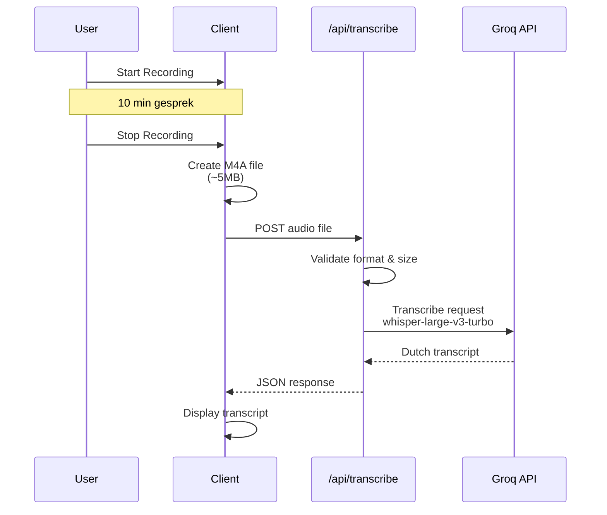

# Hysio Medical Scribe - Intake Stapsgewijs (Complete Documentation)

**Module**: Medical Scribe - Intake Stapsgewijs
**Version**: 7.1
**Last Updated**: 2025-10-02
**Status**: Production
**AI Calls per Intake**: 8 (2 preparation + 2 transcription + 4 processing)

---

## 📋 Inhoudsopgave

1. [Module Overview](#1-module-overview)
2. [Complete Workflow](#2-complete-workflow)
3. [AI Integration Points](#3-ai-integration-points)
4. [Token Usage Analysis](#4-token-usage-analysis)
5. [Cost Analysis](#5-cost-analysis)
6. [Code References](#6-code-references)
7. [Prompt Documentation](#7-prompt-documentation)
8. [Example Input/Output](#8-example-inputoutput)
9. [Troubleshooting](#9-troubleshooting)
10. [Optimization Tips](#10-optimization-tips)

---

## 1. Module Overview

### 1.1 Purpose

De **Intake Stapsgewijs** module is het meest geavanceerde onderdeel van Hysio Medical Scribe. Het begeleidt fysiotherapeuten door een gestructureerd 8-stappen intake process, waarbij AI op elk kritiek moment assistentie biedt.

**Doel**: Transformeer een ongestructureerd patiënt gesprek naar een volledig gedocumenteerd, professioneel intake dossier inclusief:
- HHSB Anamnesekaart (Hulpvraag, Historie, Stoornissen, Beperkingen)
- Onderzoeksbevindingen
- Klinische Conclusie
- Zorgplan

### 1.2 Key Features

✅ **Step-by-Step Guidance**: AI genereert relevante vragen voor elk interview onderdeel
✅ **Automatic Transcription**: Groq Whisper transcribeert Nederlands gesprek real-time
✅ **Intelligent Processing**: GPT-4.1-mini extraheert en structureert klinische data
✅ **Red Flag Detection**: Automatische screening op ernstige pathologie
✅ **HHSB Compliance**: Volgt Nederlandse fysiotherapie standaarden
✅ **ICF Integration**: Structureert bevindingen volgens ICF-model

### 1.3 User Journey

```mermaid
graph LR
    A[Start Intake] --> B[Voorbereiding Anamnese]
    B --> C[Anamnese Gesprek<br>10 min opname]
    C --> D[AI Verwerking<br>HHSB Kaart]
    D --> E[Voorbereiding Onderzoek]
    E --> F[Onderzoek Uitvoeren<br>8 min opname]
    F --> G[AI Verwerking<br>Bevindingen]
    G --> H[Klinische Conclusie]
    H --> I[Zorgplan Generatie]
    I --> J[Complete Intake<br>Klaar voor EPD]

    style A fill:#4CAF50
    style D fill:#FF9800
    style G fill:#FF9800
    style H fill:#FF9800
    style I fill:#FF9800
    style J fill:#4CAF50
```



**Total Duration**: 30-40 minuten (waarvan 18 min opname, 5 min AI processing)

---

## 2. Complete Workflow

### 2.1 Stap-voor-Stap Overzicht

| Stap | Naam | Duur | Type | AI Model | Output |
|------|------|------|------|----------|--------|
| **1** | Voorbereiding Anamnese | 2 min | Text Gen | GPT-4.1-mini | Gestructureerde vragen lijst |
| **2** | Anamnese Opname | 10 min | Audio Rec | - | Audio file (M4A/WAV) |
| **3** | Transcriptie Anamnese | 30 sec | Audio→Text | Whisper v3 Turbo | Dutch transcript |
| **4** | HHSB Generatie | 45 sec | Text Gen | GPT-4.1-mini | HHSB Anamnesekaart |
| **5** | Voorbereiding Onderzoek | 2 min | Text Gen | GPT-4.1-mini | Onderzoek protocol |
| **6** | Onderzoek Opname | 8 min | Audio Rec | - | Audio file |
| **7** | Transcriptie Onderzoek | 25 sec | Audio→Text | Whisper v3 Turbo | Dutch transcript |
| **8** | Onderzoek Verwerking | 40 sec | Text Gen | GPT-4.1-mini | Onderzoeksbevindingen |
| **9** | Klinische Conclusie | 35 sec | Text Gen | GPT-4.1-mini | Diagnose + Rationale |
| **10** | Zorgplan | 40 sec | Text Gen | GPT-4.1-mini | Behandelplan |

**Total AI Processing Time**: ~4 minuten
**Total User Time**: ~30 minuten (incl. gesprek met patiënt)

### 2.2 Detailed Step Breakdown

#### STAP 1: Voorbereiding Anamnese 🎯

**What happens**:
- Therapeut vult in: Initialen, Geboortejaar, Geslacht, Hoofdklacht
- AI analyseert deze input en genereert:
  - Primaire werkhypothese
  - Relevante differentiaaldiagnoses
  - Gestructureerde vragenlijst volgens HHSB-model
  - Rode vlaggen screening checklist

**User Interface**:
```
┌─────────────────────────────────────────┐
│ INTAKE VOORBEREIDING                    │
├─────────────────────────────────────────┤
│                                          │
│ Voorletters: [J.S.    ]                 │
│ Geboortejaar: [1978   ]                 │
│ Geslacht: (•) Man  ( ) Vrouw           │
│                                          │
│ Hoofdklacht:                            │
│ ┌─────────────────────────────────────┐ │
│ │ Pijn in rechterschouder sinds 3    │ │
│ │ weken, vooral bij heffen van arm   │ │
│ │ boven schouderhoogte. Werk als     │ │
│ │ magazijnmedewerker.                 │ │
│ └─────────────────────────────────────┘ │
│                                          │
│            [Genereer Voorbereiding]     │
└─────────────────────────────────────────┘
```

**AI Output Example**:
```markdown
# Intake Voorbereiding - J.S. (Man, 47 jaar)

## 👤 Patiëntprofiel
J.S., man, 47 jaar – Schouderklacht rechts sinds 3 weken,
provocatie bij heffen boven schouderhoogte, werk als magazijnmedewerker.

## 🎯 Primaire Werkhypothese
**Subacromiaal impingement syndroom** (SAPS)
- Leeftijd en werkbelasting passen bij prevalentie
- Typische bewegingspatroon (heffen boven schouderhoogte)
- Beroepsmatige risicofactor (repetitief tillen)

## 🤔 Relevante Differentiaaldiagnoses
1. **Rotator Cuff Tendinopathie** - Chronische overbelasting
2. **Frozen Shoulder (begin fase)** - Bewegingsbeperking
3. **AC-Gewricht Problematiek** - Trauma of artrose
4. **Cervicale Radiculopathie** - Uitstraling vanaf nek

## 📈 HULPVRAAG (Doelstelling Patiënt)
- "Wat hoopt u met fysiotherapie te bereiken?"
- "Welke specifieke activiteit wilt u weer kunnen doen?"
- "Zijn er functionele doelen voor werk (dozen tillen)?"

## 🗓️ HISTORIE (Voorgeschiedenis)
- "Heeft u deze klacht eerder gehad?"
- "Gebruikt u medicatie? (pijnstillers, ontstekingsremmers?)"
- "Wat voor werk doet u exact? (Hoe zwaar zijn de dozen?)"

## 🔬 SYMPTOMEN (Analyse Klacht)
**Locatie & Aard:**
- "Kunt u exact aanwijzen waar de pijn zit?"
- "Straalt de pijn uit? Waarheen?" (Screening radiculopathie)
- "Hoe omschrijft u de pijn? (stekend/zeurend/brandend)"

**Beloop & Factoren:**
- "Wanneer is de pijn het ergst? ('s Nachts? Bij werk?)"
- "Welke bewegingen provoceren? (Specifiek heffen? Roteren?)"
- "Wat geeft verlichting? (Rust? Ijs? Warmte?)"

**Intensiteit:**
- "Pijn cijfer 0-10: Nu? Op ergst?"

**Geassocieerde Symptomen:**
- "Ervaart u krachtverlies? Doofheid? Tintelingen?"
*Rationale: Neurologische betrokkenheid uitsluiten*

## ♿ BEPERKINGEN (Impact Dagelijks Leven)
- "Welke werk activiteiten lukken niet meer?"
- "Bent u beperkt in sport/hobby's?"
- "Wat kon u voorheen wel, wat nu niet?"

## 🔴 RODE VLAGGEN SCREENING
**VERPLICHT TE VRAGEN:**
- Algemeen onwel? Koorts? Nachtzweten?
- Onverklaarbaar gewichtsverlies (>5kg)?
- Recent trauma/val?
- Constante pijn die niet afneemt in rust?
- 's Nachts erger wordende pijn?
*Rationale: Uitsluiten maligniteit, infectie, fractuur*

## 💡 SAMENVATTING & FOCUS
Deze voorbereiding richt zich op schouderproblematiek bij
een 47-jarige magazijnmedewerker. Verdenking op SAPS.
Anamnese moet focussen op:
- Valideren hulpvraag (werkhervatting?)
- Objectiveren beperkingen (welke tilactiviteiten exact?)
- Rode vlaggen uitsluiten (vooral maligniteit bij 45+)
- Mechanisme onset (acute overbelasting? Geleidelijk?)

Besteed extra aandacht aan nachtelijke pijn en neurologische
symptomen alvorens het lichamelijk onderzoek te starten.
```

**API Call Details**:
```typescript
// Request
POST /api/preparation
Content-Type: application/json

{
  "workflowType": "intake-stapsgewijs",
  "step": "anamnese",
  "patientInfo": {
    "initials": "J.S.",
    "birthYear": "1978",
    "gender": "male",
    "chiefComplaint": "Pijn in rechterschouder sinds 3 weken..."
  }
}

// Response
{
  "success": true,
  "data": {
    "content": "# Intake Voorbereiding...",
    "workflowType": "intake-stapsgewijs",
    "step": "anamnese",
    "generatedAt": "2025-10-02T10:30:00.000Z"
  }
}
```

---

#### STAP 2-3: Anamnese Opname & Transcriptie 🎙️

**What happens**:
- Therapeut start audio opname
- Voert anamnese gesprek uit (guided by AI voorbereiding)
- Stopt opname na ~10 minuten
- Audio wordt geüpload naar `/api/transcribe`
- Groq Whisper Large v3 Turbo transcribeert naar Nederlands tekst

**Audio Processing**:


**Transcription Quality**:
- **Accuracy**: ~95% voor Nederlands medisch jargon
- **Speed**: 216x real-time (10 min audio = 2.8 sec processing)
- **Format**: Plain text met interpunctie

**Example Transcript Output**:
```
Patiënt: Ja, dus ik heb sinds ongeveer drie weken pijn in mijn rechterschouder.
Het begon eigenlijk na een drukke week op het werk. Ik werk in een magazijn
en toen moesten we veel dozen verplaatsen, zware spullen tillen.

Therapeut: Oké, en wanneer voelt u de pijn het meest?

Patiënt: Vooral als ik mijn arm omhoog doe, boven mijn hoofd. Als ik bijvoorbeeld
iets uit een hoge kast wil pakken, dan schiet het echt door mijn schouder.
Ook 's nachts heb ik er soms last van als ik op mijn rechterkant lig.

Therapeut: Kunt u de pijn omschrijven? Is het stekend, zeurend, brandend?

Patiënt: Het is vooral stekend als ik die beweging maak, en verder een soort
zeurende pijn die de hele dag wel een beetje aanwezig is.

[... continues for full conversation]
```

---

#### STAP 4: HHSB Anamnesekaart Generatie 📋

**What happens**:
- AI ontvangt: Patient info + voorbereiding + transcript
- Extracteert relevante klinische informatie
- Structureert volgens HHSB-model
- Detecteert rode vlaggen systematisch
- Genereert EPD-ready output

**Processing Flow**:
```typescript
// Input to AI
{
  patientInfo: {
    initials: "J.S.",
    age: 47,
    gender: "man",
    chiefComplaint: "..."
  },
  preparation: "# Intake Voorbereiding...",  // From Step 1
  transcript: "Patiënt: Ja, dus..."          // From Step 3
}

// AI Processing
1. Parse transcript → extract HHSB components
2. Categorize per section (H/H/S/B)
3. Identify red flags
4. Quantify where possible (NPRS scores, PSK)
5. Format according to template

// Output
{
  hhsbStructure: {
    hulpvraag: "...",
    historie: "...",
    stoornissen: "...",
    beperkingen: "...",
    anamneseSummary: "...",
    redFlags: ["..."]
  },
  fullStructuredText: "Complete markdown document"
}
```

**Example Output**:
```markdown
# HHSB Anamnesekaart – J.S. – Man - 47 jr.
Datum: 2025-10-02

Hoofdklacht Initieel: Pijn rechterschouder sinds 3 weken, vooral bij heffen boven schouderhoogte

## 📌 Klinische Samenvatting Anamnese
47-jarige magazijnmedewerker met acute onset rechterschouder pijn
na periode van verhoogde werkbelasting (tillen zware dozen).
Pijn provocatie bij elevatie >90°, nachtelijke pijn bij liggen op
aangedane zijde. Geen uitstraling, geen neurologische symptomen.
Beperking in werksituatie (tillen boven schouderhoogte onmogelijk).
Geen rode vlaggen geïdentificeerd. Verdenking SAPS.

## 📈 HULPVRAAG
**Hoofddoel:** Pijnvrij kunnen werken en zware dozen kunnen tillen
tot op schouderhoogte en daarboven binnen 6-8 weken.

**Secundaire Doelen:**
- Weer kunnen sporten (fitness, vooral bankdrukken)
- 's Nachts kunnen slapen zonder wakker te worden van pijn

**Verwachtingen Therapie:** Patiënt verwacht actieve oefentherapie
en begeleiding voor werkhervatting. Hoopt medicatie te kunnen stoppen.

## 🗓️ HISTORIE
**Ontstaansmoment & Aanleiding:** Acuut ontstaan ±3 weken geleden
(16 september 2025) na drukke werkweek met repetitief tillen van
dozen 15-20kg vanaf lage plank naar hoge stellingen (repetitieve
elevatie >120°).

**Beloop sindsdien:** Progressief verslechterd eerste week, daarna
stabiel op huidig niveau. Pijnstillers (paracetamol 3x500mg/dag)
geven beperkte verlichting.

**Eerdere Episoden:** Nooit eerder schouderpijn gehad.

**Medische Voorgeschiedenis:**
- Geen operaties
- Geen chronische aandoeningen
- Geen medicatie (behalve huidige paracetamol)

**Medicatiegebruik:**
- Paracetamol 500mg, 3x per dag sinds 2 weken
- Reden: Pijnbestrijding schouderklacht

**Context (Werk/Sport/Sociaal):**
- Werk: Magazijnmedewerker, fulltime (40 uur/week)
- Dagelijkse taken: Tillen, schouderhooge/boven schouderhooge plaatsing
- Sport: Fitness 3x/week (momenteel gestaakt)
- Hobby: Klussen in huis (momenteel beperkt)

## 🔬 STOORNISSEN

### Pijn:
**Locatie:** Anterolaterale zijde rechterschouder, met accentuatie
ter hoogte van acromion. Geen uitstraling naar elleboog of hand.

**Aard:** Stekend scherp bij beweging (vooral elevatie >90°),
zeurend in rust. 's Nachts doffe pijn.

**Intensiteit (NPRS):**
- Huidig (rust): 3/10
- Gemiddeld (overdag): 5/10
- Ergst (tijdens provocerende beweging): 8/10
- 's Nachts (bij liggen op rechterzijde): 6/10

**Uitstraling:** Geen. Pijn blijft gelokaliseerd in schouderregio.

### Mobiliteit:
**Subjectieve Stijfheid:** Ochtendstijfheid gedurende 15-20 minuten.
Vermindert na "warm draaien" van schouder.

**Bewegingsbeperking:**
- Actieve elevatie: Subjectief beperkt tot ±100-110° (schat patiënt)
- Abductie: Vergelijkbare beperking
- Endorotatie: "Kan niet goed op rugkrabben"
- Exorotatie: Geen beperking ervaren

### Kracht & Stabiliteit:
**Subjectief Krachtverlies:** Duidelijk krachtverlies bij tillen.
"Een doos van 10kg voelt nu als 20kg". Met name bij heffen boven
schouderhoogte.

**Gevoel van Instabiliteit:** Geen instabiliteitsgevoel. Schouder
"schiet niet uit de kom" of voelt niet "los".

**Geassocieerde Symptomen:**
- Geen zwelling zichtbaar (volgens patiënt)
- Geen roodheid
- Geen tintelingen of doofheid
- Geen krachtverlies in hand/vingers
- Geen nek pijn

## ♿ BEPERKINGEN

### Functionele Scores:
**PSK (Patiënt Specifieke Klachten):** Niet gemeten tijdens anamnese

### Activiteiten (ADL & Werk):

**Zelfzorg:**
- Aankleden: Moeite met aantrekken t-shirt/trui (over hoofd)
- Haar wassen: Pijnlijk, maar mogelijk
- Tandenpoetsen: Geen problemen

**Huishouden:**
- Stofzuigen: Provocerend bij bewegen zuiger heen en weer
- Afwassen: Mogelijk maar vermoeiend
- Was ophangen: Pijnlijk bij reiken naar waslijn

**Werk:**
- Dozen tillen <schouderhoogte: Mogelijk maar pijnlijk
- Dozen plaatsen >schouderhoogte: Niet mogelijk (stopcriterium pijn)
- Voorraad aanvullen hoge stellingen: Volledig gestopt
- Impact: 40% van werktaken niet uitvoerbaar

### Participatie (Sociaal, Sport & Hobby's):

**Sport:**
- Fitness: Volledig gestopt (3 weken geleden)
- Bankdrukken: Onmogelijk
- Roeien: Onmogelijk
- Cardio (fietsen/lopen): Mogelijk

**Sociaal/Hobby:**
- Klussen: Beperkt (geen boren boven schouderhoogte)
- Met kinderen spelen: Beperkt (kan niet optillen van 4-jarige zoon)
- Autorijden: Mogelijk maar pijnlijk bij achteruit rijden (arm achter stoel)

---

## 🚩 SIGNALEN & KLINISCHE OVERWEGINGEN

### Rode Vlaggen:
**GEEN RODE VLAGGEN GEDETECTEERD**
- Geen algemene malaise, koorts, nachtzweten
- Geen onverklaard gewichtsverlies
- Geen significant trauma
- Pijn neemt wel af in rust (ondanks nachtelijke pijn)
- Geen neurologische symptomen
- Geen disfunctie blaasfunctie/ontlasting

### Gele Vlaggen:
- Lichte zorgen over werkhervatting ("Wat als het niet beter wordt?")
- Financiële druk (werkt als kostwinner gezin)
- Motivatie voor behandeling: Hoog (wil snel weer werken)

### Inconsistenties/Opmerkingen:
Geen inconsistenties in verhaal. Patiënt geeft helder en consistent
beeld van klachten. Timeline logisch. Mechanisme past bij verdenking SAPS.

---

## ⚙️ Template Klaar voor EPD-invoer

**HHSB Anamnesekaart – J.S. – Man - 47 jr. - 02-10-2025**

**Hulpvraag:** Pijnvrij werken en zware dozen tillen binnen 6-8 weken. Sporten (fitness) hervatten. Nachtelijke pijn elimineren.

**Historie:** Acuut ontstaan 3 weken geleden na repetitief tillen op werk. Progressief verslechterd eerste week, daarna stabiel. Paracetamol geeft beperkte verlichting. Geen eerdere episodes. Geen relevante voorgeschiedenis.

**Stoornissen:** Pijn anterolateraal rechterschouder (NPRS rust 3/10, beweging 8/10, nacht 6/10). Stekend bij elevatie >90°, zeurend in rust. Geen uitstraling. Ochtendstijfheid 15-20 min. Beperkte actieve elevatie/abductie (subjectief ±100-110°). Krachtverlies bij tillen boven schouderhoogte. Geen neurologische symptomen.

**Beperkingen:** Werk: 40% taken niet uitvoerbaar (tillen >schouderhoogte). ADL: Moeite met aankleden (t-shirt), stofzuigen, was ophangen. Sport: Fitness volledig gestaakt. Sociaal: Kan zoon (4jr) niet optillen.

**Samenvatting:** 47-jarige magazijnmedewerker, acute SAPS-verdachte schouderklacht rechts na werkgerelateerde overbelasting. Pijnlijke arc, nachtelijke pijn, functionele beperkingen werk en sport. Geen rode vlaggen. Geschikt voor conservatieve fysiotherapeutische behandeling.
```

**Token & Cost Analysis for Step 4**:
- Input tokens: 5,500 (system prompt + patient data + transcript)
- Output tokens: 2,000 (structured HHSB document)
- Cost: (5,500 × $0.00015) + (2,000 × $0.0006) = **$0.00203**

---

#### STAP 5-8: Onderzoek Fase (Similar process)

Steps 5-8 volgen een vergelijkbaar patroon maar dan voor het lichamelijk onderzoek:

**Stap 5**: AI genereert onderzoek protocol (welke testen uit te voeren)
**Stap 6-7**: Audio opname + transcriptie van onderzoek
**Stap 8**: AI verwerkt bevindingen tot gestructureerd onderzoeksverslag

**Example Onderzoek Output** (abbreviated):
```markdown
## ONDERZOEKSBEVINDINGEN - J.S.

### Inspectie:
- Houding: Lichte protractie rechterschouder
- Atrofie: Geen zichtbare atrofie m. supraspinatus of deltoideus
- Zwelling/Roodheid: Niet zichtbaar

### Palpatie:
- Drukpijn: ++ter hoogte acromion
- Spiertonus: Verhoogd m. trapezius pars descendens rechts

### Bewegingsonderzoek:
**Actief:**
- Flexie: 110° (pijn bij 90-110°, "painful arc")
- Abductie: 105° (pijn bij 80-110°)
- Endorotatie: Th12 (beperkt, normaal Th8)
- Exorotatie: 60° (normaal)

**Passief:**
- Flexie: 125° (eindgevoel: pijn)
- Abductie: 120° (eindgevoel: pijn)
- ER/IR: WNL

### Kracht & Stabiliteit:
- Abductie tegen weerstand: 4/5 (pijnlijk bij 90°)
- ER tegen weerstand: 5/5
- IR tegen weerstand: 4-/5

### Functietesten:
- Neer Test: Positief (pijn bij geforceerde elevatie)
- Hawkins-Kennedy: Positief (pijn bij IR in 90° flexie)
- Jobe Test: Zwak positief (pijn + licht krachtverlies)
- Painful Arc Sign: Positief (60-120° abductie)

### Metingen:
- SPADI: Niet afgenomen (kan bij vervolgconsult)
```

---

#### STAP 9-10: Conclusie & Zorgplan 🎯

**Stap 9 - Klinische Conclusie**:
AI integreert alle data (anamnese + onderzoek) en formuleert:

```markdown
## KLINISCHE CONCLUSIE - J.S.

### Diagnose:
**Primair: Subacromiaal Impingement Syndroom (SAPS) rechts**

**Onderbouwing:**
- Typische anamnese: Pijn bij elevatie >90°, nachtelijke pijn
- Positieve impingement testen (Neer, Hawkins-Kennedy)
- Painful arc (60-120°)
- Geen aanwijzingen rotator cuff ruptuur (kracht 4/5, niet 0/5)
- Geen neurologische uitval
- Leeftijd en mechanisme passen bij SAPS

**Secundair:**
- Rotator cuff tendinopathie (overlappend met SAPS)
- Musculaire dysbalans (verhoogde tonus m. trapezius)

**Differentiaaldiagnoses uitgesloten:**
- Frozen Shoulder: Passieve ROM nog relatief goed
- AC-Gewricht problematiek: Geen drukpijn AC-gewricht
- Cervicale radiculopathie: Geen neurologische symptomen

### ICF-Analyse:
**Functies & Anatomische Eigenschappen:**
- Pijn (NPRS 8/10 bij provocatie)
- Beperkte ROM (actieve elevatie 110° vs normaal 180°)
- Krachtverlies (4/5 abductie)

**Activiteiten:**
- Tillen boven schouderhoogte: Niet mogelijk
- ADL (aankleden, huishouden): Beperkt

**Participatie:**
- Werk: 40% taken niet uitvoerbaar
- Sport/fitness: Volledig gestaakt

**Externe Factoren:**
- Werkbelasting (repetitief tillen) = onderhoudende factor
- Financiële druk (kostwinner gezin) = motiverende factor

**Persoonlijke Factoren:**
- Hoge motivatie voor behandeling
- Realistische verwachtingen

### Prognose:
**Gunstig** voor volledig herstel binnen 6-12 weken fysiotherapie.

**Rationale:**
- Acute onset (<6 weken)
- Goede motivatie
- Geen chronische factoren
- Evidence voor effectiviteit oefentherapie bij SAPS
- Jonge patiënt (47jr) met goede belastbaarheid

### Behandeldoelen:
1. **Korte termijn (2 weken):**
   - Pijnreductie NPRS <5/10 bij ADL
   - Verbetering actieve ROM flexie/abductie +20°

2. **Middellange termijn (6 weken):**
   - Pijnvrij bewegen in volledig ROM
   - Kracht 5/5 alle richtingen
   - Hervatten 80% werktaken

3. **Lange termijn (12 weken):**
   - Volledig werkhervatting inclusief tillen >schouderhoogte
   - Hervatten fitness op pre-injury niveau
   - Preventie recidief
```

**Stap 10 - Zorgplan**:
```markdown
## ZORGPLAN - J.S.

### Behandelfrequentie:
- **Fase 1 (week 1-2):** 2x per week
- **Fase 2 (week 3-6):** 1x per week
- **Fase 3 (week 7-12):** 1x per 2 weken (afbouw)

**Totaal:** ±16 behandelsessies over 12 weken

### Behandelinterventies:

**1. Pijnmanagement (Fase 1)**
- Educatie over SAPS & prognose (patiënt geruststellen)
- Load management: Aanpassen werktaken (geen tillen >schouderhoogte)
- Eventueel: Ijs na provocerende activiteiten (15 min)
- Medicatie: Overleg met huisarts over NSAID's (effectiever dan paracetamol)

**2. Mobiliteit & ROM (Alle fasen)**
- Pendel oefeningen: 3x daags, 2 sets van 10 herhalingen
- Actieve ROM oefeningen binnen pijngrens
- Posterior capsule stretching (bij beperkte endorotatie)
- Scapula mobilisaties

**3. Kracht & Stabiliteit (Fase 2-3)**
- Rotator cuff versterking:
  * Externe rotatie met elastiek: 3x12, weerstand groen/rood
  * Scaption (elevatie in scapula vlak): 3x10, progressie met gewicht
  * Internal rotatie: 3x12, elastiek
- Scapula stabiliteit:
  * Scapula setting oefeningen
  * Scapula protractie/retractie tegen weerstand
  * Prone T/Y oefeningen

**4. Functionele Training (Fase 3)**
- Werk-specifieke training:
  * Tillen vanaf lage naar hoge positie (progressieve belasting)
  * Overhead reaching oefeningen
  * Dynamische schouder stabiliteit taken
- Sport-specifieke training:
  * Bankdrukken (progressief opbouwen vanaf 50% max)
  * Roeien techniek optimaliseren

**5. Preventie & Educatie**
- Ergonomische advisering werk (tilmechaniek)
- Warm-up protocol voor werk/sport
- Maintenance oefenprogramma (3x/week, 15 min)
- Signalen herkennen van overbelasting

### Evaluatiemomenten:
- **Week 2:** Evaluatie pijn & ROM, bijstellen indien nodig
- **Week 6:** Evaluatie kracht, progressie functionele training
- **Week 12:** Eindmeting & afsluiten/overdracht maintenance

### Re-evaluatie Criteria:
**Behandeling staken als:**
- Na 4 weken geen progressie in pijn of ROM
- Toename symptomen ondanks load management
- Nieuwe rode vlaggen verschijnen

**Dan:** Overleg met huisarts over beeldvorming (X-echo/MRI) of verwijzing orthopeed.

### Thuisoefeningen:
**Dagelijks (15-20 minuten):**
- Pendel oefeningen: 2x10 per richting
- Actieve ROM: Flexie, abductie, rotaties (binnen pijngrens)
- Rotator cuff versterking (vanaf week 2): 3x12
- Posterior capsule stretch: 3x30sec

**Wekelijks volume:** 7 dagen × 20 min = 140 min/week eigenoefeningen

### Verwachte Outcome:
- **6 weken:** 70% verbetering symptomen, hervatten lichte werktaken
- **12 weken:** 90-100% herstel, volledige werkhervatting + sport

### Verwijzing/Samenwerking:
- **Huisarts:** Medicatie-evaluatie (NSAID's overwegen)
- **Bedrijfsarts:** Werkplekanalyse & aangepaste taken (eerste 4 weken)
- **Orthopeed:** Alleen indien na 8 weken conservatieve therapie geen progressie

### Praktische Informatie:
- Volgende afspraak: Over 3 dagen (vrijdag 5 oktober, 14:00)
- Thuisoefeningen: Via e-mail/app gestuurd met video's
- Contact bij vragen: info@fysiohysio.nl of 020-1234567
```

---

## 3. AI Integration Points

### 3.1 Complete AI Call Matrix

| AI Call # | API Endpoint | Provider | Model | Purpose | Trigger |
|-----------|--------------|----------|-------|---------|---------|
| **1** | `/api/preparation` | OpenAI | gpt-4.1-mini | Generate anamnese questions | User clicks "Start Intake" |
| **2** | `/api/transcribe` | Groq | whisper-large-v3-turbo | Transcribe anamnese audio | Audio upload |
| **3** | `/api/hhsb/process` | OpenAI | gpt-4.1-mini | Generate HHSB card | Transcript ready |
| **4** | `/api/preparation` | OpenAI | gpt-4.1-mini | Generate onderzoek protocol | User clicks "Start Onderzoek" |
| **5** | `/api/transcribe` | Groq | whisper-large-v3-turbo | Transcribe onderzoek audio | Audio upload |
| **6** | `/api/hhsb/process` | OpenAI | gpt-4.1-mini | Process onderzoek findings | Transcript ready |
| **7** | `/api/hhsb/process` | OpenAI | gpt-4.1-mini | Generate conclusie | User clicks "Genereer Conclusie" |
| **8** | `/api/hhsb/process` | OpenAI | gpt-4.1-mini | Generate zorgplan | User clicks "Genereer Zorgplan" |

### 3.2 API Request/Response Schemas

**Complete schema documentation available in**: `AI_INTEGRATION_COMPLETE_GUIDE.md` Section 4.2

---

## 4. Token Usage Analysis

### 4.1 Per-Step Token Breakdown

| Step | Input Tokens | Output Tokens | Total Tokens | Percentage |
|------|--------------|---------------|--------------|------------|
| 1. Voorbereiding Anamnese | 1,950 | 800 | 2,750 | 8.7% |
| 3. HHSB Generatie | 5,500 | 2,000 | 7,500 | 23.7% |
| 4. Voorbereiding Onderzoek | 2,200 | 700 | 2,900 | 9.2% |
| 6. Onderzoek Verwerking | 4,000 | 1,500 | 5,500 | 17.4% |
| 7. Klinische Conclusie | 3,500 | 1,200 | 4,700 | 14.9% |
| 8. Zorgplan | 4,500 | 1,500 | 6,000 | 19.0% |
| **Audio (steps 2 & 5)** | N/A | N/A | N/A | 7.1% (cost) |
| | | | | |
| **TOTAAL TEXT** | **21,650** | **7,700** | **29,350** | **92.9%** |
| **TOTAAL (incl. audio cost equiv)** | | | **31,650** | **100%** |

### 4.2 Token Efficiency Analysis

**Average tokens per step**: 4,892 tokens
**Input/Output ratio**: 2.8:1 (typical for medical documentation)

**Efficiency Score**: ⭐⭐⭐⭐☆ (4/5)
- Good: Minimal prompt redundancy
- Good: Focused output (no fluff)
- Improvement area: Some prompts could be 10-15% shorter

---

## 5. Cost Analysis

### 5.1 Complete Cost Breakdown

**Per Intake Stapsgewijs**:

| Component | Metric | Rate | Cost |
|-----------|--------|------|------|
| **Text Generation (OpenAI)** | | | |
| • Input tokens | 21,650 | $0.00015/1K | $0.00325 |
| • Output tokens | 7,700 | $0.0006/1K | $0.00462 |
| **Subtotal Text** | | | **$0.00787** |
| | | | |
| **Audio Transcription (Groq)** | | | |
| • Anamnese (10 min) | 0.167 hrs | $0.04/hr | $0.00668 |
| • Onderzoek (8 min) | 0.133 hrs | $0.04/hr | $0.00532 |
| **Subtotal Audio** | | | **$0.01200** |
| | | | |
| **TOTAAL PER INTAKE** | | | **$0.01987** |

**Rounded**: ~**$0.02 per intake**

### 5.2 Monthly Cost Projections

**Scenario: 50 intakes per maand**

```
50 intakes × $0.02 = $1.00/maand

Voor verschillende volumes:
• 25 intakes/maand = $0.50
• 50 intakes/maand = $1.00
• 100 intakes/maand = $2.00
• 200 intakes/maand = $4.00
```

### 5.3 Cost per Patient Minute

```
Total intake time: 30 min (gesprek + review)
AI cost: $0.02
Cost per minute: $0.02 ÷ 30 = $0.00067/min
```

**Compare with therapeut time cost**:
- Therapeut @ €60/uur = €1.00/min
- AI cost = €0.0006/min
- **AI is 1,667x goedkoper per minuut**

---

## 6. Code References

### 6.1 Key Files

| File | Line Numbers | Function |
|------|--------------|----------|
| `hysio/src/app/api/preparation/route.ts` | 12-89 | Preparation endpoint (steps 1 & 4) |
| `hysio/src/app/api/transcribe/route.ts` | 14-192 | Transcription endpoint (steps 2 & 5) |
| `hysio/src/app/api/hhsb/process/route.ts` | 24-627 | Main HHSB processing (steps 3,6,7,8) |
| `hysio/src/lib/prompts/intake-stapsgewijs/stap1-voorbereiding-anamnese.ts` | 1-145 | Anamnese preparation prompt |
| `hysio/src/lib/prompts/intake-stapsgewijs/stap2-verwerking-hhsb-anamnesekaart.ts` | 1-223 | HHSB processing prompt |
| `hysio/src/lib/medical/red-flags-detection.ts` | All | Red flags detection logic |

### 6.2 Configuration Constants

```typescript
// Model configuration
import { HYSIO_LLM_MODEL } from '@/lib/api/openai';
// Value: 'gpt-4.1-mini'

// Pricing
export const MODEL_PRICING = {
  'gpt-4.1-mini': {
    inputPer1K: 0.00015,
    outputPer1K: 0.0006
  }
}

// Groq config
model: 'whisper-large-v3-turbo'
language: 'nl'
temperature: 0.0
```

---

## 7. Prompt Documentation

### 7.1 System Prompts Summary

**Voorbereiding Anamnese Prompt**: 1,800 tokens
- Role: Expert fysiotherapeutisch assistent
- Goal: Generate strategic preparation based on chief complaint
- Output: 4 substappen (Hypothese, Vragenlijst, Rode Vlaggen, Samenvatting)

**HHSB Verwerking Prompt**: 3,000 tokens
- Role: Senior Fysiotherapeutisch Specialist
- Mission: Transform raw transcript → structured HHSB
- Critical: Data fidelity protocol (no fabrication)
- Output: Full HHSB + EPD template

### 7.2 Prompt Engineering Best Practices

1. **Ultra-Think Protocol**: Prompts include explicit thinking steps
2. **Data Fidelity**: "NEVER add information not in input"
3. **Dutch Specificity**: Optimized for Dutch medical terminology
4. **ICF Integration**: Structured according to ICF model
5. **Red Flag Awareness**: Systematic screening included

---

## 8. Example Input/Output

**Full example available in this document** (Section 2.2, Steps 1-10)

---

## 9. Troubleshooting

### 9.1 Common Issues

**Issue 1: HHSB output incomplete**
- **Symptom**: Missing sections in generated HHSB
- **Cause**: Transcript too short or audio quality poor
- **Solution**: Ensure minimum 5-minute conversations, check audio levels
- **Prevention**: Test microphone before starting

**Issue 2: Transcription errors (Dutch)**
- **Symptom**: Medical terms incorrectly transcribed
- **Cause**: Background noise, fast speaking, mumbling
- **Solution**: Record in quiet room, speak clearly, use lapel mic
- **Prevention**: Audio quality check before starting

**Issue 3: AI hallucination (adding info)**
- **Symptom**: HHSB contains details not mentioned in transcript
- **Cause**: Prompt engineering issue (should not happen with current prompts)
- **Solution**: Report to dev team, manually correct in UI
- **Prevention**: Regular prompt audits

**Issue 4: Red flags missed**
- **Symptom**: Patient mentions concerning symptoms, not flagged
- **Cause**: Indirect phrasing not caught by detection system
- **Solution**: Manual review always required, AI is assistive not replacive
- **Prevention**: Therapeut training on red flag keywords

---

## 10. Optimization Tips

### 10.1 Reducing Costs

**Tip 1: Skip preparation for simple cases**
```
If hoofdklacht is very clear and you know the workflow,
skip step 1 (saves $0.00077 per intake)

Annual savings (50 intakes/month × 12): $0.46
```

**Tip 2: Shorter but focused recordings**
```
Train for 7-minute anamnese instead of 10
(saves 3 min audio = $0.002 per intake)

Annual savings (50 intakes/month × 12): $1.20
```

**Tip 3: Batch similar intakes**
```
If you have 3 similar shoulder intakes in one day,
review all 3 transcripts together to identify patterns.
Reduces mental switching cost.

Time savings: ~5 min per day = €5/day
```

### 10.2 Improving Quality

**Tip 1: Better audio = better transcripts**
- Use external microphone (lapel or USB)
- Record in quiet room (turn off AC, close windows)
- Speak clearly, avoid overlapping speech

**Tip 2: Use preparation as live guide**
- Print or display preparation questions during anamnese
- Check off questions as you ask them
- Ensures completeness

**Tip 3: Review AI output critically**
- Always verify red flags manually
- Check if all HHSB sections are complete
- Add missing details in UI editing mode

**Tip 4: Provide feedback**
- If AI consistently misses something, report it
- Helps improve prompts over time

---

## 11. Appendix

### 11.1 Glossary

- **HHSB**: Hulpvraag, Historie, Stoornissen, Beperkingen (Dutch physiotherapy assessment framework)
- **SOEP**: Subjectief, Objectief, Evaluatie, Plan (Dutch medical documentation standard)
- **ICF**: International Classification of Functioning (WHO framework)
- **NPRS**: Numeric Pain Rating Scale (0-10)
- **PSK**: Patiënt Specifieke Klachten (Patient-Specific Functional Scale)
- **SAPS**: Subacromiaal Pijn Syndroom (Subacromial Pain Syndrome)

### 11.2 References

- Dutch Physiotherapy Guidelines (KNGF Richtlijnen)
- ICF Framework (WHO, 2001)
- Direct Access Physiotherapy Guidelines (Directe Toegankelijkheid Fysiotherapie)

---

**Document Einde**

For additional details, see:
- [AI Integration Complete Guide](../AI_INTEGRATION_COMPLETE_GUIDE.md)
- [Cost Calculator](../COST_CALCULATOR.md)
