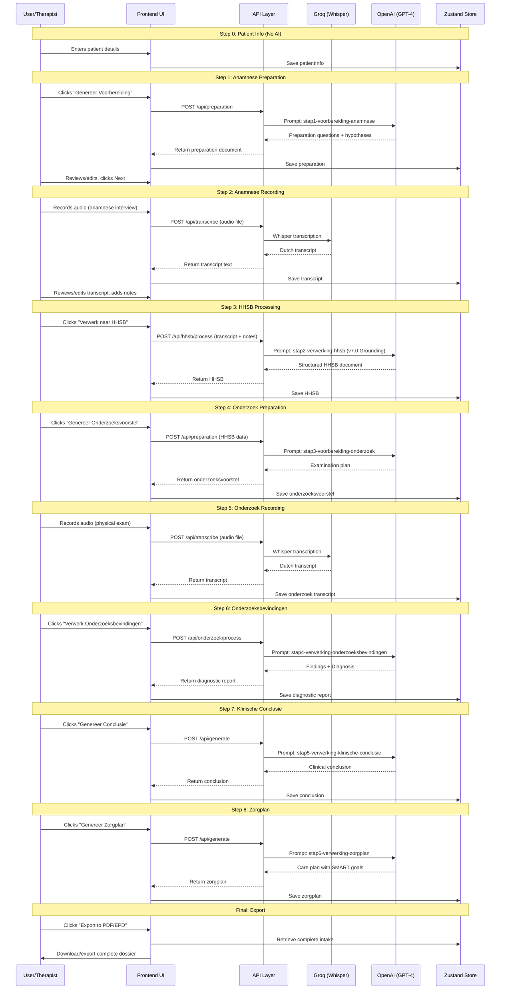

# Intake Stapsgewijs - Complete AI Workflow Documentation

**Module**: Medical Scribe - Intake Stapsgewijs
**Purpose**: Step-by-step comprehensive physiotherapy intake
**Version**: 7.0 (with Grounding Protocol)
**Total AI Calls**: 8 per complete intake session
**Total Prompts Used**: 6 unique prompts

---

## Table of Contents

1. [Workflow Overview](#workflow-overview)
2. [Complete User Journey](#complete-user-journey)
3. [Step-by-Step Breakdown with AI Integration](#step-by-step-breakdown-with-ai-integration)
4. [Data Flow Diagrams](#data-flow-diagrams)
5. [File Structure & Code References](#file-structure--code-references)
6. [Example Data Flow](#example-data-flow)
7. [Error Handling & Edge Cases](#error-handling--edge-cases)

---

## Workflow Overview

Intake Stapsgewijs provides a **structured 6-step intake process** designed for comprehensive patient evaluation. Each step builds on the previous, with AI assistance at preparation and processing phases.

### High-Level Flow

```
Step 0: Patient Info (Manual) → No AI
Step 1: Anamnese Preparation → AI generates questions
Step 2: Anamnese Recording → AI transcribes audio
Step 3: HHSB Processing → AI structures anamnese data
Step 4: Onderzoek Preparation → AI creates exam plan
Step 5: Onderzoek Recording → AI transcribes audio
Step 6: Onderzoeksbevindingen → AI analyzes exam results
Step 7: Klinische Conclusie → AI synthesizes diagnosis
Step 8: Zorgplan → AI creates treatment plan
```

### AI Call Summary

| Step | AI Provider | Purpose | Estimated Tokens |
|------|-------------|---------|-----------------|
| 1 | OpenAI GPT-4 | Generate preparation questions | 1,500-2,000 |
| 2 | Groq Whisper | Transcribe anamnese audio | N/A (audio) |
| 3 | OpenAI GPT-4 | Structure HHSB from transcript | 3,000-5,000 |
| 4 | OpenAI GPT-4 | Create examination plan | 2,000-3,000 |
| 5 | Groq Whisper | Transcribe onderzoek audio | N/A (audio) |
| 6 | OpenAI GPT-4 | Process exam findings | 3,000-4,000 |
| 7 | OpenAI GPT-4 | Generate clinical conclusion | 2,000-3,000 |
| 8 | OpenAI GPT-4 | Create care plan | 3,000-4,000 |
| **TOTAL** | | | **~15,000-20,000 tokens** |

---

## Complete User Journey

### Initial State
- Therapist opens Intake Stapsgewijs module
- Empty form displayed
- Stepper UI shows 8 steps

### Step 0: Patient Information (No AI)

**UI Location**: `hysio/src/app/scribe/intake-stapsgewijs/page.tsx`

**User Actions**:
1. Fills in patient details:
   - Voorletters
   - Geboortejaar
   - Geslacht (Man/Vrouw/Anders)
   - Hoofdklacht (free text, ~100 characters)

2. Clicks "Volgende" (Next)

**Data Storage**:
- Stored in Zustand state: `useIntakeStapsgewijsStore`
- File: `hysio/src/lib/state/intake-stapsgewijs-store.ts`
- State shape:
```typescript
{
  patientInfo: {
    voorletters: string;
    geboortejaar: number;
    geslacht: "man" | "vrouw" | "anders";
    hoofdklacht: string;
  }
}
```

**No AI involved** - Pure form data collection

---

### Step 1: Anamnese Preparation (AI Call #1)

**UI Location**: `hysio/src/app/scribe/intake-stapsgewijs/stap1/page.tsx`

#### User Actions

**Option A: Generate Preparation (AI-assisted)**
1. User sees patient info summary
2. Clicks button: **"Genereer Voorbereiding"**
3. Loading spinner appears

**Option B: Manual Entry**
1. User skips AI generation
2. Types preparation notes manually

#### AI Call Details (Option A)

**API Call**:
```typescript
// File: hysio/src/app/scribe/intake-stapsgewijs/stap1/page.tsx (line 45)
const response = await fetch('/api/preparation', {
  method: 'POST',
  headers: { 'Content-Type': 'application/json' },
  body: JSON.stringify({
    voorletters: patientInfo.voorletters,
    geboortejaar: patientInfo.geboortejaar,
    geslacht: patientInfo.geslacht,
    hoofdklacht: patientInfo.hoofdklacht,
    type: 'intake-stapsgewijs-anamnese'
  })
});
```

**API Endpoint**: `POST /api/preparation`
**Handler File**: `hysio/src/app/api/preparation/route.ts` (line 23)

**Prompt Used**: `INTAKE_STAPSGEWIJS_VOORBEREIDING_ANAMNESE_PROMPT`
**Prompt File**: `hysio/src/lib/prompts/intake-stapsgewijs/stap1-voorbereiding-anamnese.ts`
**Full Documentation**: [01-preparation-anamnese-prompt.md](./01-preparation-anamnese-prompt.md)

**AI Model Configuration**:
```typescript
{
  model: "gpt-4-turbo-2024-04-09",
  temperature: 0.7,
  max_tokens: 2000,
  top_p: 0.9
}
```

**Input Example**:
```json
{
  "voorletters": "J.P.",
  "geboortejaar": 1985,
  "geslacht": "man",
  "hoofdklacht": "Pijn in rechterschouder bij overhead bewegingen"
}
```

**Output Example**:
```markdown
👤 Patiëntprofiel: J.P., man, 40 jaar – Pijn in rechterschouder bij overhead bewegingen.

🎯 Primaire Werkhypothese: Subacromiaal Pijnsyndroom (SAPS) - Op basis van leeftijd, geslacht en provocatie bij overhead bewegingen wijst dit op mogelijke rotator cuff tendinopathie of bursitis.

🤔 Relevante Differentiaaldiagnoses:
- AC-gewricht artrose
- Frozen shoulder (adhesieve capsulitis)
- Cervicogene referentiepijn

📈 Hulpvraag (De Doelstelling van de Patiënt)
- "Wat hoopt u met fysiotherapie te bereiken?"
- "Welke specifieke activiteit zou u weer willen kunnen doen zonder problemen?"
...
```

**Display**:
- AI-generated preparation appears in text editor
- Therapist can edit/modify
- Content saved to state

---

### Step 2: Anamnese Recording (AI Call #2 - Transcription)

**UI Location**: `hysio/src/app/scribe/intake-stapsgewijs/stap2/page.tsx`

#### User Actions

**Option A: Record Audio**
1. User reads preparation questions aloud
2. Clicks "Start Opname" (microphone button)
3. Browser requests microphone permission
4. User conducts anamnese interview (patient responds)
5. Clicks "Stop Opname"
6. Preview audio player appears

**Option B: Upload Audio File**
1. User records interview externally
2. Clicks "Upload Bestand"
3. Selects MP3/WAV/WebM file (<70MB)

#### AI Call Details (Transcription)

**API Call**:
```typescript
// File: hysio/src/app/scribe/intake-stapsgewijs/stap2/page.tsx (line 78)
const formData = new FormData();
formData.append('file', audioBlob, 'anamnese.webm');

const response = await fetch('/api/transcribe', {
  method: 'POST',
  body: formData
});
```

**API Endpoint**: `POST /api/transcribe`
**Handler File**: `hysio/src/app/api/transcribe/route.ts` (line 15)

**AI Provider**: **Groq Whisper v3**
**Implementation**: `hysio/src/lib/api/groq.ts` (line 45-89)

**Groq API Call**:
```typescript
const transcription = await groqClient.audio.transcriptions.create({
  file: audioFile,
  model: 'whisper-large-v3',
  language: 'nl', // Dutch
  response_format: 'text',
  temperature: 0.0 // Deterministic for transcription
});
```

**Input**: Audio file (WebM/MP3/WAV)
**Output**: Plain text Dutch transcript

**Example Output**:
```text
Therapeut: Goedemiddag, wat brengt u hier vandaag?
Patiënt: Nou, ik heb al een paar weken last van mijn rechterschouder. Het doet vooral pijn als ik mijn arm omhoog beweeg, bijvoorbeeld bij het aantrekken van een jas of bij het pakken van iets uit een hoge kast.
Therapeut: Wanneer is dit precies begonnen?
Patiënt: Ongeveer drie weken geleden. Ik had toen een zware doos opgetild op mijn werk...
```

**Display**:
- Transcript appears in editable text area
- Therapist can review and correct errors
- Add manual notes (optional)
- Click "Volgende" to proceed

---

### Step 3: HHSB Processing (AI Call #3)

**UI Location**: `hysio/src/app/scribe/intake-stapsgewijs/stap3/page.tsx`

#### User Actions

1. Reviews transcript and notes from Step 2
2. Optionally adds klinimetrie data (NPRS, PSK scores)
3. Clicks **"Verwerk naar HHSB"**
4. AI processing indicator shown

#### AI Call Details

**API Call**:
```typescript
// File: hysio/src/app/scribe/intake-stapsgewijs/stap3/page.tsx (line 102)
const response = await fetch('/api/hhsb/process', {
  method: 'POST',
  headers: { 'Content-Type': 'application/json' },
  body: JSON.stringify({
    transcript: anamneseTranscript,
    notes: manualNotes,
    patientInfo: {
      voorletters,
      geboortejaar,
      geslacht,
      hoofdklacht
    },
    klinimetrie: {
      nprs: nprsScore || null,
      psk: pskScore || null
    }
  })
});
```

**API Endpoint**: `POST /api/hhsb/process`
**Handler File**: `hysio/src/app/api/hhsb/process/route.ts` (line 18)

**Prompt Used**: `INTAKE_STAPSGEWIJS_VERWERKING_HHSB_PROMPT`
**Prompt File**: `hysio/src/lib/prompts/intake-stapsgewijs/stap2-verwerking-hhsb-anamnesekaart.ts`
**Full Documentation**: [02-hhsb-anamnesekaart-prompt.md](./02-hhsb-anamnesekaart-prompt.md)

**v7.0 Grounding Protocol**: This prompt includes the **ABSOLUTE DATA FIDELITY** rules - no fabrication!

**AI Model Configuration**:
```typescript
{
  model: "gpt-4-turbo-2024-04-09",
  temperature: 0.7,
  max_tokens: 5000,
  top_p: 0.9
}
```

**Critical Feature - v7.0 Grounding Protocol**:

The prompt STRICTLY enforces:
```markdown
⚠️ KRITISCH: Jouw output moet een PERFECTE weerspiegeling zijn van de verstrekte input.

🚫 VERBOD OP FABRICATIE:
- NOOIT symptomen toevoegen die niet expliciet zijn genoemd
- NOOIT klinimetrische scores fabriceren of schatten
```

**Example Input/Output**:

**Input (Transcript)**:
```text
Patiënt meldt pijn in rechterschouder sinds 3 weken.
Pijn vooral bij overhead bewegingen zoals jas aantrekken.
Kan niet meer tennissen.
Pijn 's nachts NPRS 6/10, overdag 3-4/10.
Geen uitstraling genoemd.
```

**Output (HHSB Structure)**:
```markdown
HHSB Anamnesekaart – J.P. – man - 40 jr.
Datum: 2025-10-02

📌 Klinische Samenvatting Anamnese
40-jarige man presenteert zich met rechterschouderpijn sinds 3 weken, ontstaan na belasting. Pijn provoceert bij overhead activiteiten. Belangrijkste beperking: tennis gestaakt.

📈 Hulpvraag
Hoofddoel: Pijnvrij kunnen tennissen
Secundaire Doelen: Zonder pijn dagelijkse activiteiten uitvoeren (jas aantrekken)

🗓️ Historie
Ontstaansmoment & Aanleiding: 3 weken geleden
Beloop sindsdien: Aanhoudend
Eerdere Episoden: Niet vermeld in anamnese
Medische Voorgeschiedenis: Niet vermeld in anamnese
Medicatiegebruik: Niet vermeld in anamnese

🔬 Stoornissen
Pijn:
  Locatie: Rechterschouder
  Aard: Niet specifiek omschreven in anamnese
  Intensiteit (NPRS): Nachtelijk 6/10, overdag 3-4/10
  Uitstraling: Niet vermeld in anamnese  ← v7.0: Explicitly marked as missing!

Mobiliteit:
  Bewegingsbeperking: Overhead bewegingen provocerend

♿ Beperkingen
Participatie:
  Sport: Tennis volledig gestaakt wegens schouderpijn
```

**Note the v7.0 features**:
- "Niet vermeld in anamnese" explicitly used for missing data
- NO fabricated scores
- NO assumed details
- Direct extraction from transcript only

**Display**:
- Structured HHSB document shown in editor
- Therapist can review/edit
- Saved to state
- Click "Volgende"

---

### Step 4: Onderzoek Preparation (AI Call #4)

**UI Location**: `hysio/src/app/scribe/intake-stapsgewijs/stap4/page.tsx`

#### User Actions

1. Reviews completed HHSB from Step 3
2. Clicks **"Genereer Onderzoeksvoorstel"**
3. AI generates examination plan

#### AI Call Details

**API Call**:
```typescript
// File: hysio/src/app/scribe/intake-stapsgewijs/stap4/page.tsx (line 56)
const response = await fetch('/api/preparation', {
  method: 'POST',
  headers: { 'Content-Type': 'application/json' },
  body: JSON.stringify({
    hhsbAnamneseKaart: hhsbData,
    type: 'intake-stapsgewijs-onderzoek'
  })
});
```

**Prompt Used**: `INTAKE_STAPSGEWIJS_VOORBEREIDING_ONDERZOEK_PROMPT`
**Prompt File**: `hysio/src/lib/prompts/intake-stapsgewijs/stap3-voorbereiding-onderzoek.ts`
**Full Documentation**: [03-preparation-onderzoek-prompt.md](./03-preparation-onderzoek-prompt.md)

**AI Model Configuration**:
```typescript
{
  model: "gpt-4-turbo-2024-04-09",
  temperature: 0.7,
  max_tokens: 3000
}
```

**Output Example**:
```markdown
Fysiotherapeutisch Onderzoeksvoorstel – J.P. - man - 40 - Rechterschouderpijn bij overhead
Datum: 2025-10-02

Primaire Werkhypothese: Subacromiaal Pijnsyndroom (SAPS) rechts

1. Onderzoeksdoelen
Hypothese Bevestigen: Objectief aantonen van rotator cuff betrokkenheid en/of subacromiale impingement
Differentiaaldiagnoses Uitsluiten: 1. Excluderen van cervicogene invloed. 2. AC-gewricht pathologie uitsluiten
Baseline Vaststellen: Kwantificeren actieve en passieve ROM, SPADI-score

2. Algemene Inspectie & Problematische Handeling
Statische Inspectie: Houding, zwelling, atrofie schoudergordel
Functionele Basistests: Jas aan/uittrekken simuleren, kammen haren

3. Oriënterend Basisonderzoek
Actief Bewegingsonderzoek (AROM): Glenohumerale gewricht - elevatie, abductie, rotaties
Passief Bewegingsonderzoek (PROM): Eindgevoel beoordelen

4. Specifiek Hypothesetoetsend Onderzoek
Cluster 1: SAPS-testen
  - Painful Arc Test
  - Hawkins-Kennedy Test
  - Jobe's Test (Empty Can)
  Rationale: Cluster heeft hoge diagnostische waarde voor SAPS

Cluster 2: Cervicale invloed
  - Spurling's Test
  - CWK ROM en pijnprovocatie
  Rationale: Excluderen radiculaire prikkeling

5. Klinimetrie
  - NPRS bij provocatieve tests
  - SPADI-vragenlijst
  Rationale: Baseline voor behandeleffect monitoring
```

---

### Step 5: Onderzoek Recording (AI Call #5 - Transcription)

**Same as Step 2** - Groq Whisper transcription

**UI Location**: `hysio/src/app/scribe/intake-stapsgewijs/stap5/page.tsx`

User records or uploads onderzoek (physical examination) audio:
```text
Therapeut: We beginnen met de inspectie. Ik zie een lichte elevatie van de rechterschouder, geen zwelling of roodheid zichtbaar.

Therapeut: Actieve elevatie rechts - patiënt tilt arm op. Ik zie pijn tussen 70 en 110 graden. Maximale elevatie bereikt 110 graden.

Therapeut: Nu de Hawkins-Kennedy test - positief, herkenbare pijn gereproduceerd.

Therapeut: Jobe's test - ook positief, geen krachtverlies maar wel pijnprovocatie...
```

---

### Step 6: Onderzoeksbevindingen (AI Call #6)

**UI Location**: `hysio/src/app/scribe/intake-stapsgewijs/stap6/page.tsx`

#### User Actions

1. Reviews onderzoek transcript
2. Adds manual notes/measurements
3. Clicks **"Verwerk Onderzoeksbevindingen"**

#### AI Call Details

**API Call**:
```typescript
const response = await fetch('/api/onderzoek/process', {
  method: 'POST',
  body: JSON.stringify({
    onderzoekTranscript: onderzoekTranscript,
    onderzoekNotes: manualNotes,
    hhsbAnamneseKaart: hhsbData,
    onderzoeksvoorstel: onderzoeksvoorstelData
  })
});
```

**Prompt Used**: `INTAKE_STAPSGEWIJS_VERWERKING_ONDERZOEKSBEVINDINGEN_PROMPT`
**Prompt File**: `hysio/src/lib/prompts/intake-stapsgewijs/stap4-verwerking-onderzoeksbevindingen.ts`
**Full Documentation**: [04-onderzoeksbevindingen-prompt.md](./04-onderzoeksbevindingen-prompt.md)

**Output Structure** (Two Parts):

**Part 1: Objective Findings**
```markdown
Fysiotherapeutisch Onderzoeksbevindingen – J.P. – 40 jr.

Deel 1: Objectieve Onderzoeksbevindingen

1. Inspectie & Palpatie
Inspectie: Lichte elevatie rechterschoudergordel, geen zwelling/roodheid
Palpatie: Drukpijn supraspinatus pees (NPRS 4/10)

2. Bewegingsonderzoek
Actief (AROM):
  - Elevatie rechts: 110° (pijnlijk 70-110°)
  - Abductie: 95°
  - Exorotatie: 40°
Passief (PROM):
  - Elevatie: 130° (capsulair eindgevoel)

3. Specifieke Tests
SAPS-cluster:
  - Hawkins-Kennedy: Positief (+)
  - Painful Arc: Positief (+) 70-110°
  - Jobe's Test: Positief (+), kracht intact

Cervicale tests:
  - Spurling's: Negatief (-)

4. Klinimetrie
SPADI: 55/100
NPRS (Jobe's test): 6/10
```

**Part 2: Clinical Synthesis & Diagnosis**
```markdown
Deel 2: Klinische Synthese & Diagnostische Conclusie

1. Interpretatie
Bevestigende Bevindingen: Positieve SAPS-testcluster wijst sterk op subacromiale pathologie
Uitsluitende Bevindingen: Cervicale invloed onwaarschijnlijk (negatieve Spurling's)

2. Fysiotherapeutische Diagnose
Subacromiaal Pijnsyndroom (SAPS) rechts, vermoedelijk tendinopathie m. supraspinatus

3. Onderbouwing
Evidence-Based: Positieve 3-testcluster heeft hoge diagnostische waarde (richtlijn Schouderklachten)
```

---

### Step 7: Klinische Conclusie (AI Call #7)

**UI Location**: `hysio/src/app/scribe/intake-stapsgewijs/stap7/page.tsx`

#### User Actions

1. Reviews onderzoeksbevindingen + diagnose
2. Clicks **"Genereer Klinische Conclusie"**

#### AI Call Details

**Prompt Used**: `INTAKE_STAPSGEWIJS_VERWERKING_KLINISCHE_CONCLUSIE_PROMPT`
**Prompt File**: `hysio/src/lib/prompts/intake-stapsgewijs/stap5-verwerking-klinische-conclusie.ts`
**Full Documentation**: [05-klinische-conclusie-prompt.md](./05-klinische-conclusie-prompt.md)

**Output Example**:
```markdown
Klinische Conclusie – J.P. – 40 jr.
Datum: 2025-10-02

1. Management Samenvatting
Patiëntprofiel: 40-jarige man met rechterschouderpijn
Fysiotherapeutische Diagnose: Subacromiaal Pijnsyndroom (SAPS) rechts
Kernprobleem: Pijn en bewegingsbeperking leiden tot staken tennis en ADL-beperkingen

2. Het Klinisch Verhaal: Van Klacht naar Diagnose
Patiënt's Hulpvraag: Pijnvrij kunnen tennissen, ADL zonder beperking
Diagnostisch Pad: Anamnese wees op SAPS-patroon, bevestigd door positieve testcluster (Hawkins, Painful Arc, Jobe)
Conclusie: Bevindingen convergeren naar SAPS diagnose, ondersteund door evidence-based richtlijnen
```

---

### Step 8: Zorgplan (AI Call #8)

**UI Location**: `hysio/src/app/scribe/intake-stapsgewijs/stap8/page.tsx`

#### User Actions

1. Reviews complete dossier
2. Clicks **"Genereer Zorgplan"**

#### AI Call Details

**Prompt Used**: `INTAKE_STAPSGEWIJS_VERWERKING_ZORGPLAN_PROMPT`
**Prompt File**: `hysio/src/lib/prompts/intake-stapsgewijs/stap6-verwerking-zorgplan.ts`
**Full Documentation**: [06-zorgplan-prompt.md](./06-zorgplan-prompt.md)

**Output Example**:
```markdown
Fysiotherapeutisch Zorgplan – J.P. – 40 jr.
Fysiotherapeutische Diagnose: SAPS rechts

1. Management Samenvatting
Kernprobleem: Schouderpijn belemmert tennis en ADL
Plan: 8-weeks gefaseerd traject: pijn → functie → sport

2. Prognose
Algemeen: 6-12 weken volgens richtlijn Schouderklachten
Individueel: 8 weken (positieve factoren: jonge leeftijd, gemotiveerd)

3. Behandelplan
Hoofddoel 1: Binnen 12 weken pijnvrij 3 sets tennis (NPRS <2/10)
Hoofddoel 2: Binnen 8 weken pijnvrij ADL

Fase 1 (Week 1-2): Pijnmanagement
  - Educatie over SAPS en prognose
  - Manuele therapie: zachte mobilisaties
  - Oefentherapie: pendel-oefeningen, isometrisch

Fase 2 (Week 3-6): Functieherstel
  - Progressieve weerstandstraining
  - Scapulaire stabilisatie
  - ROM optimalisatie

Fase 3 (Week 7-8+): Return-to-Sport
  - Sportspecifieke training
  - Plyometrische oefeningen
  - Recidiefpreventie

4. Evaluatieplan
Meetmomenten: Week 2, 6, ontslag
Klinimetrie: SPADI, NPRS herhalen
```

**Final Step**: User can export complete intake to PDF or EPD system

---

## Data Flow Diagrams

### Complete Intake Sequence Diagram



---

## File Structure & Code References

### Frontend Components

```
hysio/src/app/scribe/intake-stapsgewijs/
├── page.tsx                    # Main container + Step 0 (Patient Info)
├── stap1/
│   └── page.tsx               # Step 1: Anamnese Preparation UI
├── stap2/
│   └── page.tsx               # Step 2: Anamnese Recording UI
├── stap3/
│   └── page.tsx               # Step 3: HHSB Processing UI
├── stap4/
│   └── page.tsx               # Step 4: Onderzoek Preparation UI
├── stap5/
│   └── page.tsx               # Step 5: Onderzoek Recording UI
├── stap6/
│   └── page.tsx               # Step 6: Onderzoeksbevindingen UI
├── stap7/
│   └── page.tsx               # Step 7: Klinische Conclusie UI
└── stap8/
    └── page.tsx               # Step 8: Zorgplan UI
```

### API Routes

```
hysio/src/app/api/
├── preparation/
│   └── route.ts               # Handles Steps 1 & 4 (preparation prompts)
├── transcribe/
│   └── route.ts               # Handles Steps 2 & 5 (Groq Whisper)
├── hhsb/
│   └── process/
│       └── route.ts           # Handles Step 3 (HHSB processing)
├── onderzoek/
│   └── process/
│       └── route.ts           # Handles Step 6 (onderzoek processing)
└── generate/
    └── route.ts               # Generic endpoint for Steps 7 & 8
```

### Prompts

```
hysio/src/lib/prompts/intake-stapsgewijs/
├── stap1-voorbereiding-anamnese.ts           # Step 1 prompt
├── stap2-verwerking-hhsb-anamnesekaart.ts    # Step 3 prompt (v7.0)
├── stap3-voorbereiding-onderzoek.ts          # Step 4 prompt
├── stap4-verwerking-onderzoeksbevindingen.ts # Step 6 prompt (v7.0)
├── stap5-verwerking-klinische-conclusie.ts   # Step 7 prompt (v7.0)
└── stap6-verwerking-zorgplan.ts              # Step 8 prompt (v7.0)
```

### State Management

```
hysio/src/lib/state/
└── intake-stapsgewijs-store.ts    # Zustand store for all intake data
```

### AI Provider Libraries

```
hysio/src/lib/api/
├── groq.ts                        # Groq Whisper integration
└── openai.ts                      # OpenAI GPT-4 integration
```

---

## Example Data Flow

### Real-World Example: Shoulder Pain Intake

**Step 0 Input**:
```json
{
  "voorletters": "M.J.",
  "geboortejaar": 1978,
  "geslacht": "vrouw",
  "hoofdklacht": "Schouderpijn rechts sinds 1 maand, vooral bij boven-hoofd werken"
}
```

**Step 1 AI Output** (abbreviated):
```markdown
👤 M.J., vrouw, 47 jaar – Schouderpijn rechts bij overhead activiteiten

🎯 Primaire Werkhypothese: Subacromiaal Pijnsyndroom
- Prevalentie hoog bij vrouwen 40-60 jaar
- Overhead provocatie klassiek patroon

🤔 Differentiaaldiagnoses:
- Frozen shoulder (leeftijd + geslacht)
- AC-gewricht artrose
- Cervicogene referentiepijn
```

**Step 2 Audio → Transcript**:
```
Input: [5-minute audio recording of anamnese]
Output: "Patiënt meldt dat de klacht 1 maand geleden begon na het schilderen van het plafond. Pijn bij overhead bewegingen, 's nachts NPRS 7/10. Kan haar werk als kapster niet meer goed uitvoeren..."
```

**Step 3 HHSB** (v7.0 Grounding enforced):
```markdown
📈 Hulpvraag
Hoofddoel: Pijnvrij kunnen werken als kapster

🗓️ Historie
Ontstaansmoment: 1 maand geleden na plafond schilderen
Beloop: Aanhoudend, niet verbeterd

🔬 Stoornissen
Pijn:
  Intensiteit (NPRS): Nachtelijk 7/10
  Uitstraling: Niet vermeld in anamnese  ← v7.0: Not fabricated!
```

**Step 6 Diagnosis**:
```markdown
Fysiotherapeutische Diagnose: SAPS rechts met m. supraspinatus tendinopathie
```

**Step 8 Zorgplan**:
```markdown
Hoofddoel 1: Binnen 10 weken pijnvrij kapperswerkzaamheden (overhead knippen/föhnen)
Fase 1 (Week 1-2): Pijnreductie + ergonomische adviezen
Fase 2 (Week 3-7): Progressieve belasting rotator cuff
Fase 3 (Week 8-10): Werkspecifieke training
```

---

## Error Handling & Edge Cases

### Common Issues

#### 1. Empty Transcript
**Scenario**: Recording failed or no speech detected
**Handling**:
- API returns error: "Transcript is empty"
- UI shows: "Geen spraak gedetecteerd. Probeer opnieuw."
- User can re-record or manually type

#### 2. AI Fabrication (Pre-v7.0)
**Scenario**: AI invents data not in transcript
**v7.0 Solution**: Grounding Protocol prevents this
**Check**:
```typescript
// In prompt validation (not yet implemented):
if (output.contains("NPRS") && !transcript.contains("NPRS")) {
  return { error: "AI fabricated data - retry needed" };
}
```

#### 3. Incomplete Data
**Scenario**: Patient didn't answer all questions
**v7.0 Handling**: HHSB output shows "Niet vermeld in anamnese"
**Example**:
```markdown
Medicatiegebruik: Niet vermeld in anamnese
Eerdere Episoden: Niet besproken
```

#### 4. Audio Upload Failure
**Scenario**: File too large or wrong format
**Handling**:
- Client-side validation: <25MB, .mp3/.wav/.webm only
- Server error: "File type not supported"
- UI suggests: "Gebruik MP3, WAV of WebM formaat"

#### 5. OpenAI Rate Limit
**Scenario**: Too many requests
**Handling**:
- Exponential backoff (3 retries)
- User message: "Server druk. Probeer over 30 seconden opnieuw."
- Log error for monitoring

---

## Performance Optimization

### Tips for Speed

1. **Parallel Requests**: Don't wait for user to click "Next" - preload next step UI
2. **Caching**: Store preparation templates (not yet implemented)
3. **Streaming**: Use SSE for long AI responses (not yet implemented)
4. **Compression**: Gzip API responses

### Expected Timings

| Step | Operation | Typical Duration |
|------|-----------|-----------------|
| 1 | Preparation generation | 3-5 seconds |
| 2 | Whisper transcription (5 min audio) | 15-30 seconds |
| 3 | HHSB processing | 5-8 seconds |
| 4 | Onderzoek preparation | 3-5 seconds |
| 5 | Whisper transcription (5 min audio) | 15-30 seconds |
| 6 | Onderzoeksbevindingen | 5-8 seconds |
| 7 | Klinische conclusie | 3-5 seconds |
| 8 | Zorgplan | 5-7 seconds |
| **TOTAL** | **Complete intake** | **~60-90 seconds of AI processing** |

---

## Testing & Quality Assurance

### Golden Transcript Tests

**Location**: `hysio/src/__tests__/golden-transcripts/intake-stapsgewijs/`

**Files**:
- `golden-anamnese-schouderpijn.txt`
- `golden-anamnese-kniepijn.txt`
- `golden-anamnese-rugpijn.txt`

**Test Example**:
```typescript
describe('HHSB Processing - v7.0 Grounding', () => {
  it('should NOT fabricate NPRS if not in transcript', async () => {
    const transcript = readFile('golden-without-nprs.txt');
    const hhsb = await processHHSB({ transcript });

    expect(hhsb).not.toContain('NPRS: 5/10'); // Fabrication
    expect(hhsb).toContain('NPRS: Niet gemeten'); // Correct
  });
});
```

### Manual Testing Checklist

**Before Production Deployment**:
- [ ] Test complete flow with real audio (5+ patients)
- [ ] Verify v7.0 Grounding: NO fabricated data
- [ ] Check all 8 steps load correctly
- [ ] Test with incomplete transcripts (missing info)
- [ ] Verify HHSB structure correctness
- [ ] Confirm diagnosis logic sound
- [ ] Check zorgplan SMART goals present
- [ ] Test error handling (empty transcript, API failure)
- [ ] Verify mobile responsiveness
- [ ] Check PDF export functionality

---

## Future Enhancements (Roadmap)

### Planned Features

1. **Real-time Transcription**: Whisper streaming during recording
2. **Prompt Caching**: Reuse common preparation templates
3. **Multi-language Support**: English, German prompts
4. **Voice Commands**: "Next step" voice trigger
5. **Collaborative Editing**: Multiple therapists review same intake
6. **AI Confidence Scores**: Show certainty of diagnosis
7. **Template Library**: Save/reuse custom preparations

---

**End of Intake Stapsgewijs Workflow Documentation**

For detailed prompt documentation, see individual prompt files:
- [01-preparation-anamnese-prompt.md](./01-preparation-anamnese-prompt.md)
- [02-hhsb-anamnesekaart-prompt.md](./02-hhsb-anamnesekaart-prompt.md)
- [03-preparation-onderzoek-prompt.md](./03-preparation-onderzoek-prompt.md)
- [04-onderzoeksbevindingen-prompt.md](./04-onderzoeksbevindingen-prompt.md)
- [05-klinische-conclusie-prompt.md](./05-klinische-conclusie-prompt.md)
- [06-zorgplan-prompt.md](./06-zorgplan-prompt.md)

**Questions?** Review the [AI Integration Master Guide](../../AI_INTEGRATION_MASTER_GUIDE.md) or check the source code at the referenced file paths.
